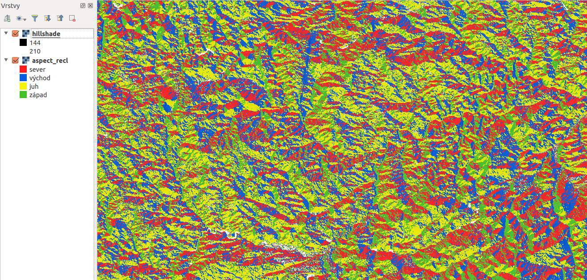

   

.. index::
   pair: algebra; mapová algebra

Použití rastrového kalkulátoru
------------------------------

Při tvorbě mapy orientace vůči světovým stranám je lepší reklasifikovat
(rozdělit) rozsah hodnot do kategorií sever (1), východ (2), jih (3) a západ
(4), přičemž sever znamená :item:`0°` a východ :item:`90°`. Jednou z možností je
využití tzv. rastrového kalkulátoru. Ten je dostupný v menu :item:`Nástroje
zpracování`, které je dostupné přes |processingAlgorithm| :sup:`Sada nástrojů`. Nástroj je ve složce |providerQgis| :item:`Rastrová analáza` pod názvem 
:item:`Raster calculator`.

Rastrový kalkulátor souvisí s mapovou algebrou. Jedná se o matematické
operace s rastrovými mapami, které jsou reprezentovány jako matice
čísel s prostorovým umístěním. Pomocí mapové algebry je možné
matematickými, ale i jinými operacemi kombinovat více rastrových
vrstev a vytvářet tak nové vrstvy.

.. raw:: latex

   \newpage
	 
.. _rstcalculator:

.. figure:: images/rstcalculator.png
   :class: small
   :scale-latex: 45
   
   Princip mapové algebry.
   
Níže uvedený příklad je výpočet tzv. reklasifiakce. Jde vlastně o přepočet
hodnot podle pravidla. Na tento konkrétní úkol je možné použít i specifický
nástroj určený pro reklasifikaci, například :item:`Reclassify by table`.

Pokud jsme mapu orientací nazvali :map:`aspect`, výraz bude vypadat následovně:
:code:`(("aspect@1"  >= 315)  OR  ("aspect@1" < 45)) * 1 + (("aspect@1"  
>= 45)  AND  ("aspect@1" < 135)) * 2 + (("aspect@1"  >= 135)  AND  ("aspect@1" 
< 225)) * 3 + (("aspect@1"  >= 225)  AND  ("aspect@1" < 315)) * 4`.
Reklasifikované vrstvě následně nastavíme  barevnost a popisy (:numref:`nesw` a
:numref:`aspectrecl`).

.. warning:: Je nutné vyplnit velikost buňky a i extent, automatické přiřazení
   hodnot prozatím nefunguje správně a výpočet vyhodí chybu.
   Nastavení souřadnicového systému není volitelný, ale povinný, jinak výpočet
   neproběhne a vypíše chybu. 

.. _nesw:

.. figure:: images/nesw.png
   :class: large
   :scale-latex: 75

   Reklasfikace orientace svahů vůči světovým stranám pomocí mapového kalkulátoru.

Symbologie se nastaví na přesné hodnoty 1,2,3,4, pomocí histogramu je možné
skontrolovat, zda jsme neudělali chybu a rastr neobsahuje jiné než očekávané
hodnoty. Pokud hodnoty v rastru reprezentují jakoukoli charakteristiku, tak
použít nastavení pospisků pro jednotlivé hodnoty či skupiny.

V případě ukázky je vidět, že rastr obsahuje bílé plochy. To je způsobeno tím, 
že v těchto místech je rovná plocha - bez orientace a tyto místa mají extrémní
hodnotu tzv. \"No data\".  Tyto hodnoty nejsou uvedeny v legendě, v případě
potřeby je možné těmto hodnotámnastavit samostatnou kategorii.

.. _aspectrecl:

   Reklasifikovaná mapa orientací svahů vůči světovým stranám. 

.. noteadvanced::

   Při reklasifikacích se obvykle používá modul systému GRASS
   :grasscmd:`r.reclass` (viz školení :skoleni:`GRASS GIS pro
   začátečníky <grass-gis-zacatecnik>`).  Na to je však potřebné
   nainstalovat zásuvný modul :item:`GRASS`, který není dostupný v
   každé verzi *QGIS*. Cílem bylo ukázat, že reklasifikace je možná i
   bez pluginů.
