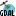
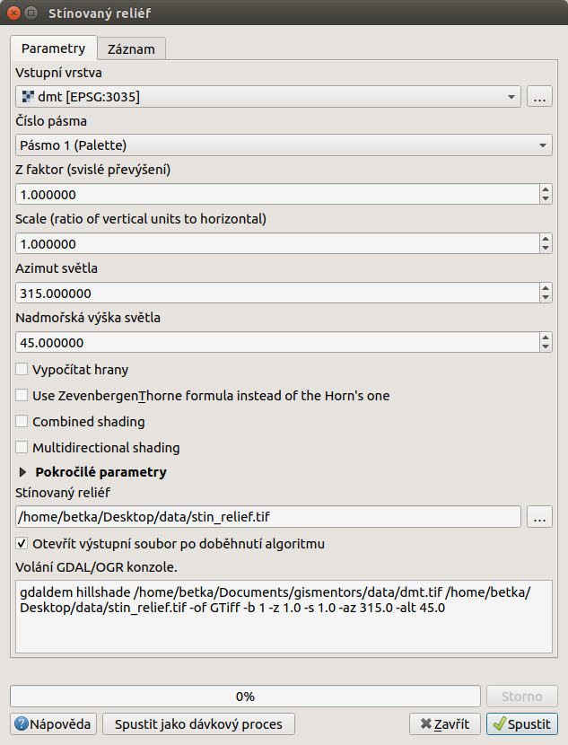
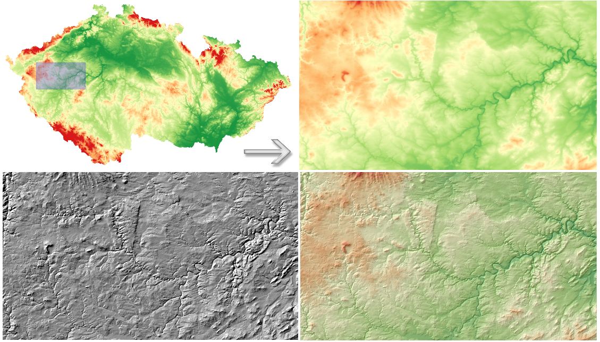

.. |mActionZoomIn| image:: ../images/icon/mActionZoomIn.png
   :width: 1.5em
.. |checkbox| image:: ../images/icon/checkbox.png
   :width: 1.5em

Terénní analýzy
---------------

Digitální výškový model terénu je užitečný typ dat, ze kterého je
možné odvodit další informace o daném území a tak lépe vystihnout
charakter zkoumaného území.  Nástroje pro terénní analýzy a
vizualizace terénu jsou dostupné z menu :menuselection:`Rastr -->
Analýza`. Pomocí těchto nástrojů můžeme odvodit datové sady, které nebyly
úplně evidentní z původního rastru výškopisu. Může jít například o
odvození sklonu reliéfu nebo orientaci svahu vůči světovým stranám.

Funkce nemají samostatné ikony, ale pouze ikonu skupiny nástrojů poskytovatele 
|gdal|-`GDAL`. U všech níže uvedených nástrojů je v okně vidět náhled na zápis
použití této funkce s nastavením všech  použitých parametrů. Je vidět, že u
všech analýz se používá jedna funce - `gdaldem` a samotný typ výpočtu je určen
až dál. Zároveň je to jednoduchý postup, jak se naučit používat funkce ne
pomocí grafického okna, ale pomocí příkazů.

.. note:: 

   Nástrojová lišta :item:`Rastr` obsahuje kromě možnosti vykonávat terénní
   analýzy i nástroje týkající se mapové algebry, souřadnicových systémů,
   konverze do jiných formátů, ořezávání rastrů, generování vrstevnic a jiné.

Stínovaný reliéf (*Hillshade*)
^^^^^^^^^^^^^^^^^^^^^^^^^^^^^^

Jak již bylo uvedeno v části o nastavení transparentnosti rastrových
dat, stínovaný reliéf je využívanou rastrovou vrstvou při zobrazování
2D dat reprezentujících 3D jevy, protože s jeho pomocí se dá dosáhnout
prostorového efektu. Abstraktní informace o výšce terénu znázorníme
pomocí rastrové vrstvy stínovaného reliéfu, tzv. *hillshade*. Ten
vytvoříme tak, že z nabídky menu vybereme :menuselection:`Rastr -->
Analýza --> Stínovaný reliéf...`. V dialogovém okně nastavíme název a
cestu ke vstupní (:map:`dmt.tif`) a výstupní rastrové vrstvě
(:map:`hillshade.tif`).  Při volbě výstupního souboru je možné vybrat
i formát do kterého bude výpočet uložen.  Předvolené nastavení všech
ostatních parametrů lze označit za \"standardní\".  Při zatrhnuté
možnosti |checkbox| :sup:`Otevřít výstupní soubor po doběhnutí
algoritmu` je možné výpočet spustit pomocí tlačítka :item:`OK` a
výstup se po ukončení přidá do mapového okna.

   
   Nastavení funkce pro výpočet stínovaného reliéfu.

.. noteadvanced:: 

   V rámci možností režimu vytváření stínovaného reliéfu je možné nastavit
   hodnotu svislého převýšení, poměr svislých a vodorovných jednotek, azimut či
   nadmořskou výšku světla.

    .. figure:: images/hillshade_parameters.png
       :class: small
      
       Určení azimutu a nadmořské výšky světla pro výpočet.
   
   Pokud chceme zvýraznit výškové poměry částí terénu, tak použijeme nastavení 
   Z faktor a nastavíme toto číslo na hodnotu vyšší než 1. (Hodnota 2 například
   způsobí že pokud byl výškový rozdíl při hodnotě 1 40 výškových metrů, tak 
   bude tento rozdíl působit jako 80 výškových metrů.)
   
   Dalším parametrem je přeputí způsobu výpočtu z výchozíno Hornova na tzv.
   Zevenbergen-Thorne výpočet (vhodnější pro jemný terén).  
   
   Do výpočtu terénu lze také zapnout výpočet hran.

Abychom lépe viděli detaily, pomocí |mActionZoomIn| :sup:`Přiblížit`
si ohraničíme část území. Následně způsobem, který byl popsaný výše,
nastavíme všeobecnou transparentnost rastrové vrstvy :map:`hillshade`
na hodnotu :item:`60%`. Dostaneme výsledek znázorněný na
:numref:`rsthillshade`.

.. _rsthillshade:

   
   Vytvoření prostorového efektu dat díky stínovanému reliéfu.

.. note::

   Rastrová vrstva stínovaného reliéfu je v menu :item:`Vrstvy` nad vrstvou
   :map:`dmt.tif`. Je možné udělat i opačné pořadí vrstev - :map:`hillshade`
   ponechat jako podklad a nastavit transparentnost digitálního výškového modelu
   terénu. 

Sklon (*Slope*)
^^^^^^^^^^^^^^^

Jednou z užitečných informací o terénu je i sklon, který představuje maximální
změnu (gradient) výšky mezi sousedními buňky rastru. Rastrovou vrstvu sklonu
vygenerujeme pomocí nástroje z :menuselection:`Rastr --> Analýza --> Sklon...`
Na :numref:`rstsklon` je znázorněný výsledek s barevnou paletou *BrBG*, přičemž je
použité  rozdělení do 10 stejných intervalů.

.. _rstsklon:

.. figure:: images/rst_sklon.png
   :class: middle
   :scale-latex: 55
              
   Rastrová vrstva sklonu reliéfu.
   
.. noteadvanced:: 
   
   Jako pokročilé nastavení je možné dělat výpočet v procentech místo výchozích
   stupňů. Pokud bychom měli jenom rastr se sklony a potřebovali bychom převést
   hodnoty na procenta, tak bychom mohli použít rastrový kalkulátor.

Orientace vůči světovým stranám (*Aspect*)
^^^^^^^^^^^^^^^^^^^^^^^^^^^^^^^^^^^^^^^^^^

Pro vytvoření mapy orientace svahu vůči světovým stranám použijeme
nástroj :menuselection:`Rastr --> Analýza --> Aspekt...` a postupujeme
obdobně jako při předchozích analýzách.

U výchozího nastavení se orientace určuje azimutem ve stupních. Pomocí parametru
je možné určovat ji jako trigonometrický úhel. 

Místa, které jsou vodorovné nemají žádnou orientaci a standardně se jim přiřadí
hodnota `-9999`. Pro přiřazení hodnoty `0` je k dispozici opět samostatný
parametr. Toto nastavení je důležité z  hlediska vizualizace, ale i navazujících
výpočtů.

Orientace svahu je ve stupních, přičemž server má hodnotu 45°.
Severní strana má tedy rozsah 0°-90°. Jižní strana pak 180°-270°.

.. _rstaspekt:

.. figure:: images/aspekt.png
   :class: middle
   :scale-latex: 55
              
   Rastrová vrstva orientace svahu.

