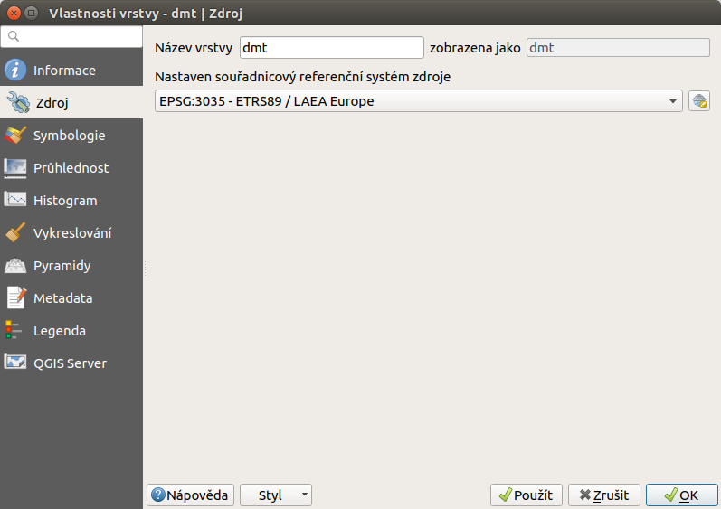
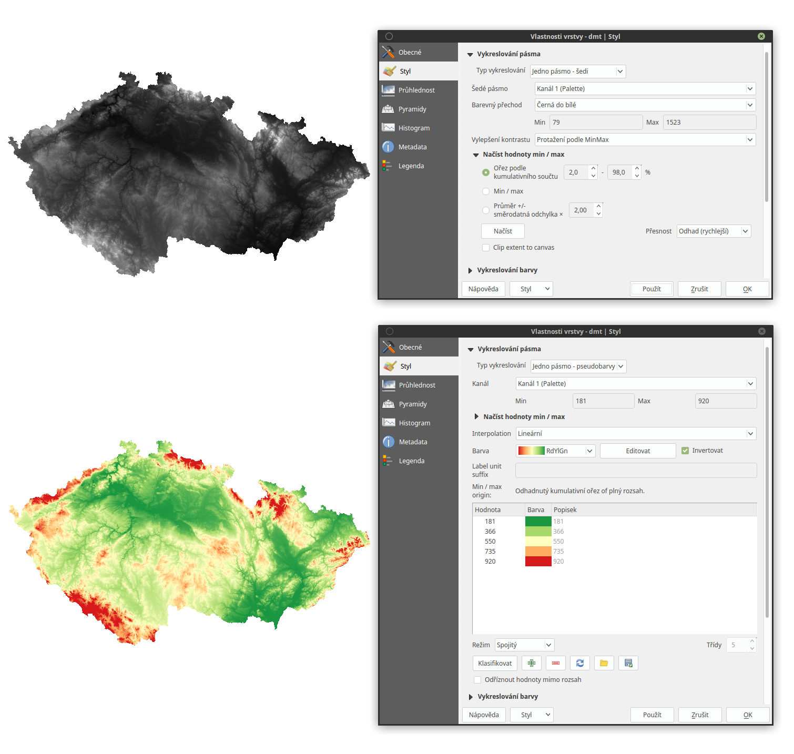
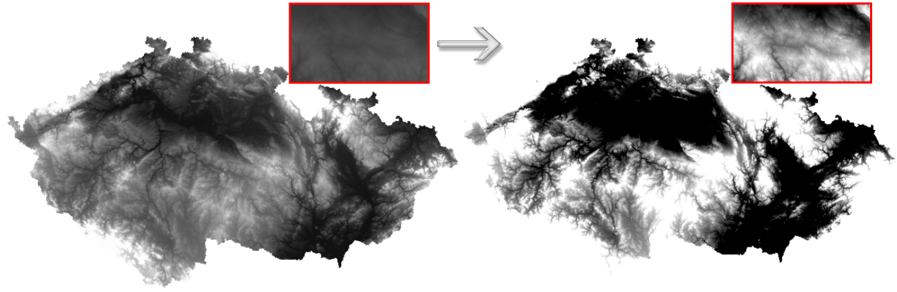

.. |mActionFullHistogramStretch| image:: 
   ../images/icon/mActionFullHistogramStretch.png
   :width: 1.5em
.. |checkbox| image:: ../images/icon/checkbox.png
   :width: 1.5em
.. |CRS| image:: ../images/icon/CRS.png
   :width: 1.5em
.. |mActionLocalCumulativeCutStretch| image:: 
   ../images/icon/mActionLocalCumulativeCutStretch.png
   :width: 1.5em
.. |mIconZoom| image:: ../images/icon/mIconZoom.png
   :width: 1.5em
.. |symbologyAdd| image:: ../images/icon/symbologyAdd.png
   :width: 1.5em
.. |mActionContextHelp| image:: ../images/icon/mActionContextHelp.png
   :width: 1.5em
.. |mActionFileOpen| image:: ../images/icon/mActionFileOpen.png
   :width: 1.5em
.. |symbologyRemove| image:: ../images/icon/symbologyRemove.png
   :width: 1.5em
.. |mActionFileSave| image:: ../images/icon/mActionFileSave.png
   :width: 1.5em

Vlastnosti rastrové vrstvy
--------------------------

Na to abychom viděli a nastavili vlastnosti dané rastrové vrstvy, použijeme buď
levý dvouklik na název vrstvym, nebo pravým klikem zvolíme z kontextového menu
položku :item:`Vlastnosti`. Dialogové okno obsahuje šest záložek : *Všeobecné*,
*Styl*, *Průhlednost*, *Pyramidy*, *Histogram* a *Metadata*.

Všeobecné
^^^^^^^^^

Prvá záložka poskytuje základní informace o vrstvě jako je název souboru, název
vrstvy v legendě s možností editace, zdroj vrstvy, počet sloupců a řádků,
souřadnicový referenční systém, který je možno změnit kliknutím na tlačítko
|CRS| :sup:`Vyberte SRS`. V této záložce je možné nastavit i viditelnost v
závislosti na měřítku (:num:`#obecneraster`).

.. _obecneraster:

   Vlastnosti rastové vrstvy

Styl
^^^^
Tato záložka slouží na nastavení barevnosti rastrových dat v mapovém okně. Je
možné nastavit vykreslování pásma, barvy nebo převzorkování. V dané vrstvě mohou
být barvy invertované, dá se vylepšit kontrast, sytost, jas, rosah
vykreslovaných hodnot (:num:`#stylraster`).

.. _stylraster:

       
   Různé styly té samé rastrové vrstvy: šedé pásmo(vlevo), pseudobarvy (vpravo)
    
.. note:: 

   Po nastavení barevné palety je potřebné nezapomenout na tlačítko
   :item:`Klasifikovat`, které vygeneruje barvy pro konkrétní režim, v našem
   případě lineární barevná interpolace a invertovaná spojitá paleta *RdYIGn*.
   Nastavení hodnoty směrodatné odchylky dokáže zabezpečit, aby hodnoty, které
   se příliš liší od průměru pro vrstvu, nebyli zobrazené.     
  
.. noteadvanced:: 

   Další možnosti stylování nabízí lišta :item:`Raster`, která se zapíná přes
   :menuselection:`Zobrazit --> Nástrojové lišty --> Raster`. Například první
   položka zleva |mActionLocalCumulativeCutStretch| :sup:`Local Cumulative Cut
   Stretch` automaticky vylepší kontrast na základě minimální a maximální
   hodnoty buňky v aktuální lokální části rastru, přičemž bere do úvahy výchozí
   limity a odhadnuté hodnoty. Výsledek je na :num:`#stylrstpanel` vlevo. Volba
   |mActionFullHistogramStretch| :sup:`Roztáhnout histogram na celý dataset`
   nástrojové lišty vrátí změny zpět jak byli na :num:`#stylraster`, t.j. vyrovná
   kontrast vzhledem na celý rastr dle skutečných hodnot. Pokud pravým
   kliknutím na název vrstvy zvolíme z kontextového menu :item:`Zoom na
   nejvhodnější měřítko (100%)`, klikneme na |mActionLocalCumulativeCutStretch|
   :sup:`Local Cumulative Cut Stretch` a zvolíme |mIconZoom| :sup:`Přiblížit na
   vrstvu` čímž vytvoříme styl znázorněný na :num:`#stylrstpanel` vpravo. 

.. _stylrstpanel:

   Změna stylu rastrové vrstvy pomocí nástrojové lišty :item:`Raster`

Průhlednost
^^^^^^^^^^^
QGIS umožňuje zobrazovat každou vrstvu v mapovém okně s různým stupněm
průhlednosti. Má to velkou výhodu například pokud chceme, aby kromě aktuální
rastrové vrstvy byla viditelná i jiná vrstva. Typickým příkladem je překryv
stínovaného reliéfu s jakoukoli barevnou rastrovou vrstvou. Překryv a vhodné
nastavení průhlednosti způsobí prostorový vzhled 2D vrstvy. Konkrétní příklad je
uveden později. 

Záložka umožňuje nastavit všeobecnou průhlednot, ale taktéž průhlednost pro
každý pixel. V části o uživatelských nastaveních transparentnosti (viz.
:num:`#rsttransparency` s paletovým typom vykreslení pásma pro rastr) je možné
nastavit hodnoty pomocí tlačítek |symbologyAdd| :sup:`Zadat hodnoty ručně` nebo
|mActionContextHelp| :sup:`Přidat hodnoty z obrazovky`, dále možno
|symbologyRemove| :sup:`Odstranit vybrané řádky`, hodnoty |mActionFileOpen|
:sup:`Importovat z` nebo |mActionFileSave| :sup:`Exportovat do` souboru, comá
smysl hlavně u detailnějších, časovo náročných pracích. Tato záložka umožňuje
taky nastavení pro *no data* hodnoty. 

.. _rsttransparency:

.. figure:: images/rst_transparency.png

   Možnosti nastavení průhlednosti rastrové vrstvy

Pyramidy
^^^^^^^^

Pyramidy jsou datové struktury, které typicky obsahují menší množství dat.
Cílem je snížit výpočetní náročnost při práci s daty. Podstatou je, že se kromě
původního rastru v plném rozlišení vytvoří zjednodušená verze (kopie s nižším
rozlišením pro konkrétní zoom). Na převzorkování se použijí různé metody, 
nejčastěji jde o metodu průměru (*Average*) nebo metodu nejbližšího souseda 
(*Nearest Neighbour*).

.. note::

   Oprávněný na takovéto úkony je jenom ten, kdo má právo zápisu do adresáře s
   původními daty.

.. important::

   Je potřebné vědět, že vytvoření pyramid může pozměnit originální rastr a
   proto se doporučuje vytvoření zálohy původní bezpyramidové verze dat.

Histogram
^^^^^^^^^
QGIS nabízí nástroj pro generování histogramu rastrové vrstvy
(:num:`#rsthistogram`). Je vytvořen automaticky po kliknutí na volbu
:item:`Vypočíst histogram`.

.. _rsthistogram:

.. figure:: images/rst_histogram.png
   :class: middle

   Výpočet histogramu rastrové vrstvy digitálního výškového modelu terénu
       
Metadata
^^^^^^^^
Tato záložka by měla poskytovat informace o dané rastrové vrstvě (pokud
existují). Jedná se zejména o základní popis dat (nadpis, abstrakt, seznam
klíčových slov), Url metadat a legendy či jiné vlastnosti (ovladač, popis
datasetu, velikost pixelu, souřadnicový systém, rozsah vrstvy, a další).

