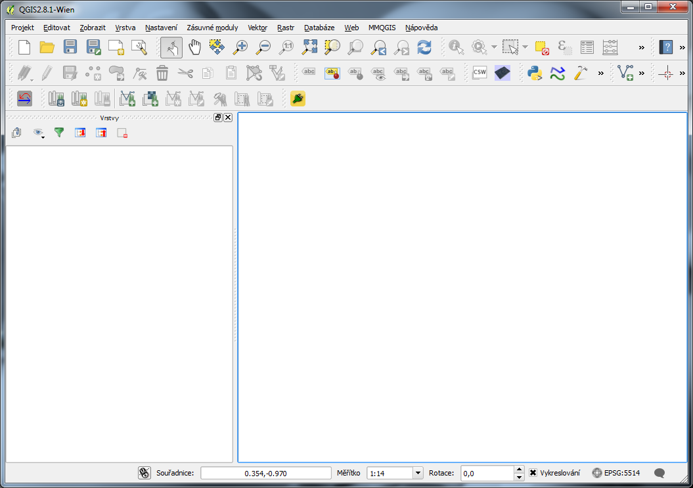
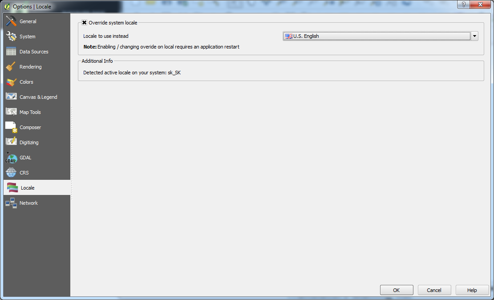

Lokalizace
----------

V současné době je možné vybrat si ze skoro 30 jazykových variant programu QGIS.
Úrovně lokalizace jsou různé, čeština patří k těm kvalitnějším.

.. noteadvanced::
                
   Jednotlivé překlady je možno ovlivnit. Připojit se k překladatelům je možné
   na oficiálních `stránkách QGIS 
   <https://qgis.org/en/site/getinvolved/translate.html>`_.
                
   .. figure:: images/translations.png

               Popis systému pro tvorbu lokalizací.
                            
          
.. _volba-lokalizace:

Volba lokalizace
================

QGIS se spustí v lokalizaci dle nastavení operačního systému.

           
   Lokalizace QGIS v českém jazyce.

Lokalizaci je však možné nastavit z menu :menuselection:`Nastavení -->
Možnosti...` záložka :item:`Lokalizace`

            Menu pro nastavení jazykové lokalizace.
          
Aby se změna nastavení jazyka projevila, je nutné systém QGIS vypnout. Po opětovném 
spuštění se změna lokalizace již projeví. 
