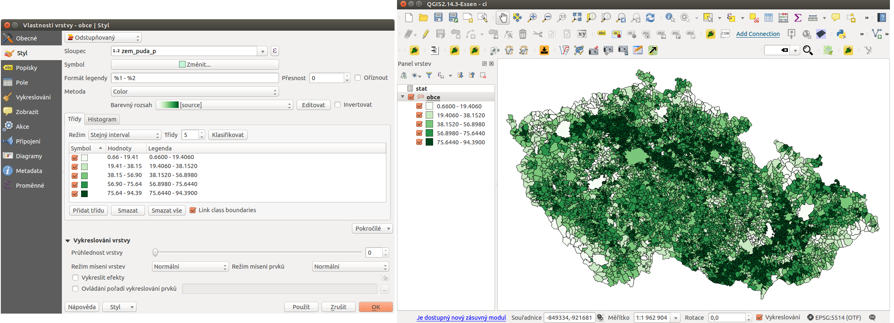
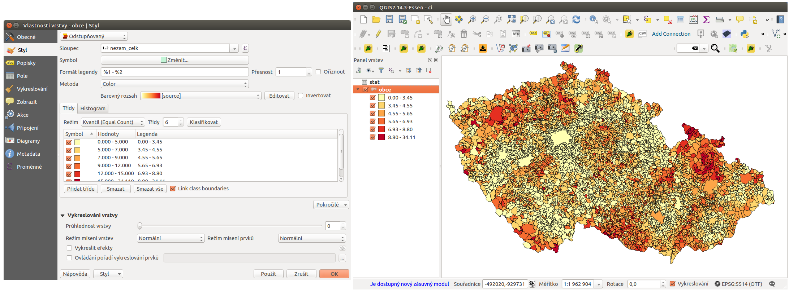
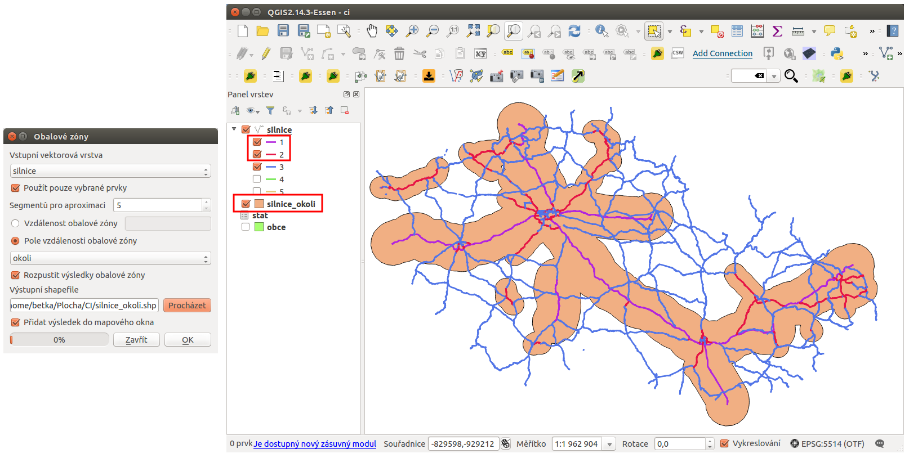
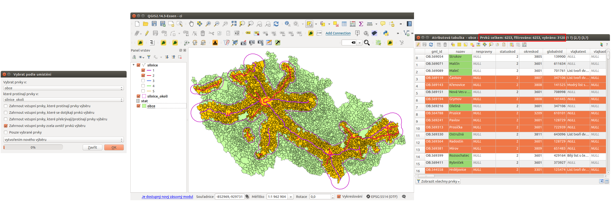

.. |mActionCalculateField| image:: ../images/icon/mActionCalculateField.png
   :width: 1.5em
.. |mIconExpressionSelect| image:: ../images/icon/mIconExpressionSelect.png
   :width: 1.5em

Ukázka zpracování dat
---------------------

V následující ukázce je popsán postup zpracování dat o obcích ČR,
které jsou získány z `RÚIANu
<http://www.cuzk.cz/ruian/RUIAN.aspx>`_. Tyto data zkombinujeme z
daty, která jsou poskytována `Statistickým úřadem
<https://www.czso.cz/>`_.

Tento postup je zkloubením základních postupů, které jsou součástí školení pro 
začátečníky. Požadovaným výsledkem je jednak grafická vizualizace různých 
statistických údajů, které jsou odvozeny ze základních ukazatelů, ale také 
zkloubení dat pomocí prostorových analýz s jinými datovými sadami.

Podkladová data
===============

Jak již bylo zmíněno, budeme používat datovou sadu **obcí ČR** z datasetu *RÚIAN*. 

Další datová sada pochází ze statistického úřadu. Tyto data poskytují různorodé
údaje definující sadu faktorů popisující každou obec. 
Data je možné získat `zde <https://www.czso.cz/csu/czso/csu_a_uzemne_analyticke_podklady>`_
(**Aktuální údaje za všechny obce ČR (data mimo SLDB)**) i s popisem evidovaných hodnot.

Příprava dat
============

Jako první si načteme vrstvu obcí. Můžeme použít například data ze `školení QGIS 
<http://training.gismentors.eu/geodata/qgis/data.zip>`_.

Data stáhnuté ze statistického úřadu si upravíme pro import do QGISu. Jako první
si odstraníme řádky 1-3,5,6 a takto upravenou tabulku si uložíme do formátu 
:map:`CSV`.

.. warning:: Některé sloupce, které mají číslenou hodnotu je vhodné upravit. 
   Například sloupce spadající pod kategorii 30 (výměry druhů pozemků) obsahujou
   pomlčku. Při importu 
   takovýchto dat bude pak atribut používán jako *textový řetězec* a ne jako 
   *číslo*.

   Takovéto hodnoty je lepší hromadně nahradit vhodnou hodnotou.
   Podobný případ se týká například sloupce 8.5 (počet dlouhodobě 
   nezaměstnaných). Zde jsou sice uvedeny všude *čísla*, ale pokud je celé číslo
   čtyřciferné tak jsou stovky a tisíce *odděleny mezerou*. I tento případ je
   nutné opravit, jinak *není možné provádět matematické operace*.

   Obě opravy je možné udělat jak před importem, tak až po importu. Výběr záleží
   na uživateli.

Takto upravený soubor načteme podle `postupu <http://training.gismentors.eu/qgis-zacatecnik/vektorova_data/import_delim.html>`_
s ohledem na to, že importujeme *data bez geometrie*. 
Vrstvu pro naše účely pojmenujeme :item:`stat`

.. _imported_data:

.. figure:: images/stat_imported_data.png
   :class: large
        
   Import tabulkových dat a zobrazení obou datových sad v QGISu.

Připojení dat
=============

Dalším krokem je připojení dat z vrstvy :item:`stat` k vrstvě :item:`obce` tak,
abychom u každé obce viděli všechny atributy z obou vrstev.

Klíčovým je atribut podle kterého se data z obou vrstev spárujou. V tomto
případě použijeme kód obce. Tento atribut se nachází v obou vrstvách - v jedné 
je pojmenován **kod_ob** a v druhé **kodobce**. Je to číselný identifikátor 
unikátní pro každou obec v ČR. Samotné připojení je popsáno `zde 
<http://training.gismentors.eu/qgis-zacatecnik/vektorova_data/join.html>`_. 
V našem případě bude definice připojení vypadat jako na následujícím obrázku 
:num:`#join`.

.. _join:

.. figure:: images/stat_join.png
   :class: small
        
   Připojení atributů vrstvy stat k vrstvě obce.

Po tomto kroku máme všechy data z vrstvy stat připojené ke stávajícím atributům
vrstvy obce a můžeme je využít na další zpracování.

Výpočet podílu zemědělské půdy v obcích
=======================================

Data, které jsme si v předchozím kroku připojili obsahují i atribut určující 
*rozlohu zemědělské půdy v daném území* :item:`30.12` a také *celkovou rozlohu 
území obce* :item:`30.13`. 
Z těchto hodnot spočteme **podíl zemědělské půdy pro všechny obce v procentech**
, tuto hodnotu uložíme jako nový atribut (můžeme a nemusíme) a následně uděláme
vizualizaci těchto hodnot.

Pomocí |mActionCalculateField| :sup:`Kalkulčka polí` si nadefinujeme výpočet 
hledané hodnoty a jejich uložení do nového atributu. Na :num:`fieldcalc1`
je zadáno vytvoření nového atributu :item:`zem_puda_p` (desetiné čílo). Výpočet
hodnoty je **podíl atributu zemědělské plochy k celkové ploše a převod na procenta**.

.. _fieldcalc1:

.. figure:: images/stat_field_calc1.png
   :class: small
        
   Po dokončení výpočtu se přidá nový atribut, který definuje procento území 
   které zabírá zemědělská plocha v každé obci. Nově přidaný atribut je nutné 
   uložit.

Dalším krokem je vizualizace těchto hodnot
^^^^^^^^^^^^^^^^^^^^^^^^^^^^^^^^^^^^^^^^^^

U vrstvy obce nastavíme *odstupňované stylování* podle atributu 
:item:`zem_puda_p` a zvolíme si další možnosti - jako je barevný rozsah, 
počet kategorií a jejich rozdělení a další. 
Při tvorbě takovéhoto stylování je nutné dbát na následné použití dat.

.. _clasification1:

        
   Příklad klasifikace a výsledné zobrazení v mapovém okně

Výpočet nezaměstnanosti v obcích
================================

Jedná se o podobný příklad jako je ten předešlý. Použijeme data o *počtu 
obyvatelů ve věku 15-64 let* :item:`37.10` a *počet nezaměstnaných* :item:`8.3`.
Zajímavý může  být i výpočet s hodnotou *nezaměstnaných absolventů* :item:`8.4`
anebo *nezaměstnaných nad 12 měsíců* :item:`8.5`.

Opět použijeme |mActionCalculateField| :sup:`Kalkulčka polí` . 
Vytvoříme nové pole s názvem :item:`nezam_celk` a hodnotu spočteme jako **podíl
nezaměstnaných a obyvatelů mezi 14 a 65 přepočten na procenta**. 
Nově votvořené pole obsahuje hodnoty procentuální nezaměstnanosti pro každou obec.

.. _fieldcalc2:

.. figure:: images/stat_field_calc2.png
   :class: small
        
Pro vizualizaci zopakujeme postup tvorby stylu z předchozího příkladu. 
Možné stylování a výseldek je zobrazen na obr :num:`#clasification2`

.. _clasification2:

        
   Příklad stylování a výslední zobrazení v mapovém okně

Výběr obcí podle vícero atributů
================================

Data zle samozřejmě použít i k výběru. Jedním z příkladů je výběr území, kde 
dlouhodobě nezaměstnaní (:item:`8.5`) tvoří víc než 50% všech nezaměstnaných 
(:item:`8.3`).

Atributové dotazování je popsáno v samostatné `části <http://training.gismentors.eu/qgis-zacatecnik/vektorova_data/dotazovani.html#atributove-dotazovani>`_

Použijeme funkci |mIconExpressionSelect| :sup:`Vybrat prvky pomocí vzorce`. 
Tento nástroj nám umožní napsat podmínku, pomocí které se vyberou pouze prvky, 
které splňují podmínku.

V našem případě bude vypadat vzorec jako na obrázku :num:`#attrib`.
Po provedení se výběr aplikuje v mapovém okně i atributové tabulce - 
:num:`#attrib2`. 
Je zde vidět, že z celkového počtu 6253 obcí je naší **podmínku splňuje 749 obcí**.

.. _attrib:

.. figure:: images/stat_attribute_select1.png
   :class: small
        
   Výběr obcí pomocí výrazu podílu dlouhodobě nezaměstnaných nad 50% s výsledkem

.. _attrib2:

.. figure:: images/stat_attribute_select2.png
   :class: large
        
   Výsledek výběru v mapovém okně a atributové tabulce

Výběr obcí, které leží do 20 km od dálnic a do 10km  od rychlostních silnic
=========================================================================== 

K této analýze potřebujeme vrstvu obcí, jako v předešlých případech. 
Druhou vrstvou je vrstva silnic z datasetu OpenStreetMap - opět lze použít data
připravené pro školení - `zde <http://training.gismentors.eu/geodata/qgis/data.zip>`_.

Nová atribut s hodnotou vzdálenosti
^^^^^^^^^^^^^^^^^^^^^^^^^^^^^^^^^^^

Ze zadání vyplývá, že budeme hledat obalovou zónu silnic. 
Nejde ale o konstantní vzdálenost, ale o hodnotu odvíjející se od existující
kategorie silnice.

Stávající atributy vrstvy :item:`silnice` doplníme o nový atribut :item:`okoli`,
který vyplníme pro typ silnice = 1 (dálnice) hodnotou 20000 a pro typ silnice =
2 (rychlostní komunikace) 10000. 

Použijeme |mActionCalculateField| :sup:`Kalkulčka polí`  pro nové pole typu 
*integer* a pomocí výrazu *CASE* vyplníme hodnoty dle požadavku - jako na 
obrázku :num:`#fieldcalc3`.
 
.. _fieldcalc3:

.. figure:: images/stat_field_calc3.png
   :class: medium

   Podmíněný výpočet nového atributu a ukázka výsledku a atributové tabulce.

.. note:: Prostorové analýzy pracují v základních jednotkách souřadnicových 
   systémů. V případě práce v S-JTSK (EPSG:5514) se jedná o metry. Proto
   zadáváme 20 kilometrů jako 20 000 metrů.

Výběr dálnic a rychlostních silnic
^^^^^^^^^^^^^^^^^^^^^^^^^^^^^^^^^^

Dalším krokem je **výběr pouze dálnic a rychlostních cest**. Tento výběr lze 
provést různými způsoby:

1. použijeme **výběr prvku pomocí vzorce** a jako vzorec použijeme vzorec
   **typ = 1 OR typ = 2**
2. použijeme **výběr prvku pomocí vzorce** a jako vzorec použijeme nově 
   vytvořený atribut a vzorec **okoli IS NOT NULL** (hodnota NULL je u ostatních
   kategorií) anebo **okoli = 20000 OR okoli = 10000**
3. použijeme **kategorizované stylování** podle atributu typ, necháme zobrazit
   pouze hledané kategorie a provedene **výběr prvků v mapovém okně** (můžeme v
   ybrat pouze prvky, které se v mapovém okně zobrazují)

.. _selectroads:

.. figure:: images/stat_select_roads.png
   :class: large

   Tři různé způsoby jak do výběru vybrat pouze  silnice a rychlostní cesty.

Tvorba obalové zóny
^^^^^^^^^^^^^^^^^^^

Pokud máme vybrané jenom požadované kategorie silnic, tak na nich můžeme
vytvořit obalovou zónu. 
Použijeme prostorovou analýzu `obalová zóna <http://training.gismentors.eu/qgis-zacatecnik/vektorova_data/prostorove_analyzy.html#obalova-zona-buffer>`_
:menuselection:`Vektor-->Nástroje geoprocessingu-->Obalové zóny ...`.

Podstatné je použít *pouze vybrané prvky*, velikost bufferu určit atributem
:item:`okoli`. V tomto případě použijeme i možnost *"rozpustit obalovou zónu"*.

Výsledkem této analýzy je nová *polygonová vrstva*. 
Po přidání do mapového okna a překrytí obou vrstev je vidět, že analýza má
očekávaný výsledek. 

.. _buffer:

   Nastavení tvorby obalové zóny a zobrazení výsledku v mapovém okně.

Prostorový výběr
^^^^^^^^^^^^^^^^

Posledním krokem je geometrický výběr.
Ten nám má vybrat **všechny obce které se nachází v obalové zóně** vytvořené v
předchozím kroku.

Použijeme tedy funkci :menuselection:`Vektor-->Výzkumné nástroje-->Vybrat podle umísténí...`
. Podstatné je dobře nadefinovat její kroky - vybíráme prvky z vrstvy
:item:`obce`, které protínají prvky v :item:`silnice_okoli`. Co je
nejdůležitější - jestli chceme obce, které do vrstvy okolí zasahují byť jeno
m malým kouskem, anebo musí být celé uvnitř, což záleží na požadavcích.

V našem případě chceme jenom obce, které **leží celou svou plochou uvnitř**.
Celé nastavení výběru, zobrazení výsledku výběru v mapovém okně i ukázka
atributové tabulky je  na obr :num:`#selectedareas`. 

Výsledkem tohoto úkolu je **3120 obcí** které se nachází v zadané vzdálenosti od 
dálnic a rychlostních komunikací.

Pro zobrazení v mapovém okně je nutné pohrát si s vykreslováním jednotlivých
vrstev a s jejich průsvitností.

.. _selectedareas:

   Prostorový výběr, zobrazení v mapovém okně a detail atributové tabulky.
