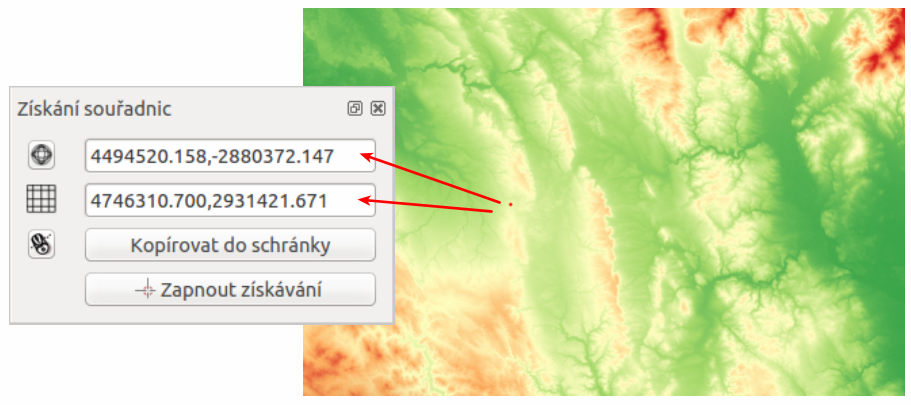

.. |plug1| image:: ../images/icon/mActionShowPluginManager.png
   :width: 1.5em
.. |checkbox_unchecked| image:: ../images/icon/checkbox_unchecked.png
   :width: 1.5em
.. |plugin| image:: ../images/icon/plugin.png
   :width: 1.5em
.. |plugin-installed| image:: ../images/icon/plugin-installed.png
   :width: 1.5em
.. |q2t| image:: ../images/icon/q2t.png
   :width: 1.5em
.. |plugin-upgrade| image:: ../images/icon/plugin-upgrade.png
   :width: 1.5em
.. |mActionTransformSettings| image:: ../images/icon/mActionTransformSettings.png
   :width: 1.5em
.. |star| image:: ../images/icon/osm_star.png
   :width: 1.5em
.. |1| image:: ../images/icon/dxf2shp_converter.png
   :width: 1.5em
.. |3| image:: ../images/icon/roadgraph.png
   :width: 1.5em
.. |2| image:: ../images/icon/coordinate_capture.png
   :width: 1.5em
.. |4| image:: ../images/icon/spatialquery.png
   :width: 1.5em
.. |5| image:: ../images/icon/olp.png
   :width: 1.5em
.. |6| image:: ../images/icon/mGeorefRun.png
   :width: 1.5em
.. |7| image:: ../images/icon/evis_icon.png
   :width: 1.5em
.. |8| image:: ../images/icon/gps_importer.png
   :width: 1.5em
.. |9| image:: ../images/icon/dem.png
   :width: 1.5em
.. |checkbox| image:: ../images/icon/checkbox.png
   :width: 1.5em
.. |geographic| image:: ../images/icon/checkbox.png
   :width: 1.5em
.. |reticle| image:: ../ruzne/images/p_reticle.png
   :width: 1.5em
.. |askcor| image:: ../ruzne/images/p_askcor.png
   :width: 1.5em
.. |askcorcopy| image:: ../ruzne/images/p_askcorcopy.png
   :width: 1.5em
.. |mActionNewVectorLayer| image:: ../images/icon/mActionNewVectorLayer.png
   :width: 1.5em
.. |selectcreatelayer| image:: ../images/icon/selectcreatelayer.png
   :width: 1.5em

QGIS pluginy
------------

QGIS umožňuje práci se zásuvnými moduly, tzv. :wikipedia:`plugin
<https://en.wikipedia.org/wiki/Plug-in_(computing)>` -mi. Ve všeobecnosti se
jedná o softvéry, které nepracují samostatně, ale jako doplňkové moduly jiné
aplikace a tím rozšiřujú její funkčnost. V současnosti existuje pro QGIS víc než
300 zásuvných modulů. Všechny jsou napsané v programovacím jazyku `Python 
<https://www.python.org/>`_ nebo `C++ <https://isocpp.org/>`_. Mnohé z nich jsou
stále ve vývoji. Jejich kompletní seznam spolu s příslušnou charakteristikou,
informacemi například o použití, potřebné minimální verzi QGISu, domovské
stránce, autorech, o počtu stáhnutí, o tom, které jsou označené jako
nejoblíbenější je dostupný `zde <https://plugins.qgis.org/plugins/>`_.
    

Moduly jsou udržované vývojovým týmem QGISu (`QGIS Development Team 
<http://qgis-development-team.software.informer.com/>`_) a jsou automaticky
součástí každé jeho distribuce. Všechny externí pluginy jsou napsané v
programovacím jazce Python a jsou udržovány příslušnými autory. Chyby (angl.
*bugy*) by měli být zveřejnovány  a dostupné na stránkách `projektu 
<http://hub.qgis.org/projects/qgis-user-plugins>`_.

.. _spravca-plugin:

Správce zásuvných modulů
========================

V prvník kroku v menu zvolíme :menuselection:`Zásuvné moduly --> Spravovat a instalovat
zásuvné moduly` (|plug1| :sup:`Spravovat a instalovat zásuvné moduly`).
Spustí se dialogové okno (:num:`#vse`), které slouží na prohlížení, vypínání a
zapínání  dostupných modulů příslušné verze QGISu.

.. _vse:

.. figure:: images/p_vse.png
   :scale: 55%

   Správce zásuvných modulů v prostředí QGIS

Pod položkou |plugin-installed| :sup:`Instalované` najdeme ty, které byli
nainstalované automaticky při instalaci QGISu. Z nich jsou některé načtené, jiné
lze dočasně povolit nebo zakázat zaškrtnutím ikonky |checkbox_unchecked|.
V případě, že klikneme na některý z modulů, zobrazí se jeho charakteristika nebo
účel, spolu s dalšími informacemi jako je název, popis, počet hodnocení a
stáhnutí modulu,reprezentující ikona, kategorie, instalovaná nebo dostupná
verze, autor, seznam změn a další. Na :num:`plugininfo`  je znázorněný příklad
zásuvného modulu s názvem |q2t| :sup:`Qgis2threejs`.

.. _plugininfo:

.. figure:: images/p_info.png
   :scale: 55%

   Charakteristika zásuvného modulu na prohlížení 3D objektů ve webovém
   prohlížeči.

Seznam všech dostupných pluginů možno zobrazit a konkrétní modul načíst zvolením
|plugin| :sup:`Nenainstalováno` a spuštěním :item:`Instalovat zásuvný modul`.
Následně se dá tento modul přeinstalovat nebo úplně odinstalovat 
(:num:`#p-instal`).  

.. _p-instal:

.. figure:: images/p_instal.png
   :scale: 55%

   Seznam nenainstalovaných modulů :fignote:`(1)`, instalace :fignote:`(2)`,
   možnost odinstalování :fignote:`(3)` nebo přeinstalování :fignote:`(4)`
   kteréhokoli z modulů

Pod záložkou |plugin-upgrade| :sup:`Aktualizovatelný` se nachází zásuvné moduly,
které jsou dostupné i v novější verzi. Záložka |mActionTransformSettings| 
:sup:`Nastavení` obsahuje nastavení týkající se kontroly aktualizací modulů,
experimentálních a neschválených modulů a zobrazuje i seznam repozitářů, které
lze přidávat editovat nebo mazat, viz :num:`#akt-nast`.
Po zaškrtnutí políček |checkbox_unchecked|  při položkách :item:`Zobrazit také 
experimentální` a :item:`neschválené moduly` je k dispozici téměř 500 zásuvných
modulů.

.. _akt-nast:

.. figure:: images/p_akt_nast.png
   :scale: 55%

   Záložky svisející s aktualizacemi a nastavením zásuvných modulov

.. tip:: Seznam zásuvních modulů může uživatel uspořádat dle svých potřeb.
   Po stisknutí pravého tlačítka myši v seznamu modulů jek dispozici jejich
   uspořádání dle abecedy, počtu stáhnutí, hlasů nebo stavu (:num:`#rad`).

    .. _rad:

    .. figure:: images/p_rad.png
       :scale: 55%

       Možnosti seřazení zásuvných modulů

.. note:: Je zapotřebí připomenout, že zásuvné moduly v oficiálních repozitářech
   byli testovány, no jednotlivé repozitáře mohou obsahovat i méně ověřené
   moduly různé kvality a stádia vývoje. Proto je dobrou pomůckou zobrazení
   hodnocení či počtu  |star| |star| |star|.  

.. tip:: Pokud známe alespoň přibližný název konkrétního modulu, při vyhledávání
   může vyplnění políčka :item:`Hledat` v dialogovém okně.   

 

Príklady zásuvných modulov
==========================

V ďalšej časti si aspoň čiastočne ukážeme niektoré z užitočných a často 
používaných zásuvných modulov programu QGIS: 

.. only:: latex
          
   .. tabularcolumns:: |p{5cm}|p{10cm}|
                       
.. only:: html
                                 
   .. cssclass:: border

+------------------------------------------------+-------------------------------------------------+
| Zásuvný modul                			 | Charakteristika  	  	                   |
+================================================+=================================================+
| |1| :sup:`Konvertor Dxf2Shp` 			 | konvertuje formát ``*.dxf`` do formátu ``*.shp``|
+------------------------------------------------+-------------------------------------------------+
| |2| :sup:`Získání souřadnic`     		 | získáva souřadnic myši                          |
+------------------------------------------------+-------------------------------------------------+
| |3| :sup:`Zásuvný modul silničního grafu` 	 | řeší problém nejkratší cesty                    |
+------------------------------------------------+-------------------------------------------------+
| |4| :sup:`Zásuvný modul prostorových dotazů`   | tvorba prostorových dotazů			   |
+------------------------------------------------+-------------------------------------------------+
| |5| :sup:`OpenLayers Plugin`                   | OpenLayers vrstvy			           |
+------------------------------------------------+-------------------------------------------------+
| |6| :sup:`Georeferencovač GDAL`		 | georeferencování rastrů pomocí GDAL             |
+------------------------------------------------+-------------------------------------------------+
| |7| :sup:`eVis`             			 | nástroj vizualizace událostí                    |
+------------------------------------------------+-------------------------------------------------+
| |8| :sup:`GPS nástroje`      			 | nástroje pro načtení a import dat GPS           |
+------------------------------------------------+-------------------------------------------------+
| |9| :sup:`Zásuvný modul analýzy terénu rastru` | nástroj pro analýzu terénu 		           |
+------------------------------------------------+-------------------------------------------------+

|1| :sup:`Konvertor Dxf2Shp`
^^^^^^^^^^^^^^^^^^^^^^^^^^^

V prípade, že máme k dispozícii súbor AutoCAD DXF 
(`Drawing Exchange Format <https://en.wikipedia.org/wiki/AutoCAD_DXF>`_), 
do prostredia programu QGIS ho vieme načítať vďaka zásuvnému 
modulu *Konvertor Dxf2Shp*. Ako intuitívne napovedá názov, prevedieme na 
*Shapefile*.

Po načítaní modulu pomocou :ref:`správcu zásuvných modulov <spravca-plugin>`
sa po kliknutí na ikonu |1| objaví dialógové okno, kde je potrebné nastaviť
vstupný ``*.dxf`` súbor, názov, cestu a typ nového ``*.shp`` súboru, 
viď. :num:`#dxf2shp`. Povolenie |checkbox| :sup:`Exportovat textové značky`
vytvorí extra bodovú vrstvu s označeniami a príslušná ``*.dbf`` tabuľka bude
obsahovať "textové" informácie zo súboru ``*.dxf``. 

.. note:: Ak sa po spustení modulu tlačidlom :item:`OK` zobrazí dialógové
okno súvisiace so súradnicovými systémami, systém nastavíme.

.. _dxf2shp:

.. figure:: images/p_dxf2shp.png
   :scale: 70%

   Dialógové okno modulu na prevod AutoCAD DXF súboru na súbor Shapefile

|2| :sup:`Získání souřadnic`
^^^^^^^^^^^^^^^^^^^^^^^^^^^^

Tento zásuvný modul sa používa veľmi jednoducho a umožňuje zobrazenie súradníc
myši pre dva vybrané súradnicové systémy. Dialógové okno je na :num:`#zis-sur`.
Kliknutím na ikonu |geographic| nastavíme požadovaný súradnicový systém, 
zvolením |2| :sup:`Zapnout získávání` sa myš zmení na |reticle|. 
Po kliknutí do mapového okna sa objaví malá červená bodka. Jej súradnice 
v súradnicovom systéme projektu sa zobrazia v okne vedľa symbolu |askcor|. 
Na :num:`#zis-sur` sú na ukážku zobrazené súradnice vybraného bodu v 
súradnicových systémoch S-JTSK (Greenwich) Krovak a S-JTSK (Greenwich) Krovak 
East North. Ikona |askcorcopy| umožňuje súradnice kopírovať do schránky v podobe 
štyroch hodnôt (pre :num:`#zis-sur` by to bolo ``4494520.158,-2880372.147,
4746310.700,2931421.671``).

.. _zis-sur:

   Dialógové okno modulu na zobrazenie súradníc z mapového okna

|3| :sup:`Zásuvný modul silničního grafu`
^^^^^^^^^^^^^^^^^^^^^^^^^^^^^^^^^^^^^^^^^

Vo vstve polylínií modul vypočíta a následne vykreslí najkratšiu cestu medzi 
dvoma zvolenými bodmi. Je napísaný v programovacom jazyku C++. Umožňuje určiť 
najoptimálnejšiu trasu na základe dĺžky alebo času.  Výsledok je automaticky 
exportovaný ako nová vektorová vrstva. 

.. note:: Pri počítaní najkratšej cesty sa odporúča nastaviť súradnicový systém
projektu podľa súradnicového systému vrstvy polylínií. 

Zásuvný modul cestného grafu aktivujeme v 
:ref:`paneli správcu zásuvných modulov <spravca-plugin>`. V lište menu prejdeme 
na :menuselection:`Vektor --> Silniční graf --> Nastavení`. Zobrazí sa okno,
kde vyplníme základné nastavenia ako jednotku času, vzdialenosti, topologickú
toleranciu a ďalšie, viď. :num:`#path-nast`. Na predstvenie modulu použijeme
vektorovú vrstva ciest Českej republiky zobrazenú na :num:`path-vector` podľa 
typu.

.. _path-nast:

.. figure:: images/p_path_nast.png
   :scale: 55%

   Nastavenia zásuvného modulu cestného grafu

.. _path-vector:

.. figure:: images/p_path_vector.png
   :scale: 60%

   Cesty Českej republiky zobrazené podľa typu.

V paneli :item:`Nejkratší cesta` použijeme |2| a v mapovom okne kliknutím 
zvolíme začiatočný a koncový bod cesty. Zobrazí sa ako zelená, resp. červená 
bodka. Následne nastavíme kritérium, t.j. dĺžku alebo čas a potvrdíme stlačením
:item:`Vypočítat`. Po prebehnutí výpočtu sa v mapovom okne zobrazí výsledok 
v podobe polylínie, ktorá sa dá exportovať ako nová vektorová vrstva (použitím
:item:`Export`). Tlačidlo :item:`Vyčistit` slúži na vymazanie obsahu políčok.
Postup je znázornený na :num:`#path`.

.. _path:

.. figure:: images/p_path.png
   :scale: 60%

   Použitie zásuvného modulu cestného grafu a výpočet najoptimálnejšej cesty

.. tip:: Ak nevidíme panel :item:`Nejkratší cesta`, pridáme ju z menu lišty 
:item:`Zobrazit` (:menuselection:`Zobrazit --> Panely --> Nejkratší cesta`) 
ako to znázorňuje :num:`#path-menu`.

    .. _path-menu:
    
    .. figure:: images/p_path_menu.png
       :scale: 55%

       Zobrazenie dialógového okna na výpočet najkratšej cesty

|4| :sup:`Zásuvný modul prostorových dotazů`
^^^^^^^^^^^^^^^^^^^^^^^^^^^^^^^^^^^^^^^^^^^

Týmto zásuvným modulom môžeme vykonávať rôzne priestorové dotazy. Medzi dostupné 
priestorové vzťahy patrí vzťah dotyku, rozpojenia, kríženia, vzťah pretínania 
či prekrytia. Funkcionalita je založená na knižnici 
`GEOS <https://en.wikipedia.org/w/index.php?title=JTS_Topology_Suite&redirect=no#GEOS_Library>`_. 
Vždy je nutné pracovať s vrstvou obsahujúcou zdrojové prvky a vrstvou 
s referenčnými prvkami.

So zásuvným modulom začneme pracovať tak, že klikneme na ikonu modulu |4| alebo
z menu ako :menuselection:`Vektor --> Prostorový dotaz --> Prostorový dotaz`. 
Potom v dialógovom okne s názvom *Prostorový dotaz* nastavíme zdrojové a 
referenčné vrstvy, priestorový vzťah (operátor) a zvolíme či ide o nový výber 
alebo vyberáme z už existujúceho výberu.

Ukážeme si to na príklade výberu všetkých obcí v Českej republike (:map:`obce`), 
v ktorých sa nachádza požiarna stanica (:map:`pozarni_stanice`). Použitie je
znázornené na :num:`#p-pr-dot`. Po tom ako prebehne výber zvolením 
:item:`Použít` sa otvorí ďalšie okno (na :num:`#p-pr-dot` vpravo). V tomto kroku 
možeme tlačítkom |mActionNewVectorLayer| vytvoriť vektorovú vrstvu 
z výberu, |selectcreatelayer| môžeme pokračovať s výberom a robiť subselekcie, 
voľbou |checkbox| dokážeme približovať sa k výsledným položkám, prípadne 
zapisovať správy. 

.. _p-pr-dot:

.. figure:: images/p_pd_menu.png
   :scale: 60%

   Použitie zásuvného modulu priestorových dotazov (prvok obsahuje ...)

.. _p-pr-vysl:

.. figure:: images/p_pd_vysl.png
   :scale: 70%

   Obce Českej republiky s požiarnou stanicou

|5| :sup:`OpenLayers Plugin` 
^^^^^^^^^^^^^^^^^^^^^^^^^^^

*OpenLayers Plugin* (:menuselection:`Web --> OpenLayers Plugin`) umožňuje 
pridávať do mapového okna množstvo obrazových služieb z Google, Bing, Yahoo 
a OpenStreetMap (:num:`#plp`). Satelitné snímky týchto služieb sa môžu líšiť 
ako dátumom, tak kvalitou v závislosti od lokality či poskytovateľa. Podmienkou 
pre použitie zásuvného modulu je dobrý prístup k internetu. Na :num:`p-olm` 
je príklad načítania štyroch rôznych vrstiev s detailom pre tú istú oblasť.

.. _plp:

.. figure:: images/olp.png
   :scale: 70%

   OpenLayers Plugin z lišty menu

.. _p-olm:

.. figure:: images/p_olm.png
   :class: large

   Ukážka vrstiev OpenStreetMap :fignote:`(1)`, OpenCycleMap :fignote:`(2)`, Bing Road :fignote:`(3)` a MapQuest-OSM :fignote:`(4)` pre vybranú časť Prahy.

.. note:: Ostatné zo spomenutých modulov sú (budú) obsahom Školenia pre pokročilých.
