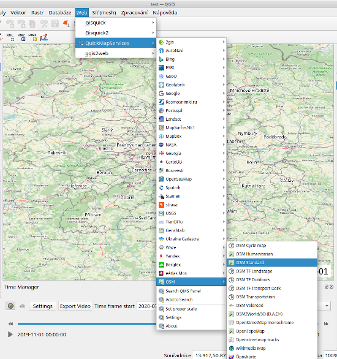

.. |checkbox_unchecked| image:: ../images/icon/checkbox_unchecked.png
   :width: 1.5em
.. |q2t| image:: ../images/icon/q2t.png
   :width: 1.5em
.. |star| image:: ../images/icon/osm_star.png
   :width: 1.5em

.. |2| image:: ../images/icon/coordinate_capture.png
   :width: 1.5em
.. |3| image:: ../images/icon/roadgraph.png
   :width: 1.5em
.. |4| image:: ../images/icon/quickmapservices.png
   :width: 1.5em
.. |5| image:: ../images/icon/geodata_cz_sk.png
   :width: 1.5em
.. |6| image:: ../images/icon/ruian.png
   :width: 1.5em
.. |7| image:: ../images/icon/evis_icon.png
   :width: 1.5em
.. |8| image:: ../images/icon/gps_importer.png
   :width: 1.5em
.. |9| image:: ../images/icon/dem.png
   :width: 1.5em
.. |checkbox| image:: ../images/icon/checkbox.png
   :width: 1.5em
.. |geographic| image:: ../images/icon/checkbox.png
   :width: 1.5em
.. |reticle| image:: ../ruzne/images/p_reticle.png
   :width: 1.5em
.. |askcor| image:: ../ruzne/images/p_askcor.png
   :width: 1.5em
.. |askcorcopy| image:: ../ruzne/images/p_askcorcopy.png
   :width: 1.5em
.. |selectcreatelayer| image:: ../images/icon/selectcreatelayer.png
   :width: 1.5em

QGIS pluginy
------------

QGIS umožňuje práci se zásuvnými moduly, tzv. :wikipedia:`pluginy
<https://en.wikipedia.org/wiki/Plug-in_(computing)>`. Ve všeobecnosti se
jedná o software, které nepracuje samostatně, ale jako doplňkový modul jiné
aplikace a tím rozšiřuje její funkčnost. V současnosti existuje pro QGIS víc než
300 zásuvných modulů. Všechny jsou napsané v programovacím jazyku `Python 
<https://www.python.org/>`_ nebo `C++ <https://isocpp.org/>`_. Mnohé z nich jsou
stále ve vývoji. Jejich kompletní seznam spolu s příslušnou charakteristikou,
informacemi například o použití, potřebné minimální verzi QGISu, domovské
stránce, autorech, o počtu stáhnutí, o tom, které jsou označené jako
nejoblíbenější je dostupný `zde <https://plugins.qgis.org/plugins/>`_.
    

Moduly jsou udržované vývojovým týmem QGISu (`QGIS Development Team
<http://qgis-development-team.software.informer.com/>`_) a jsou
automaticky součástí každé jeho distribuce. Externí pluginy jsou
napsané v programovacím jazyce Python a jsou udržovány příslušnými
autory. Chyby, angl.  *bugy* v modulech by měly být zveřejnovány a
dostupné na stránkách `projektu
<http://hub.qgis.org/projects/qgis-user-plugins>`_.

.. _spravce-plugin:

Správce zásuvných modulů
========================

V prvním kroku v menu zvolíme :menuselection:`Zásuvné moduly --> Spravovat a instalovat
zásuvné moduly`, ikona |mActionShowPluginManager|.
Spustí se dialogové okno (:numref:`vse`), které slouží k prohlížení, vypínání a
zapínání  dostupných modulů příslušné verze QGISu.

.. raw:: latex

   \newpage
	 
.. _vse:

.. figure:: images/p_vse.png
   :scale-latex: 55

   Správce zásuvných modulů v prostředí QGIS.

Pod položkou |plugin-installed| :sup:`Instalované` najdeme ty, které byly
nainstalované automaticky při instalaci QGISu. Z nich jsou některé načtené, jiné
lze dočasně povolit nebo zakázat zaškrtnutím ikonky |checkbox_unchecked|.
V případě, že klikneme na některý z modulů, zobrazí se jeho charakteristika nebo
účel, spolu s dalšími informacemi jako je název, popis, počet hodnocení a
stáhnutí modulu, reprezentující ikona, kategorie, instalovaná nebo dostupná
verze, autor, seznam změn a další. Na :numref:`plugininfo`  je znázorněný příklad
zásuvného modulu s názvem |q2t| :sup:`Qgis2threejs`.

.. _plugininfo:

.. figure:: images/p_info.png
   :scale-latex: 60
		 
   Charakteristika zásuvného modulu na prohlížení 3D objektů ve webovém
   prohlížeči.

Seznam všech dostupných pluginů je možno zobrazit a konkrétní modul načíst zvolením
|plugin| :sup:`Nenainstalováno` a spuštěním `Instalovat zásuvný modul`.
Následně se dá tento modul přeinstalovat nebo úplně odinstalovat 
(:numref:`p-instal`).  

.. raw:: latex

   \newpage

.. _p-instal:

.. figure:: images/p_instal.png
   :class: middle
		 
   Seznam nenainstalovaných modulů :fignote:`(1)`, instalace :fignote:`(2)`,
   možnost odinstalování :fignote:`(3)` nebo přeinstalování :fignote:`(4)`
   kteréhokoli z modulů.

Pod záložkou |plugin-upgrade| :sup:`Aktualizovatelný` se nachází zásuvné moduly,
které jsou dostupné i v novější verzi. Záložka |settings| 
:sup:`Nastavení` obsahuje nastavení týkající se kontroly aktualizací modulů,
experimentálních a neschválených modulů a zobrazuje i seznam repozitářů, které
lze přidávat, editovat nebo mazat, viz :numref:`akt-nast`.
Po zaškrtnutí políček |checkbox_unchecked|  při položkách `Zobrazit také 
experimentální` a `neschválené moduly` je k dispozici téměř 500 zásuvných
modulů.

.. _akt-nast:

.. figure:: images/p_akt_nast.png
   :class: middle
   :scale-latex: 60
   
   Záložky související s aktualizacemi a nastavením zásuvných modulů.

.. tip:: Seznam zásuvných modulů může uživatel uspořádat dle svých potřeb.
   Po stisknutí pravého tlačítka myši v seznamu modulů je k dispozici jejich
   uspořádání dle abecedy, počtu stáhnutí, hlasů nebo stavu (:numref:`rad`).

    .. _rad:

    .. figure:: images/p_rad.png
       :scale-latex: 60

       Možnosti seřazení zásuvných modulů.

.. note:: Je zapotřebí připomenout, že zásuvné moduly v oficiálních repozitářech
   byly testovány, nicméně jednotlivé repozitáře mohou obsahovat i méně ověřené
   moduly různé kvality a stadia vývoje. Proto je dobrou pomůckou zobrazení
   hodnocení či počtu  |star| |star| |star|.

.. tip:: Pokud známe alespoň přibližný název konkrétního modulu, při vyhledávání
   může pomoci vyplnění políčka `Hledat` v dialogovém okně. 

Příklady zásuvných modulů
=========================

V další části si částečně ukážeme některé z užitečných a často používaných
zásuvních modulů programu QGIS: 

.. only:: latex
          
   .. tabularcolumns:: |p{5cm}|p{10cm}|
                       
.. only:: html
                                 
   .. cssclass:: border

+------------------------------------------------+-------------------------------------------------+
| Zásuvný modul                			 | Charakteristika  	  	                   |
+================================================+=================================================+
| |1| :sup:`Another DXF Importer` 			 | importuje formát ``*.dxf``|
+------------------------------------------------+-------------------------------------------------+
| |2| :sup:`Získání souřadnic`     		 | získává souřadnice myši                         |
+------------------------------------------------+-------------------------------------------------+
| |3| :sup:`Zásuvný modul síťových analýz` 	 | řeší problém nejkratší cesty                    |
+------------------------------------------------+-------------------------------------------------+
| |4| :sup:`Quick Map Services`   | načítání mapových služeb			   |
+------------------------------------------------+-------------------------------------------------+
| |5| :sup:`GeoData CZ/SK`                   | mapové služby a jiné zdroje z ČR a SR	           |
+------------------------------------------------+-------------------------------------------------+
| |6| :sup:`RUIAN`		 | načítání dat z RÚIAN             |
+------------------------------------------------+-------------------------------------------------+

|1| :sup:`Another DXF Importer`
^^^^^^^^^^^^^^^^^^^^^^^^^^^^^^^

V případě, že máme k dispozici soubor AutoCAD DXF (`Drawing Exchange Format 
<https://en.wikipedia.org/wiki/AutoCAD_DXF>`_), do prostředí programu QGIS ho
umíme načíst buď přímo přes GDAL/OGR, pokud však import nedopadne podle očekávání
pak je možné využít zásovný modul Another DXF Importer. V předchozích verzích byl
dostupný také modul Konvertor Dxf2Shp, ten se však již dále nevyvíjí.

.. _dxf2shp:

.. figure:: images/p_anotherdxfimporter.png
   :scale: 70%
   :scale-latex: 45
   
   Dialogové okno modulu pro import AutoCAD DXF souboru.

Po načtení modulu ze :ref:`správce zásuvných modulů <spravce-plugin>`
se po kliknutí na ikonu |1| objeví dialogové okno, kde je zapotřebí
nastavit vstupní ``*.dxf`` soubor, název, cestu a typ nového ``*.shp``
souboru nebo GeoPackage.

.. note:: Pokud se po spuštění modulu tlačítkem :item:`OK` zobrazí dialogové
   okno související se souřadnicovými systémy, systém nastavíme.

|2| :sup:`Získání souřadnic`
^^^^^^^^^^^^^^^^^^^^^^^^^^^^

Tento zásuvný modul se používá velmi jednoduše a umožňuje zobrazení
souřadnic myši pro dva vybrané souřadnicové systémy. Dialogové okno je
zobrazeno na :numref:`zis-sur`.  Kliknutím na ikonu |geographic|
nastavíme požadovaný souřadnicový systém, zvolením |2| :sup:`Zapnout
získávání` se symbol myši změní na |reticle|. Po kliknutí do mapového
okna se objeví malá červená tečka. Její souřadnice v souřadnicovém  systému
projektu se zobrazí v okně vedle symbolu |askcor|. Na :numref:`zis-sur`
jsou na ukázku zobrazené souřadnice vybraného bodu v souřadnicových
systémech s EPSG 4326 (WGS 84) a 5514 (S-JTSK (Greenwich) / Krovak East North). 
Ikona |askcorcopy| umožňuje souřadnice kopírovat do schránky v
podobě čtyř hodnot (pro :numref:`zis-sur` by to bylo
``13.71955,49.85887,-796222.963,-1061087.065``).

.. _zis-sur:

.. figure:: images/p_zis_sur2.png

   Dialogové okno modulu na zobrazení souřadnic z mapového okna.

.. note:: Pro novou verzi QGIS byl tento modul portován a aktuálně není
   přeložen do češtiny. Funkcionalita však zústává v zásadě stejná.

|3| :sup:`Zásuvný modul síťových analýz`
^^^^^^^^^^^^^^^^^^^^^^^^^^^^^^^^^^^^^^^^

Ve vrstvě polylinií modul vypočte a následně vykreslí nejkratší cestu mezi dvěma
zvolenými body. Je napsaný v programovacím jazyku C++. Umožňuje určit
optimální trasu  na základě délky nebo času. Výsledek je automaticky
exportován jako nová vektorová vrstva. 

.. note:: Při výpočtu nejkratší cesty se doporučuje nastavit souřadnicový systém
   projektu dle souřadnicového systému vrstvy polylinií. 

Zásuvný modul aktivujeme v :ref:`panelu správce zásuvných modulů 
<spravce-plugin>`. V liště menu přejdeme na :menuselection:`Vektor --> 
Silniční graf --> Nastavení`. Zobrazí se okno, kde vyplníme základní nastavení
jako jednotku času, vzdálenosti, topologickou toleranci a další, viz 
:numref:`path-nast`. Na nastavení modulu použijeme vektorovou vrstvu cest České
republiky zobrazenou na :numref:`path-vector` dle typu.

.. _path-nast:

.. figure:: images/p_path_nast.png
   :class: small
   :scale-latex: 35

   Nastavení zásuvného modulu cestného grafu.

.. _path-vector:

.. figure:: images/p_path_vector.png
   :class: middle
   
   Silnice České republiky zobrazené dle jejich typu.

V panelu `Nejkratší cesta` použijeme |2| a v mapovém okně kliknutím zvolíme
počáteční a koncový bod cesty. Zobrazí se jako zelená, resp. červená tečka.
Následně nastavíme kritérium, t.j. délku nebo čas a potvrdíme stisknutím 
`Vypočítat`. Po proběhnutí výpočtu  se v mapovém okně zobrazí výsledek v
podobě polylinie, která se dá exportovat jako nová vektorová vrstva (použitím 
`Export`). Tlačítko `Vyčistit` slouží na smazání obsahu políček.
Postup je znázorněný na :numref:`path`.

.. raw:: latex

   \newpage

.. _path:

.. figure:: images/p_path.png
   :class: middle
        
   Použití zásuvného modulu síťových analýz a výpočet nejoptimálnější cesty.

.. tip:: Pokud nevidíme panel `Nejkratší cesta`, přidáme ho z menu lišty 
   `Zobrazit` (:menuselection:`Zobrazit --> Panely --> Nejkratší cesta`),
   jak je to znázorněno na :numref:`path-menu`.
  
    .. _path-menu:
    
    .. figure:: images/p_path_menu.png
       :class: small
       :scale-latex: 40
       
       Zobrazení dialogového okna na výpočet nejkratší cesty.

.. note:: Tento modul je možno nahradit interním algoritmem, který je dostupný
   mezi nástroji zpracování.

.. _p-path-proc:

.. figure:: images/p_path_proc.png
   :class: middle
   :scale-latex: 35

   Dialogové okno algoritmu pro hledání nejkratší cesty.

|4| :sup:`Quick Map Services`
^^^^^^^^^^^^^^^^^^^^^^^^^^^^^^^^^^^^^^^^^^^^

Pomocí tohoto zásuvného modulu je možné připojovat různé mapové služby
postavené na protokolech XYZ nebo WMS. V základním nastavení jsou např.
Open Street Map. Je však možno přidat další a také vyhledávat dle pozice.
K dispozici jsou např. i mapy.cz.

Se zásuvným modulem začneme pracovat tak, že z
menu jako :menuselection:`Web --> QuickMapServices --> ???` vybereme zdroj, který nás zajímá.

.. _p-qms-dot:

        
   Použití zásuvného modulu Quick Map Services

.. _p-qms-vysl:

.. figure:: images/p_qms_vysl.png

   Přidáná mapová služba Open Street Map.

|5| :sup:`GeoData CZ/SK`
^^^^^^^^^^^^^^^^^^^^^^^^^^^^

*GeoData CZ/SK Plugin* (:menuselection:`Zásuvné moduly --> GeoData --> Procházet datové zdroje`)
umožňuje přidávat do mapového okna množství dat z oblasti České a SLovenské republiky
obrazových služeb z XYZ a WMS zdrojů a také jiných typů zdrojů
Na :numref:`p-geodata` je dialogové okno pluginu.

.. _p-geodata:

.. figure:: images/p_geodata_cz_sk.png
   :class: large

   Ukázka dialogového okna pluginu

|6| :sup:`RUIAN`
^^^^^^^^^^^^^^^^^^^^^^^^^^^^

*RUIAN Plugin* umožňuje přidávat do mapového okna dat z registru RÚIAN
(Registr územní identifikace, adres a nemovitostí).
Na :numref:`p-ruian`  je dialogové okno pluginu.

.. _p-ruian:

.. figure:: images/p_ruian.png
   :class: large

   Ukázka dialogového okna pluginu

.. note:: Další ze zmíněných modulů budou obsahem školení QGIS pro
          pokročilé, a to především GRASS plugin.
