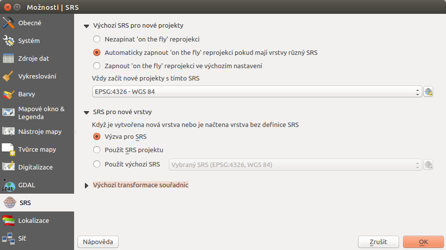
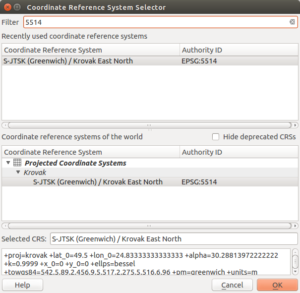

.. |set_crs| image:: ../images/icon/mActionSetProjection.png
   :width: 1.5em

Souřadnicový systém
-------------------

Definice souřadnicového systému, kartografického zobrazení a
souvisejicích témat je detailně popsáno v podkladech školení
:skoleni:`Open Source GIS <open-source-gis/soursystemy/index.html>`.

.. _sour-system:

Souřadnicový systém projektu
============================

Po instalaci je nastaven souřadnicový systém projeku na *WGS 84*
(:epsg:`4326`).  Pokud budete pracovat s daty pro území ČR, tak je
pravděpodobné, že budou v souřadnicovém systému S-JTSK (:epsg:`5514`).

Pro další práci je vhodné nastavit souřadnicový systém projektu, aby
se systém pokaždé otevřel s požadovaným nastavením. Toto nastavení je
menu v :menuselection:`Nastavení --> Možnosti...` záložka
:item:`SRS`. V části *Výchozí SRS pro nové projekty* je položka *Vždy
začít nové projekty s tímto SRS*.

 
       Menu pro nastavení CRS projektu.

Přes ikonku |set_crs| :sup:`Vyberte SRS` se vyvolá menu pro výběr souřadnicového
systému. Konkrétní souřadnicový systém je možné vybrat z nabídky nebo použít
filtrovací pole pro rychlejší vyhledání. Filtrovat lze pomocí EPSG kódu nebo
také dle názvu souřadnicového systému.

 
       Okno pro výběr CRS.

.. important:: Takováto změna se projeví při dalším spuštění systému.
    
On-the-fly transformace
^^^^^^^^^^^^^^^^^^^^^^^

V případě, že pracujete s vrstvami, které mají odlišný souřadnicový
systém než projekt, je nutné mít povolenou takzvanou "reprojekci"
(on the fly transformaci).  Toto nastavení je součástí nastavení
souřadnicového systému projektu.  V případě, že by tato transformace
nebyla povolena, tak by se vrstvy s odlišným souřadnicovým systémem
nevykreslily v mapovém okně korektně (tak aby se překrývaly).

Zda je tato transformace povolena je vidět i v stavovém řádku. EPSG kód je
doplněn o text "(OTF)".
    
.. _sour-system-vrstvy:

Souřadnicový systém nové vrstvy
===============================

Pokud budete vytvářet novou vrstvu nebo přidávat novou vrstvu bez definovaného
souřadnicového systému, tak je možné určit jim předdefinovaný souřadnicový systém.

Toto nastavení je dostupné v :menuselection:`Nastavení --> Možnosti...` záložka
:item:`SRS` v části :item:`SRS pro nové vrstvy`.  Lze zvolit konkrétní
souřadnicový systém (stejný postup jako u :ref:`projektu <sour-system>`),
vynutit si pokaždé dotaz pro zadání nebo vztáhnout nastavení k aktuálnímu
projektu.
