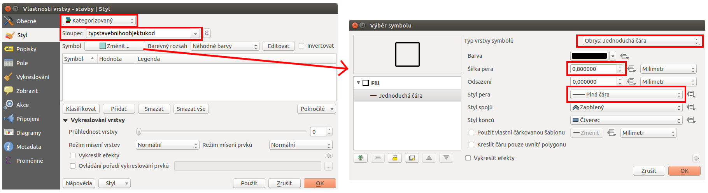

Příklad stylování kategorizovanou obrysovou čárou
-------------------------------------------------

V některých případech, zejména pokud tvoříme symbologii pro prezentaci dat, je
nutné věnovat stylování dat větší péči.
Níže je uveden případ stylování dvou vrstev - :map:`parcel a budov`, které se 
vzájemně překrývají. Data jsou získána z RÚIANu.

Zadání
^^^^^^

Nastavit styl vrstvy :map:`parcel` podle *druhu pozemku*.  Podobně
nastavit styl vrstvy :map:`stavebních objektů` a to na základě *typu
stavebního objektu*.  Jelikož se obě vrstvy vzájemně překrývají, tak
bude vrstva :map:`stavebních objektů` vykreslena pouze obrysem, tedy
bez výplně.

Nastavení stylu vrstvy parcel
^^^^^^^^^^^^^^^^^^^^^^^^^^^^^

Druh pozemku (orná půda/zahrada/zastavěná plocha a nádvoří/...) je
uveden jako jeden z atributů pomocí příslušného kódu -
:dbcolumn:`druhpozemkukod`.

Ve vlastnostech vrstvy :map:`parcely` v záložce Styl zvolíme typ stylování 
``kategorizovaný``. U položky :item:`Sloupec` vybereme atribut, podle kterého 
chceme stylovat - v našem případě :dbcolumn:`druhpozemkukod`. 
Vzhledem k tomu, že přes vrstvu parcel budeme vykreslovat ještě vrstvu budov, 
tak budeme parcely stylovat pouze výplní bez ohraničení. 
V nastavení :item:`Symbolu` proto upravíme položku :item:`Styl ohraničení` 
na hodnotu ``Bez čáry``. 

Při takovémto nastavení bude mezi jednotlivými parcelami jemná mezera,
nebude ale působit rušivě. Pokud by bychom preferovali styl bez mezery, tak
nastavíme barvu ohraničení na stejnou barvu jako je barva výplně.
Jednotlivé podstatné části nastavení jsou zvýrazněny v
:num:`#no-outline`.

.. _no-outline:

.. figure:: images/style_no_outline.png
   :class: large

   Jednotlivé kroky nastavení kategorizovaného stylování a úprava výchozího
   symbolu.
        

Dalším krokem je vytvoření barevného stylu pro každou hodnotu druhu
pozemku.  Pomocí tlačítka :item:`Klasifikovat` se vygenerují všechny
existující hodnoty pro zvolený atribut a jedna navíc.  V tomto případě
pro generování používáme ``náhodnou paletu barev``. Zvolené barvy
ručně opravíme dle svého uvážení. Kliknutím do položky :item:`symbol`
u každé hodnoty si můžeme nastavit barvu.  Dalším požadavkem je, aby
se nám v legendě nezobrazoval kód druhu pozemku ale přesná hodnota
podle číselníku `ČÚZK
<http://www.cuzk.cz/Katastr-nemovitosti/Poskytovani-udaju-z-KN/Ciselniky-ISKN/Ciselniky-k-nemovitosti.aspx#SC_D_POZEMKU>`_.
Položky legendy lze upravovat přímo.  Ukázka automaticky
vygenerovaného stylování a již upravených stylů i s popiskami pro
legendu je na zobrazena :num:`#change1`.

.. _change1:

.. figure:: images/style_colour_and_legend.png
   :class: large

   Automaticky vygenerované stylování podle zvoleného atributu a jeho manuální
   úprava - symbologie i legendy.

Výsledek stylování se projeví po uložení stylu v mapovém okně (symbologie) i 
panelu vrstev (legenda).

.. figure:: images/style_parcely.png
   :class: large
   :scale-latex: 85
              
   Výsledek předchozích kroků stylování v mapovém okně a panelu vrstev.

Nastavení stylu stavebních objektů
^^^^^^^^^^^^^^^^^^^^^^^^^^^^^^^^^^

Stavební objekty vykreslíme pouze obvodem nad vrstvou :map:`parcel`. 
Styl vykreslení jejich obvodu se bude lišit podle hodnoty atributu 
:dbcolumn:`typstavebnihoobjektukod`.

Ve vlastnostech vrstvy :map:`stavby` v záložce opět zvolíme typ
stylování ``kategorizovaný``.  U položky :item:`Sloupec` vybereme
atribut :dbcolumn:`typstavebnihoobjektukod`.  V položce nastavení
:item:`symbolu` změníme Typ vrstvy symbolů na položku
``Obrys:Jednoduchá čára``.  Dle potřeby nastavíme i :item:`šířku pera
a styl`.  V případě potřeby je ještě možné použít různé typy efektů
pro vykreslování.

   Nastavení symbolu pro vykreslování pouze obrysové čáry prvků.

Tak jako v předchozím kroku provedeme klasifikaci podle zvoleného atributu. 
V tomto případě zvolený atribut obsahuje pouze 3 různé hodnoty.
Každý vygenerovaný styl si opět můžeme upravit podle vlastních potřeb, jako i 
popisky pro legendu.

.. figure:: images/style_colour_and_legend2.png
   :class: large
    
   Ruční úprava stylů i popisků legendy je nutná i v tomto případě.

Výsledná kombinace obou stylů vrstev je ještě upravena změnou průhlednosti 
vrstvy :map:`parcel` (barvy jsou na :num:`#vysledek` jemnější).

.. raw:: latex

   \newpage

.. _vysledek:

.. figure:: images/style_parcely_stavby.png
   :class: large
   :scale-latex: 85
   
   Zobrazení obou vrstev v mapovém okně. V panelu vrstev je vidět upravené
   legendy u každé vrstvy.

.. tip::
   Vytvořený styl se ukládá jako součást QGIS projektu. 
   Styl každé vrstvy je však možné uložit jako samostatný soubor a pak jej 
   použít u další vrstvy.

   Volba pro uložení se nachází přímo v záložce styl ve spodní části. 
   Tlačítkem :item:`Styl` se otevře menu (:num:`#save`), které slouží jak
   pro uložení stávajícího stylu vrstvy, tak pro načtení uloženého stylu.

   .. _save:

   .. figure:: images/style_save.png
      
      Možnost exportu a import stylů pro vrstvu.
      
   Styly je možné uložit do dvou různých formátů - *SLD* (OGC Styled
   Layer Descriptor) a *QML* (interní soubor pro ukládání stylů
   QGISu). Oba formáty jsou soubor typu XML, takže je možné jej
   jednoduše editovat i mimo QGIS.
 

