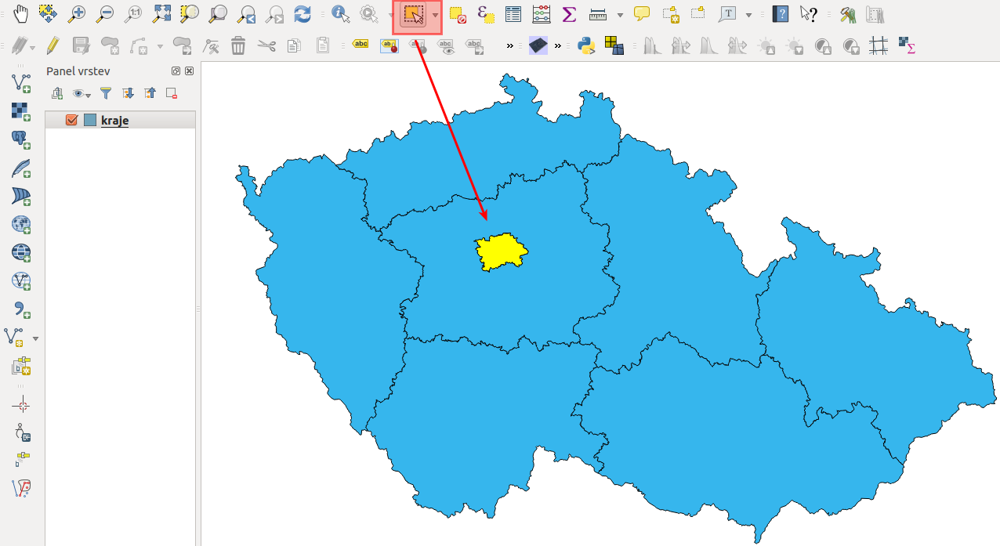
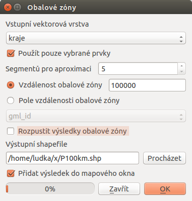
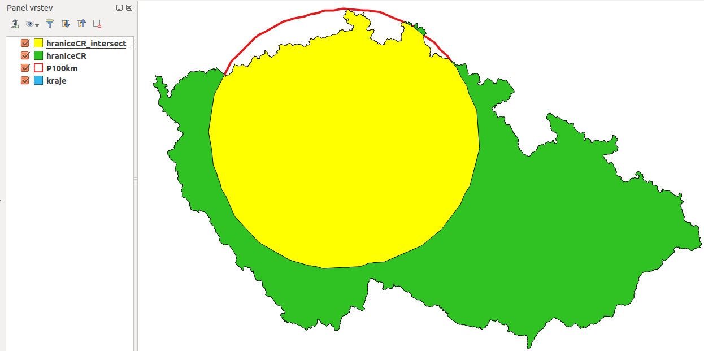
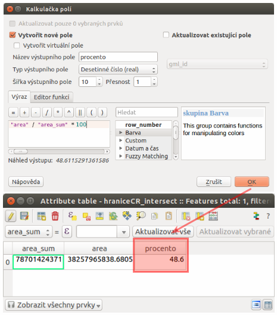

.. |srs| image:: ../images/icon/mActionSetProjection.png
   :width: 1.5em
.. |box_yes| image:: ../images/icon/checkbox.png
   :width: 1.5em
.. |mIconVectorLayer| image:: ../images/icon/mIconVectorLayer.png
   :width: 1.5em
.. |mActionSelect| image:: ../images/icon/mActionSelect.png
   :width: 1.5em
.. |buffer| image:: ../images/icon/buffer.png
   :width: 1.5em
.. |dissolve| image:: ../images/icon/dissolve.png
   :width: 1.5em
.. |mIconSelectRemove| image:: ../images/icon/mIconSelectRemove.png
   :width: 1.5em
.. |mIconEditable| image:: ../images/icon/mIconEditable.png
   :width: 1.5em
.. |mActionDeleteAttribute| image:: ../images/icon/mActionDeleteAttribute.png
   :width: 1.5em
.. |mActionCalculateField| image:: ../images/icon/mActionCalculateField.png
   :width: 1.5em
.. |intersect| image:: ../images/icon/intersect.png
   :width: 1.5em

Úkoly
-----

Prostorové analýzy
==================

Úloha č.1:
^^^^^^^^^^
Kolik procent území ČR je ve vzdálenosti do 100 km od hranic Prahy?

Data: 
^^^^^
:map:`kraje.shp`

Riešenie:
^^^^^^^^^
1. Nástrojom *Buffer* vytvoriť obalovú zónu 100 km okolo Prahy
2. Nástrojom *Dissolve* zlúčiť prvky triedy, tj. vytvoriť triedu hranice ČR
3. Nástrojom *Intersect* vytvoriť prienik vrstiev
4. V novom atribútovom poli vypočítať percentá vybranej plochy k sume pôvodnej 

Výsledek: 
^^^^^^^^^
48,1%

Po spustení programu QGIS sa zobrazí štandardné rozhranie, viď. :ref:`Popis 
rozhraní <popisrozhrani>`. Predvolene je súradnicový systém projektu nastavený
na WGS 84, čo vidíme dole vpravo (EPSG:4326). Budeme pracovať s dátami
Českej republiky, kde sa obvykle používa súradnicový systém S-JTSK (EPSG:5514).

V prvom kroku preto nastavíme súradnicový systém projektu. Z menu lišty
vyberieme :menuselection:`Nastavení --> Možnosti`. Otvorí sa dialógové okno,
kde v záložke :item:`SRS` nastavíme ``Vždy začít nové projekty s tímto SRS`` na
``EPSG:5514 - S-JTSK (Greenwich)/Křovak East North`` a to kliknutím ikonku |srs|
:sup:`Vyberte SRS`. Tento súradnicový systém nastavíme aj pre nové vrstvy
v položke ``SRS pro nové vrstvy`` a ``Použít výchozí SRS``. Na záver povolíme
|box_yes| ``"on-the-fly" SRS transformaci`` v prípade, že by sme v projekte 
pracovali s vrstvami súradnicového systému, ktorý je odlišný od systému projektu.
Postup je opísaný v časti :ref:`Souřadnicový systém<sour-system>`.

V ďalšom kroku klinknutím na |mIconVectorLayer| :sup:`Přidat vektorovou vrstvu` 
do mapového okna pridáme vrstvu :map:`kraje.shp`. Tlačidlom |mActionSelect| 
:sup:`Vybrat prvky oblastí nebo jednoklikem` klikneme do mapy na miesto, 
kde sa nachádza kraj Praha (:num:`#u-select-praha`).

.. _u-select-praha:

        
   Výber územia Prahy kliknutím do mapového okna.

Následne vytvoríme obalovú zónu 100 km od hraníc Prahy. Použijeme priestorovú
analýzu |buffer| :sup:`Buffer`. Z menu lišty vyberieme
:menuselection:`Vektor --> Nástroje geoprocessingu --> Obalové zóny`.
V dialógovom okne nastavíme vstupnú vrstvu, t.j. :map:`kraje`, zaklikneme
|box_yes| :sup:`Použít pouze vybrané prvky`, keďže chceme obalovú zónu len 
okolo konkrétneho kraja, mieru aproximácie necháme predvolenú, nastavíme však 
veľkosť obalovej zóny v metroch, názov výstupného súboru a povolíme |box_yes| 
:sup:`Přidat výsledek do mapového okna` a potvrdíme ``OK`` (:num:`#u-p100km`).  

.. _u-p100km:

        
   Tvorba obalovej zóny veľkosti 100 km okolo hraníc Prahy.

V mapovom okne pribudne vrstva :map:`P100km`. Nastavíme jej štýl (pravým 
tlačidlom myši :menuselection:`Vlastnosti --> Styl`), napr. ako na 
:num:`#u-p100km-styl`.

.. _u-p100km-styl:

.. figure:: images/u-p100km-styl.png
   :scale: 55%
        
   Nastavenie štýlu obalovej zóny.

Ďalej vytvoríme vrstvu, ktorá je zjednotením všetkých krajov, resp. vrstvu 
Českej republiky. Využijeme nástroj geoprocessingu |dissolve| :sup:`Rozpustit`. 
Predtým ešte zrušíme vybraný kraj Prahy pomocou 
|mIconSelectRemove| :sup:`Zrušit výber prvků ve všech vrstvách`. Výstupnú 
vektorovú vrstvu nazveme :map:`hraniceCR`. Dialógové okno je na 
:num:`#u-dissolve`.

.. _u-dissolve:

.. figure:: images/u-dissolve.png
   :scale: 55%
        
   Spojenie všetkých krajov do jedného polygónu pomocou nástroja *Dissolve*.

Otvoríme atribútovú tabuľku vrstvy :map:`hraniceCR` (pravým ``Otevřít 
atributovou tabulku``) a kvôli prehľadnosti vymažeme 
všetky stĺpce okrem prvého tak, že najprv zapneme editovací mód kliknutím na 
|mIconEditable| :sup:`Prepnout režim editaci`, potom zvolíme 
|mActionDeleteAttribute| :sup:`Smazat sloupec` a označíme ich názvy.
Potom použijeme kalkulačku polí, t.j. |mActionCalculateField| :sup:`Otevřít 
kalkulátor polí` a vytvoríme nový stĺpec s názvom :dbcolumn:`area_sum`, 
do ktorého vložíme hodnotu plochy polygónu. Typ výstupného poľa nastavíme ako 
``real``, šírku napr. ``10`` a ako výraz napíšeme ``$area`` (:num:`#u-area`).
Zmeny uložíme opätovným stlačením |mIconEditable|.

Nepotrebné stĺpce vymažeme aj vo vrstve :map:`P100km`.
Potom použijeme nástroj |intersect| :sup:`Průsečník`, kde vstupom budú 
vrstvy :map:`hraniceCR` a :map:`P100km`. Výsledok je na :num:`#intersect-map`.

.. _u-area:

.. figure:: images/u-hraniceCR-area.png
   :scale: 55%
        
   Vytvorenie atribútu s výmerou Českej republiky.

.. _intersect-map:

        
   Územie Českej republiky vo vzdialenosti 100 km od hraníc Prahy.

Posledným krokom je určenie percentuálnoho zastúpenia plochy republiky
do 100 km od Prahy. Najprv vypočítame plochu prieniku :map:`hraniceCR_intersect`,
pričom postupujeme podobne ako pri ploche vrstvy :map:`hraniceCR` (vytvoríme
stĺpec s názvom :dbcolumn:`area`). Potom pridáme nový atribút 
:dbcolumn:`procento`, do ktorého pomocou mapovej kalkulačky vložíme 
výsledok ``"area"/"area_sum * 100"``, ktorý je na :num:`#vysledok-u1` 
( 48,1% územia Českej republiky je vo vzdialenosti do 100 km od hraníc Prahy).

.. _vysledok-u1:

        
   Výpočet percentuálneho zastúpenia územia vo vzdialenosti do 100 km od Prahy.

