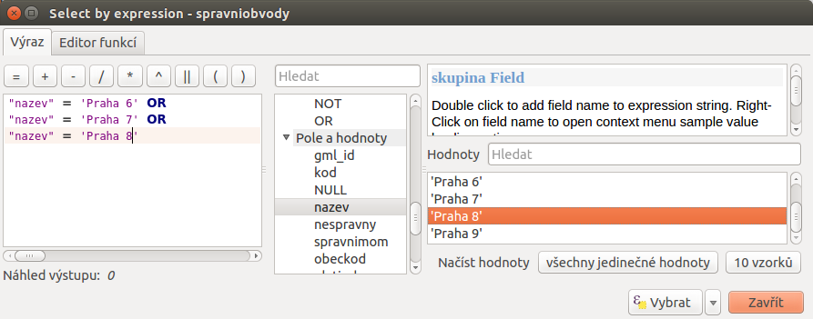
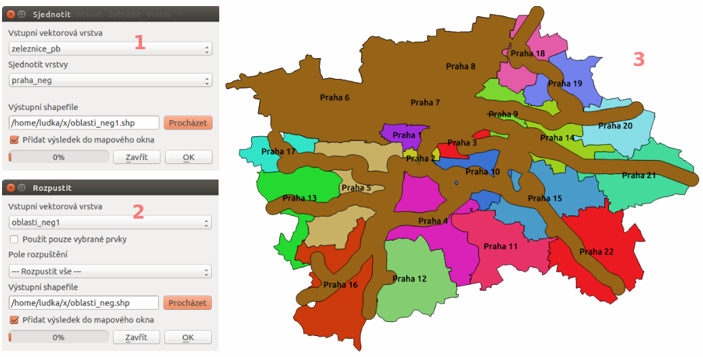
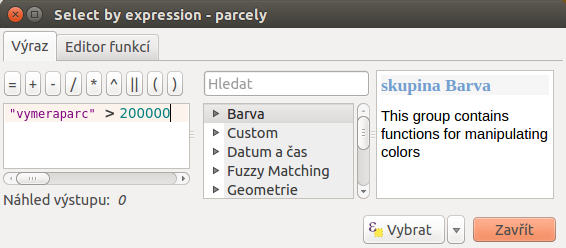

.. |srs| image:: ../images/icon/mActionSetProjection.png
   :width: 1.5em
.. |box_yes| image:: ../images/icon/checkbox.png
   :width: 1.5em
.. |box_no| image:: ../images/icon/checkbox_unchecked.png
   :width: 1.5em
.. |mIconVectorLayer| image:: ../images/icon/mIconVectorLayer.png
   :width: 1.5em
.. |mActionSelect| image:: ../images/icon/mActionSelect.png
   :width: 1.5em
.. |buffer| image:: ../images/icon/buffer.png
   :width: 1.5em
.. |dissolve| image:: ../images/icon/dissolve.png
   :width: 1.5em
.. |mIconSelectRemove| image:: ../images/icon/mIconSelectRemove.png
   :width: 1.5em
.. |mIconEditable| image:: ../images/icon/mIconEditable.png
   :width: 1.5em
.. |mActionDeleteAttribute| image:: ../images/icon/mActionDeleteAttribute.png
   :width: 1.5em
.. |mActionCalculateField| image:: ../images/icon/mActionCalculateField.png
   :width: 1.5em
.. |intersect| image:: ../images/icon/intersect.png
   :width: 1.5em
.. |mActionSaveEdits| image:: ../images/icon/mActionSaveEdits.png
   :width: 1.5em
.. |mIconExpressionSelect| image:: ../images/icon/mIconExpressionSelect.png
   :width: 1.5em
.. |union| image:: ../images/icon/union.png
   :width: 1.5em

Úkoly
-----

Priestorové analýzy
===================

Úloha č.1:
^^^^^^^^^^
Koľko percent územia ČR je vo vzdialenosti 100 km od hraníc Prahy?

Dáta: 
^^^^^
:map:`kraje.shp`

Riešenie:
^^^^^^^^^
1. Nástrojom *Buffer* vytvoríme obalovú zónu 100 km okolo Prahy.
2. Nástrojom *Dissolve* zlúčime prvky triedy, t.j. vytvoríme triedu hranice ČR.
3. Nástrojom *Intersect* vytvoríme prienik vrstiev.
4. V novom atribútovom poli vypočítame percentá vybranej plochy k sume pôvodnej. 

Postup v programovom prostredí QGIS
^^^^^^^^^^^^^^^^^^^^^^^^^^^^^^^^^^^

Po spustení programu QGIS sa zobrazí štandardné rozhranie, viď. :ref:`Popis 
rozhraní <popisrozhrani>`. Predvolene je súradnicový systém projektu nastavený
na WGS 84 s EPSG:4326, čo vidíme v stavovom riadku dole vpravo. Budeme pracovať 
s dátami Českej republiky, kde sa obvykle používa súradnicový systém S-JTSK 
(EPSG:5514).

V prvom kroku preto nastavíme súradnicový systém projektu. Z menu lišty
vyberieme :menuselection:`Nastavení --> Možnosti`. Otvorí sa dialógové okno,
kde v záložke :item:`SRS` nastavíme ``Vždy začít nové projekty s tímto SRS`` na
``EPSG:5514 - S-JTSK (Greenwich)/Křovak East North`` a to kliknutím na ikonku 
|srs| :sup:`Vyberte SRS`. Tento súradnicový systém nastavíme aj pre nové vrstvy
v položke ``SRS pro nové vrstvy`` a ``Použít výchozí SRS``. Na záver povolíme
|box_yes| ``"on-the-fly" SRS transformaci`` v prípade, že by sme v projekte 
pracovali s vrstvami súradnicového systému, ktorý je odlišný od systému projektu.
Postup je opísaný v časti :ref:`Souřadnicový systém<sour-system>`.

V ďalšom kroku kliknutím na |mIconVectorLayer| :sup:`Přidat vektorovou vrstvu` 
do mapového okna pridáme vrstvu :map:`kraje.shp`. Tlačidlom |mActionSelect| 
:sup:`Vybrat prvky oblastí nebo jednoklikem` klikneme do mapy na miesto, 
kde sa nachádza kraj Praha (:num:`#u-select-praha`).

.. _u-select-praha:

.. figure:: images/u-select-praha.png
   :class: middle
        
   Výber územia Prahy kliknutím do mapového okna.

Následne vytvoríme obalovú zónu 100 km od hraníc Prahy. Použijeme priestorovú
analýzu |buffer| :sup:`Buffer`. Z menu lišty vyberieme
:menuselection:`Vektor --> Nástroje geoprocessingu --> Obalové zóny`.
V dialógovom okne nastavíme vstupnú vrstvu, t.j. :map:`kraje`, zaklikneme
|box_yes| :sup:`Použít pouze vybrané prvky`, keďže chceme obalovú zónu len 
okolo konkrétneho kraja. Mieru aproximácie zvýšime na ``70``, pretože 
predvolená hodnota ``5`` segmentov je málo na to, aby obalová zóna odpovedala 
kruhu. Ďalej nastavíme veľkosť obalovej zóny v metroch, názov výstupného súboru 
a povolíme |box_yes| :sup:`Přidat výsledek do mapového okna` a potvrdíme ``OK`` 
(:num:`#u-p100km`).  

.. note:: Maximálny možný počet segmentov na aproximáciu je ``99``. Výhodou je 
	  síce presnejší výsledok, no výpočty môžu byť pomalšie.

.. _u-p100km:

.. figure:: images/u-p100km.png
   :scale: 50%
        
   Tvorba obalovej zóny veľkosti 100 km okolo hraníc Prahy.

V mapovom okne pribudne nová vektorová vrstva :map:`P100km`. Nastavíme jej štýl 
:menuselection:`pravým tlačidlom myši --> Vlastnosti --> Styl`, napríklad ako na 
:num:`#u-p100km-styl` transparentná výplň, ohraničenie červené a široké 1 mm.

.. _u-p100km-styl:

.. figure:: images/u-p100km-styl.png
   :scale: 55%
        
   Nastavenie štýlu obalovej zóny.

Ďalej vytvoríme zjednotenie všetkých krajov, resp. vrstvu Českej republiky.
Budeme ju potrebovať na určenie plochy celej krajiny. Využijeme nástroj 
geoprocessingu |dissolve| :sup:`Rozpustit`. 
Predtým ešte zrušíme vybraný kraj Prahy pomocou 
|mIconSelectRemove| :sup:`Zrušit výber prvků ve všech vrstvách`. Výstupnú 
vektorovú vrstvu nazveme :map:`hraniceCR`. Dialógové okno je na 
:num:`#u-dissolve`.

.. _u-dissolve:

.. figure:: images/u-dissolve.png
   :scale: 55%
        
   Spojenie všetkých krajov do jedného polygónu pomocou nástroja *Dissolve*.

Otvoríme atribútovú tabuľku vrstvy :map:`hraniceCR` (pravým ``Otevřít 
atributovou tabulku``) a kvôli prehľadnosti vymažeme 
všetky stĺpce okrem prvého tak, že najprv zapneme editovací mód kliknutím na 
|mIconEditable| :sup:`Prepnout režim editaci`, potom zvolíme 
|mActionDeleteAttribute| :sup:`Smazat sloupec` a označíme názvy tých atribútov, 
ktoré chceme vymazať. Potom použijeme kalkulačku polí, t.j. ikona v hornej lište
atibútovej tabuľky |mActionCalculateField| :sup:`Otevřít kalkulátor polí`. 
Vytvoríme nové pole s názvom :dbcolumn:`area_sum` (ako desatinné číslo), 
do ktorého vložíme hodnotu plochy polygónu. Typ výstupného poľa nastavíme teda 
ako ``real``, šírku napr. ``15`` a ako výraz napíšeme ``$area`` (:num:`#u-area`).
Zmeny uložíme ikonou |mActionSaveEdits| a editovací režim vypneme opätovným 
stlačením |mIconEditable|.

.. note:: Výraz nemusíme písať ručne. V strednom poli dialógového okna kalkulačky
	  je množstvo položiek. V našom prípade vyberieme 
	  :menuselection:`Geometrie --> $area (dvojklik)`.

.. _u-area:

.. figure:: images/u-hraniceCR-area.png
   :scale: 55%
        
   Vytvorenie atribútu s výmerou Českej republiky.

Nepotrebné stĺpce vymažeme aj vo vrstve :map:`P100km`.
Potom použijeme nástroj |intersect| :sup:`Průsečník`, kde vstupom budú 
vrstvy :map:`hraniceCR` a :map:`P100km`. Výsledok je na :num:`#intersect-map`.

.. _intersect-map:

.. figure:: images/u_intersect-map.png
   :class: middle
        
   Výsledok nástroja *Intersect*, územie Českej republiky vo vzdialenosti 100 km 
   od hraníc Prahy.

Posledným krokom je určenie percentuálneho zastúpenia plochy republiky
do 100 km od Prahy. Najprv vypočítame plochu prieniku :map:`hraniceCR_intersect`,
pričom postupujeme podobne ako pri ploche vrstvy :map:`hraniceCR` (vytvoríme
stĺpec s názvom :dbcolumn:`area`). Potom pridáme nový atribút 
:dbcolumn:`procento`, do ktorého pomocou mapovej kalkulačky vložíme 
výsledok ``"area"/"area_sum * 100"``. Ten je na :num:`#vysledok-u1` (48,6% 
územia Českej republiky je vo vzdialenosti do 100 km od hraníc Prahy).

.. _vysledok-u1:

.. figure:: images/u-vysledok-u1.png
   :scale: 70%
        
   Výpočet percentuálneho zastúpenia územia vo vzdialenosti do 100 km od Prahy.

Úloha č.2:
^^^^^^^^^^
Nájdite vhodné parcely pre výstavbu nového stavebného objektu. Kvôli prípadnému 
hluku musia byť vzdialené aspoň 300 m od železníc, ich výmera musí byť minimálne 
20 ha a mali by sa nachádzať mimo mestskej časti Praha 6, 7 a Praha 8.

.. _data-ul2:

Dáta: 
^^^^^
:map:`spravniobvody.shp, parcely.shp, zeleznice.shp`

.. _riešenie-ul2:

Riešenie:
^^^^^^^^^
1. Nástrojom *Dissolve* zlúčime správne obvody a vytvoríme vrstvu celej Prahy.
2. Nástrojom *Clip* orežeme vrstvu železníc podľa hranice Prahy.
3. Nástrojom *Buffer* vytvoríme obalovú zónu 500 m okolo pražských železníc.
4. Vyberieme správne obvody Praha 6, 7 a 8 a nástrojom *Union* ich zjednotíme
   s obalovou zónou okolo železníc (negatívne oblasti)
5. Vyberieme všetky parcely s rozlohou väčšou ako 20 ha.
6. Z vybraných parciel vyberieme tie, ktoré sú v negatívnej oblasti.
7. Nástrojom *Difference* vytvoríme vrstvu vhodných parciel pre nový stavebný 
   objekt.

Postup v programovom prostredí QGIS
^^^^^^^^^^^^^^^^^^^^^^^^^^^^^^^^^^^

Do mapového okna cez |mIconVectorLayer| :sup:`Přidat vektorovou vrstvu` pridáme
potrebné :ref:`dáta <data-ul2>`. 

Vídíme, že vrstva železníc je pre celú Českú republiku. Časti mimo Prahy 
nebudeme potrebovať, preto vrstvu orežeme. Musíme si vytvoriť hranicu mesta. 
Z menu :menuselection:`Vektor --> Nástroje geoporcessingu` vyberieme nástroj 
|dissolve| :sup:`Rozpustit`, kde ako vstupnú vektorovú vrstvu nastavíme 
:map:`spravniobvody`, pole rozpustenia na ``--- Rozpustit vše ---`` 
a výstup uložíme ako :map:`praha`.
Potom použijeme nástroj na orezanie |clipper| :sup:`Ořezávač`. Vstupom bude 
vektor železníc Českej republiky, orezávať budeme podľa novovytvorenej hranice 
Prahy :map:`Praha` a výsledok uložíme ako :map:`zeleznice_p`, teda železnice 
len na území Prahy. Dialógové okná nástrojov *Dissolve* a *Clip* sú na 
:num:`#dissolve-clip`. Následne môžeme každej vrstve 
:ref:`nastaviť štýl<styl-vrstvy>`, čím si vstupné dáta prehľadne zobrazíme 
(:num:`#vstup-ul2`). 

.. _dissolve-clip:

.. figure:: images/u-dissolve-clip.png
   :scale: 70%
        
   Použitie nástrojov *Dissolve* a *Clip*.

.. note:: Na :num:`#vstup-ul2` je pre vektorovú vrstvu :map:`parcely` 
	  nastavená jednoduchá priehľadná výplň a šedé ohraničenie 
	  s transparentnosťou ``10%``, symbol vrstvy :map:`zeleznice_p` 
	  je nastavený na ``Resident``, správne obvody 
	  sú farebne kategorizované podľa poľa :dbcolumn:`nazev`, pričom hodnoty
	  tohto atribútu sú vykreslené.

.. _vstup-ul2:

.. figure:: images/u-vstup-ul2.png
   :class: middle
        
   Správne obvody, parcely a železnice Prahy.

.. tip:: V tomto kroku je dobré si projekt uložiť, a to pomocou 
	 :menuselection:`Projekt --> Uložiť`. 

Teraz pristúpime k tvorbe obalovej zóny okolo pražských železníc, na čo 
využijeme analýzu |buffer| :sup:`Buffer`. V jeho dialógovom okne nastavíme 
vstup, mieru aproximácie na ``70``, veľkosť obalovej zóny na ``500 m``, 
zaklikneme |box_yes| :sup:`Rozpustit výsledky obalové zóny`, aby 
bola obalová zóna celistvá a výstup uložíme ako :map:`zeleznice_pb`, 
povolíme |box_yes| :sup:`Přidat výsledek do mapového okna` a spustíme ``OK``, 
viď. :num:`#zeleznice-buffer`).

.. _zeleznice-buffer:

.. figure:: images/u-zeleznice-buffer.png
   :scale: 70%
        
   Obalová zóna 500 m okolo vektorovej vrstvy pražských železníc.

Pokračujeme výberom správnych obvodov, kde sa parcela pre nový stavebný objekt
nemá nachádzať. V okne vrstiev označíme vektor :map:`spravniobvody` a v menu 
klikneme na |mIconExpressionSelect| :sup:`Vybrat prvky pomocí vzorce`. 
V strednej časti dialógového okna nájdeme položku ``Pole a hodnoty``, dvojklikom
zvolíme ``nazev``, v pravej časti klikneme na ``všechny jedinečné hodnoty`` 
a týmto spôsobom napíšeme do ľavého okna výraz ``"nazev" = 'Praha 6' OR 
"nazev" = 'Praha 7' OR "nazev" = 'Praha 8'`` (:num:`#vyraz678`), 
ktorým z vrstvy správnych obvodov vyberieme Prahu 6, Prahu 7 a Prahu 8. 
Potom pravým tlačidlo myši na vrstvu :map`spravniobvody` výber uložíme pomocou
`Uložiť jako`, nazveme ju :map:`praha_neg`. Dbáme na to, aby políčko 
|box_no| :sup:`Uložit pouze vybrané prvky` bolo zašktnuté |box_yes|.

.. note:: Operátor ``OR`` na nachádza v položke ``Operátory``.

.. _vyraz678:

        
   Výber správnych obvodov, kde vhodné parcely nebudeme hľadať.

.. note:: Po exporte zrušíme vybrané obvody Prahy pomocou |mIconSelectRemove| 
	  :sup:`Zrušit výber prvků ve všech vrstvách`.

Nasleduje spojenie "negatívnych" zón. Cieľom je dostať vektorovú vrstvu, 
ktorá je zjednotením obalovej zóny železníc a neželaných správnych obvodov.
Využijeme geoprocessný nástroj |union| :sup:`Sjednotit`. Vznikne výstup 
(napríklad :map:`oblasti_neg1`), na ktorý opäť použijeme |dissolve| 
:sup:`Rozpustit`. Výsledok pomenujeme :map:`oblasti_neg` (:num:`#neg`).

.. _neg:

        
   Zjednotenie negatívnych oblastí :fignote:`(1)`, spojenie do súvislého 
   vektora :fignote:`(2)` a zobrazenie v mapovom okne :fignote:`(3)`.

Pokračujeme krokom č. 5, viď. :ref:`Riešenie<riešenie-ul2>`. Postup je obdobný
ako pri výbere správnych obvodov pomocou |mIconExpressionSelect| 
:sup:`Vybrat prvky pomocí vzorce`. Výraz ``"vymeraparc" > 200000`` je ten, 
ktorým vyberieme parcely s výmerou nad 20 ha (:num:`#parcely20ha`).

.. _parcely20ha:

        
   Výber parciel s výmerou nad 20 hektárov.

