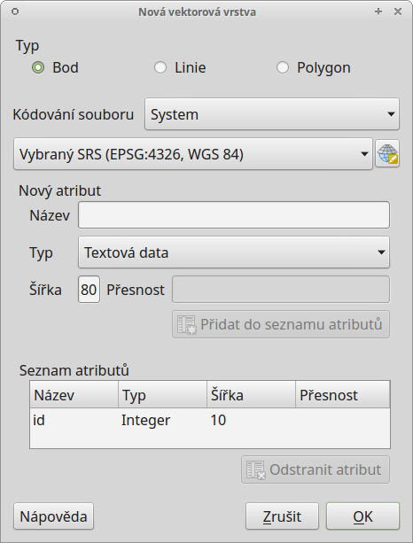

.. |selectstring| image:: ../images/icon/selectstring.png
   :width: 2.5em
.. |checkbox| image:: ../images/icon/checkbox.png
   :width: 2.5em
.. |checkbox_unchecked| image:: ../images/icon/checkbox_unchecked.png
   :width: 1.5em
.. |mActionAddOgrLayer| image:: ../images/icon/mActionAddOgrLayer.png
   :width: 1.5em
.. |mActionAllEdits| image:: ../images/icon/mActionAllEdits.png
   :width: 1.5em
.. |mActionDeleteAttribute| image:: ../images/icon/mActionDeleteAttribute.png
   :width: 1.5em
.. |mActionNewAttribute| image:: ../images/icon/mActionNewAttribute.png
   :width: 1.5em
.. |mActionCalculateField| image:: ../images/icon/mActionCalculateField.png
   :width: 1.5em
.. |splitter| image:: ../images/icon/splitter.png
   :width: 1.5em
.. |mActionReshape| image:: ../images/icon/mActionOpenTable.png
   :width: 1.5em
.. |mActionMergeFeatures| image:: ../images/icon/mActionMergeFeatures.png
   :width: 1.5em
.. |checkbox| image:: ../images/icon/checkbox.png
   :width: 1.5em
.. |mActionSplitFeatures| image:: ../images/icon/mActionSplitFeatures.png
   :width: 1.5em
.. |mActionNodeTool| image:: ../images/icon/mActionNodeTool.png
   :width: 1.5em
.. |mActionMoveFeature| image:: ../images/icon/mActionMoveFeature.png
   :width: 1.5em
.. |mActionCapturePolygon| image:: ../images/icon/mActionCapturePolygon.png
   :width: 1.5em
.. |mActionCapturePoint| image:: ../images/icon/mActionCapturePoint.png
   :width: 1.5em
.. |selectnumber| image:: ../images/icon/selectnumber.png
   :width: 1.5em
.. |mActionCaptureLine| image:: ../images/icon/mActionCaptureLine.png
   :width: 1.5em
.. |mActionToggleEditing| image:: ../images/icon/mActionToggleEditing.png
   :width: 1.5em
.. |mActionSaveAllEdits| image:: ../images/icon/mActionSaveAllEdits.png
   :width: 1.5em
.. |splitter| image:: ../images/icon/digitizing_tools/splitter.png
   :width: 1.5em
   
Tvorba nových vrstev a jejich editace
=====================================

Vytvoření Shapefile vrstvy
-------------------------
gi
Novou vrstvu lze vytovřit pomocí tlačítka |mActionAddOgrLayer| :sup:`Nová Shapefile vrstva`, nebo v hlavním menu :menuselection:`Vrstva --> Vytvořit vrstvu --> Nová Shapefile vrstva`. 

    Nová vektorová vrstva

Při vytváření zvolíme typ vrstvy (bod, linie nebo polygon), souřadnicový systém vrstvy a pokud je třeba přidáme nové atributy.

Vytváření nového atributu

- Název - název atributu (max. 10 znaků)
- Typ |selectstring|
    
    - Text (String) - formát buňek je text, nelze použít pro výpočty (max. 255 znaků)
    - Celé číslo (Intiger) - formát buňek je celé číslo, tedy bez desetinných míst (max. 10 znaků)
    - Desetinné číslo (Real) - formát buňek je desetinné číslo (max. 10 znaků)
    - Datum (Date) - formát buňek je datum (max. 20 znaků)

- Šířka - počet znaků
- Přesnost - počet desetinných míst
- pro přidání atributu vrstvy je nutné kliknout na tlačítko |mActionNewAttribute| :item:`Přidat do seznamu atributů` 

Ve spodní části okna máme seznam atributů, které máme ve vrstvě připravené. Atributy lze odstranit označením a kliknutím na tlačítko |mActionDeleteAttribute| :item:`Odstranit atribut`. Automaticky je zde přidaný atribut "id", pokud ho nechceme, lze jej také vymazat.

Pokud máme připraveno, potvrdíme tlačítkem :item:`OK`, v okně zvolíme název vrstvy a adresář, ve kterém se vrstva vytvoří a potvrdíme tlačítkem :item:`Uložit`. Vytvořená vrstva se automaticky nahraje do projektu.
   
Editace vrstvy
--------------   
   
Editaci vrstvy spustíme pomocí tlačítka |mActionToggleEditing| :sup:`Přepnout editaci` nebo v hlavním menu :menuselection:`Vrstva --> Přepnout editaci`. Spuštěním režimu editace se aktivují editační funkce v panelu a bude nám umožněno vytvářet nové prvky a jejich atributy, nebo editovat stávající. Vrstva, která je momentálně v režimu editace je v seznamu vrstev znázorěna s editační ikonkou |mActionToggleEditing|.

.. figure:: images/edit_layers_icon.png
    :scale: 90%

    Znázornění režimu editace vrstvy v seznamu vrstev

        
Režim editace ukončíme opět pomocí tlačítka |mActionToggleEditing| :sup:`Přepnout editaci`. Provedené změny je vhodné průběžně ukládat pomocí ikony |mActionSaveAllEdits| :sup:`Uložit změny vrstvy`. Pokud při editaci zapomeneme uložit změny, QGIS se nás  při ukončení editace zeptá, zda chceme provedené změny uložit či nikoliv.
        
.. tip:: |mActionAllEdits| :sup:`Aktuální změny` - hromadné ovládání změn a zapínání/vypínaní editací ve vrstvách

Základní editace geometrie
^^^^^^^^^^^^^^^^^

bodová vrstva
.............

- vytvoření prvku - |mActionCapturePoint| :sup:`přidat prvek` - kliknutím přidáme bod a zadáme atributy bodu
- posun prvku - |mActionMoveFeature| :sup:`přesunout prvek/prvky` - buď přesuneme jeden prvek, více prvků nebo pomocí výběru
- mazání prvku - odstranit vybrané prvky

liniová vrstva
..............

- vytvoření prvku - |mActionCaptureLine| :sup:`přidat prvek` - klikáním vytváříme lomové body (uzly neboli vertexy) linie, pomocí klávesnice :kbd:`backspace` je možné se vrátit se o krok zpět. Pro ukenčení tvorby prvku klikneme pravým tlačítkem a přidáme případné atributy
- posun prvku - |mActionMoveFeature| :sup:`přesunout prvek/prvky` - buď přesuneme jeden prvek, nebo pomocí výběru více prvků 
- editace lomového bodu (změna tvaru) - |mActionNodeTool| :sup:`nástroj uzlú` - lze přesouvat nebo mazat jednotlivé lomové body
- rozdelění linie - |mActionSplitFeatures| :sup:`rozdělit prvek` - naklikáme "řez" přes místa, které chceme rozdělit a pro ukončení klikneme pravým tlačítkem, linie se nám v místech průsečíků rozdělí
- sloučení prvků - |mActionMergeFeatures| :sup:`Sloučit vybrané prvky` - výběrem vybereme navazující linie nebo rozdělené linie (z předchozího krku), které chceme spojit
- změna tvaru linie - |mActionReshape| :sup:`změna tvaru prvku` - obdobně jako při tvorbě nového prvku a rozdělení prvku, lze změnit tvar prvku naklikáním nového tvaru linie přesahující přes linii, kterou cheme měnit - tím změníme průběh linie (ve cvičeních jsme zatím nedělali, ale můžete vyzkoušet)
- přichytávání kurzoru a tvorba topologicky čisté vrstvy 

    - připojení vytvářeného prvku k již vytvořenému prvku lze provést pomocí :guilabel:`přichytávání` (snapping) - :menuselection:`Nastavení --> možnosti přichytávání`
    - :guilabel:`režim přichytávání...` |selectstring| - pro aktuální vrstvu, všechny vrstvy nebo pomocí pokročílého nastavení pro konkrétní vrstvy
    - :guilabel:`přichytit k` |selectstring| - lomový bod (uzel/vertex), segment (hrana/linie), obojí
    - :guilabel:`tolerance` |selectnumber| - vzdálenost od které se vám kurzor bude k lomovému bodu nebo segmentu přichytávat
    - :guilabel:`povolit topologickou editaci` |checkbox| - při aktivaci lze pomocí `nástroje uzlů` posouvat společný lomový bod přichycení (obou prvků najednou!)
    
        - pokud není aktivní, lomový bod lze oddělit
        - lze přepínat i mimo vytváření prvků v průběhu editace
        
    - :guilabel:`povolit přichytávání na prolnutí` |checkbox| - při aktivaci se bude kurzor přichytávat i na případné místo "překřížení" segmentů (linií)                  
                                           
polygonová vrstva
.................

- vytvoření prvku - |mActionCapturePolygon| :sup:`přidat prvek` - klikáním vytváříme lomové body (uzly neboli vertexy) polygonu, pomocí klávesnice :kbd:`backspace` je možné se vrátit se o krok zpět. Pro ukenčení tvorby prvku klikneme pravým tlačítkem a přidáme případné atributy
- posun prvku - |mActionMoveFeature| :sup:`přesunout prvek/prvky` - buď přesuneme jeden prvek, nebo více prvků pomocí výběru
- editace lomového bodu (změna tvaru) - |mActionNodeTool| :sup:`nástroj uzlú` - lze přesouvat nebo mazat jednotlivé lomové body
- rozdeleni polygonu - |mActionSplitFeatures| :sup:`rozdělit prvek` - naklikáme `řez` přes místa, které chceme rozdělit a pro ukončení klikneme pravým tlačítkem, polygon se nám v místech průsečíků rozdělí
- sloučení prvků - |mActionMergeFeatures| :sup:`Sloučit vybrané prvky` - výběrem vybereme navazující polygony nebo rozdělené polygony (z předchozího krku), které chceme spojit
- změna tvaru polygonu - |mActionReshape| :sup:`změna tvaru prvku` - obdobně jako při rozdělení prvku, lze změnit tvar prvku naklikáním `řezu`, v tomto případě část s menší plochou bude vymazána - takto můžeme měnit tvar polygonů
- přichytávání kurzoru a tvorba topologicky čisté vrstvy 

    - připojení vytvářeného prvku k již vytvořenému prvku lze provést pomocí :guilabel:`přichytávání` (snapping) - :menuselection:`Nastavení --> možnosti přichytávání`
    - :guilabel:`režim přichytávání...` |selectstring| - pro aktuální vrstvu, všechny vrstvy nebo pomocí pokročílého nastavení pro konkrétní vrstvy
    
        - pokud chceme mít polygony navazující na sebe, je nutné vybrat :guilabel:`pokročilé nastavení`
        - v pokročilém nastavení, lze parametry nastavit pro každou vrstvu zvlášť, navíc je zde funkce |checkbox| `Avoid intersection`, která zabraňuje polygonům jejich překryv, jednoduše řečeno - po vytvoření navazujícího polygonu můžeme vytvořit polygon přesahující do již existujícího polygonu, tento přesah bude potom automaticky vymazán
        
    - :guilabel:`přichytit k` |selectstring| - lomový bod (uzel/vertex), segment (hrana/linie), obojí
    - :guilabel:`tolerance` |selectnumber| - vzdálenost od které se vám kurzor bude k lomovému bodu nebo segmentu přichytávat
    - :guilabel:`povolit topologickou editaci` |checkbox| - při aktivaci lze pomocí `nástroje uzlů` posouvat společný lomový bod přichycení (obou prvků najednou!)
    
        - pokud není aktivní, lomový bod lze oddělit
        - lze přepínat i mimo vytváření prvků v průběhu editace
        
    - :guilabel:`povolit přichytávání na prolnutí` |checkbox| - při aktivaci se bude kurzor přichytávat i na překryté lomové body a segmenty (v případě nepoužití `Avoid interesection` |checkbox_unchecked|, kdy máte polygony přesahující přes sebe)    
               
.. tip:: Funkce rozdělení polygonu pomocí linie - |splitter| :sup:`split by lines` ze zásuvného modulu :guilabel:`Digitizing tools`
     
    - nejprve je třeba výběrem označit jak polygon který chceme rozdělit, tak linii, která bude polygon rozdělovat
    - spustíme funkci -> v nabídce |selectstring| vybereme liniovou vrstvu (ve které je vybraný prvek, který bude polygon rozdělovat)
    - Využití:
    
        - Touto funkcí můžeme nahradit funkci :guilabel:`Avoid intersection` při přichytávání (u linií není možná), nechtěnou část polygonu potom odstraníme. Takto můžeme vytvořit topologicky čistou (bez mezer či přesahů) hranici polygon/linie
        - můžeme takto "vklínit" liniový prvek (cestu, vodní tok, transekt) do polygonu, který tímto rozdělíme na více částí
        
        
Editace atributové tabulky
^^^^^^^^^^^^^^^^^^^^^^^^^^

Pokud máme aktivní editaci (|mActionToggleEditing| :sup:`Přepnout editaci`), můžeme editovat nejen geometrii, ale i atributovou tabulku vrstvy.

    - kliknutím do libovolného pole můžeme vepisovat a upravovat hodnoty do tabulky
    

        
    - |mActionNewAttribute| :sup:`Nový sloupec` - přidá nový atribut do tabulky
    - |mActionDeleteAttribute| :sup:`Smazat sloupec` - vyvolá nabídku, ze které vybereme sloupce k vymazání
    
    
kalkulátor polí
^^^^^^^^^^^^^^^
 provádět výpočty atd. pomocí |mActionCalculateField| :sup:`Otevřít kalkulátor polí`

