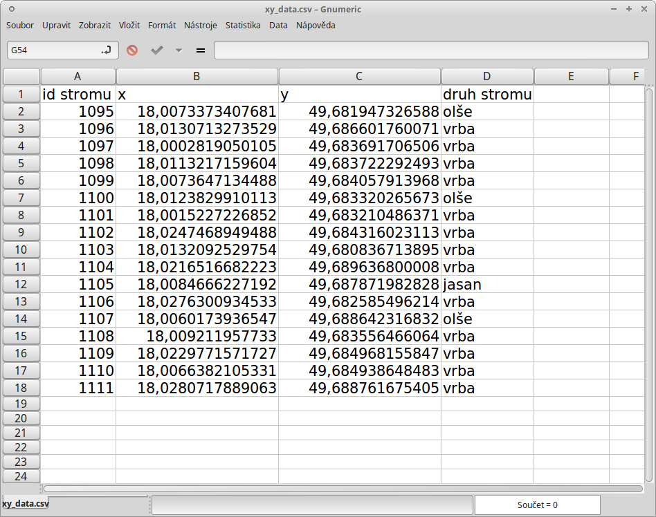

.. |selectstring| image:: ../images/icon/selectstring.png
   :width: 2.5em
.. |checkbox| image:: ../images/icon/checkbox.png
   :width: 1.5em
.. |radiobuttonon| image:: ../images/icon/radiobuttonon.png
   :width: 1.5em
.. |selectnumber| image:: ../images/icon/selectnumber.png
   :width: 2.5em
.. |mActionAddDelimitedTextLayer| image:: ../images/icon/mActionAddDelimitedTextLayer.png
   :width: 1.5em
.. |mActionRefresh| image:: ../images/icon/mActionRefresh.png
   :width: 1.5em

Import dat s oddělenými hodnotami
=================================
Data s oddělenými hodnotami (:wikipedia-en:`DSV <delimiter-separated values>`) jsou tabulková data uložená v textovém souboru. V takovém souboru jsou sloupce odděleny specifickým oddělovacím znakem a řádky koncem řádku. Pro oddělení hodnot můžeme použít jakýkoliv znak, ale nejčastěji se stkáváme s hodnotami oddělené čárkou (:wikipedia:`CSV`) nebo tabulátorem (:wikipedia-en:`TSV <Tab-separated_values>`). Soubory tabulkových procesorů lze snadno exportovat do textového souboru s oddělenýmí hodnotami, tyto soubory lze potom prohlížet jak pomocí tabulkových procesorů tak i textových editorů.

Existují dva způsoby jak mohou být prostorová data v souboru s oddělenými hodnotami uložena:

    - jako x,y souřadnice bodů v oddělených slopcích (tzv. XY data)
    - jako well-known text (:wikipedia-en:`WKT <Well-known_text>`)

.. _xydata:

    
    Příklad tabulky s vhodnými XY daty
    

Import se provadí pomocí funkce |mActionAddDelimitedTextLayer| :sup:`Přidat vrstvu s odděleným textem`

.. _delimited:

.. figure:: images/delimited.png
    
    Okno funkce |mActionAddDelimitedTextLayer| :sup:`Přidat vrstvu s odděleným textem`

|

- :item:`Jméno souboru` - cesta a název souboru, můžeme vyhledat soubor pomocí tlačítka :item:`Procházet...`
- :item:`Název vrstvy` - název nově vzniklé vrstva
- :item:`Formát souboru` |radiobuttonon| - vybreme typ oddělení hodnot v textovém souboru
        
    - |radiobuttonon| :sup:`CSV (hodnoty oddělené čárkou)` - standartní .csv soubor s hodnotami oddělenými čárkou
    - |radiobuttonon| :sup:`Vlastní oddělovače` - výběr libovolného oddělovače
    - |radiobuttonon| :sup:`Oddělovač regulárního výrazu` - použití regulárního výrazu
    
- :item:`Možnost záznamu`
        
    - :item:`Počet řádků k vypuštění` |selectnumber| - vynechá zdadaný počet rádků na začátku (shora)
    - |checkbox| :item:`První záznam obsahuje názvi polí` - zaškrtneme pokud máme v tabulce jako první řádek názvy sloupců 
    
- :item:`Možnosti pole`
    
    - |checkbox| :option:`Oříznout pole` - smaže přebytečné mezery v datech např. na konci nebo začátku záznamu 
    - |checkbox| :option:`Zrušit prázdná pole` - odstraní prázdné sloupce
    - |checkbox| :option:`Desetinný oddělovač je čárka` - zaškrtneme pokud v datech nemáme oddělena desetinná čísla tečkou, ale čárkou
    
- :item:`Definice geometrie`
        
    - |radiobuttonon| :sup:`Souřadnice bodu` - body definovány souřadnicemi X a Y (XY Data)
        
        - :option:`X pole`, `Y pole` |selectstring| - výběr sloupců, ve kterých jsou zapsané souřadnice
        - |checkbox| :option:`DMS souřadnice` - zašrtneme pokud máme souřadnice ve tvaru DMS (degrees-minutes-seconds) - stupně, minuty, vteříny
               
    - |radiobuttonon| :sup:`Well known text (WKT)`- souřadnice uložené jako řetězec WKT (např. POINT(1.525622 51.20836))
        
        - :option:`Pole geometrie` |selectstring| - výběr sloupce, ve kterém jsou zapsané souřadnice
        - :option:`Geometrický typ` |selectstring| - typ geometrie
            
    - |radiobuttonon| :sup:`Žádna geometrie (pouze atributová tabulka)` - přidá pouze tabulku, stejného výsledku dosáhneme, když do projektu přidáme .csv soubor přetažením s prohlížeče souborů
  
- :item:`Nastavení vrstvy`
    
    - |checkbox| :option:`Použít prostorový index` - vytvoří prostorový index pro rychlejší práci s daty - vhodnější pro objemné soubory
    - |checkbox| :option:`Use subset index` - vytvoří index subsady prvků
    - |checkbox| :option:`Sledovat soubor` - sledování změn souboru za běhu QGIS, při aktualizaci |mActionRefresh| se projeví změny souboru (např. přidání dalších dat do řádků) ve vrstvě
    
    - ve spodní části okna vidíme náhled vkládaných dat

Po potvrzení importu stisknutím tlačítka :item:`Ok` se objeví okno, kde musíme definovat souřadnicový systém, ve kterém jsou importované souřadnice zapsány.

.. tip:: Pokud máme v tabulce souřadnice zapsané v takové formě, že je nedokážeme importovat, můžeme hodnoty upravit pomocí funkcí tabulkového procesoru (LEFT, RIGHT atd.)

