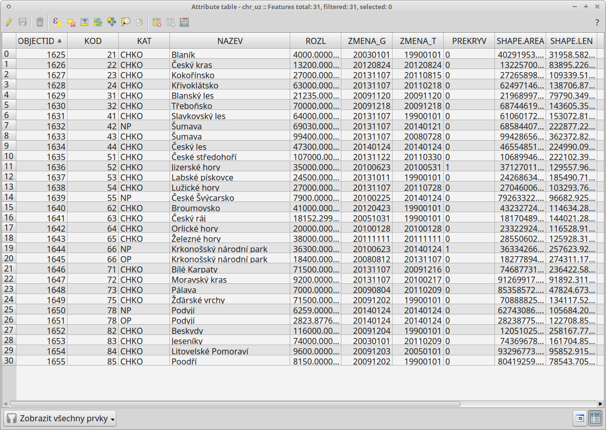

.. |symbology image:: ../images/icon/symbology.png
   :width: 2em
.. |selectstring| image:: ../images/icon/selectstring.png
   :width: 2.5em
.. |symbologyAdd| image:: ../images/icon/symbologyAdd.png
   :width: 1.5em
.. |symbologyRemove| image:: ../images/icon/symbologyRemove.png
   :width: 1.5em
.. |mActionOpenTable| image:: ../images/icon/mActionOpenTable.png
   :width: 1.5em

Vlastnosti vrstvy
=================

Vlastnosti
----------

Vlastnosti vyvoláme dvojklikem na vrstvu nebo pravým kliknutím vyvoláme kontextové menu a zvolíme :item:`vlastnosti` 

Obecné
^^^^^^

V první záložce nalezneme základní informace o nahrané vrstvě jako název vrstvy, zdroj, kódování znaků, SRS ...

.. figure:: images/properties.png

    Vlastnosti vektorové vrstvy

   
Styl (symbologie) 
^^^^^^^^^^^^^^^^^

Pomocí rolovací nabídky |selectstring| vybereme typ symbologie
    
    - :guilabel:`jednoduchý symbol` - zde máme na výběr z uložených symbolů. V levém sloupci máme zobrazený typ symbolu a jeho jednotlivé části. Při kliknutí na konkrétní část symbolu můžeme měnit její vlastnosti (Barvy, Typ výplně, Šířka ohraničení atd.). 
    
    
    .. figure:: images/symbol_simple.png

        Vlastnosti části symbologie        
        
    .. tip:: Pomocí tlačítek můžeme další části symbolu přidávat |symbologyAdd|, odebírat |symbologyRemove|, zamykat nebo měnit jejich pořadí. Tímto způsobem si můžeme vytvořit vlastní symbologii
        
    - :guilabel:`kategorizovaný` - vhodný pro katogoriální proměnné
        
            - :guilabel:`sloupec` - pro výběr atributu
            - :guilabel:`barevný rozsah` - výběr barev
            - pro vytvoření kategorii kliknout na :guilabel:`klasifikovat`
            
    - :guilabel:`odstupňovaný` - vhodný pro spojité proměnné
        
            - obdobné jako u předešlého
            - možnost režimu intervalů a počet tříd
            
Popisky
^^^^^^^
        
zaškrtnout vytvořit popisky a vybrat atribut
        
Metadata
^^^^^^^^

informace o vrstvě
 
    
Atributová tabulka
------------------

Atributovou tabulku otevřeme pomocí ikony |mActionOpenTable| :sup:`Otevřít atributovou tabulku` nebo pravým kliknutím vyvoláme kontextové menu a zvolíme :item:`Otevřít atributovou tabulku` 

    Atributová tabulka vrstvy
      
