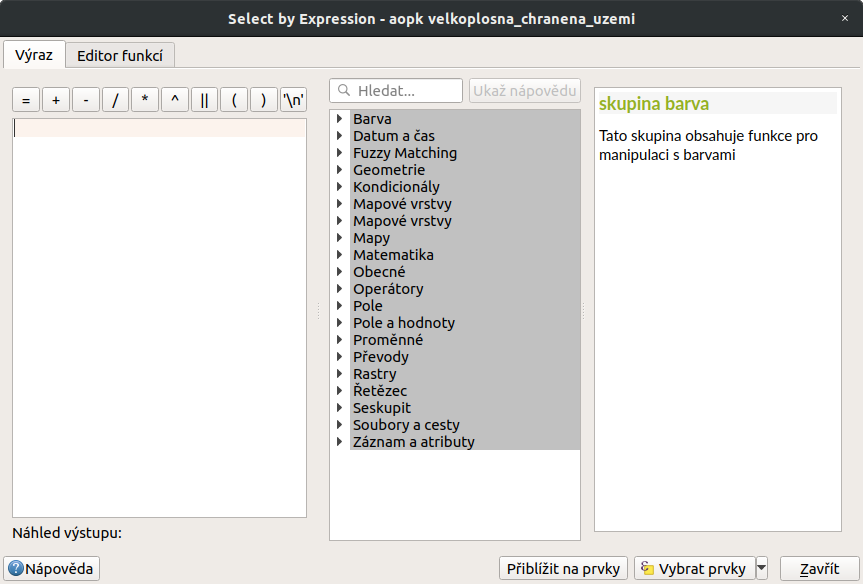
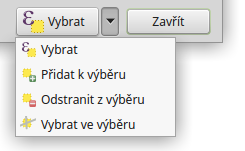
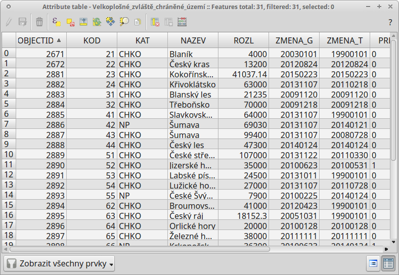
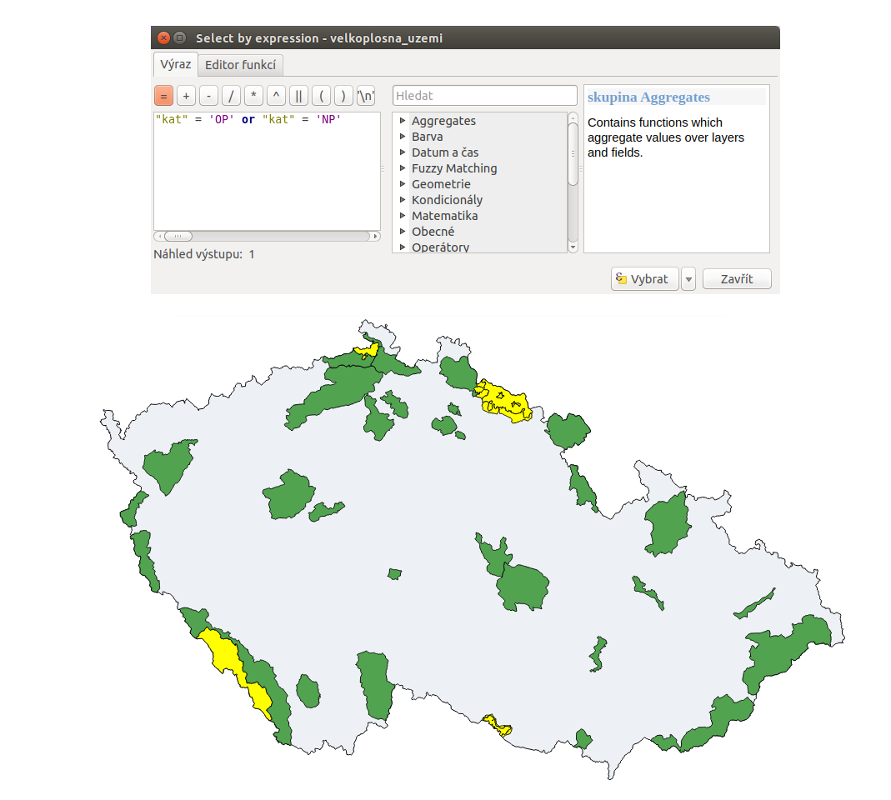
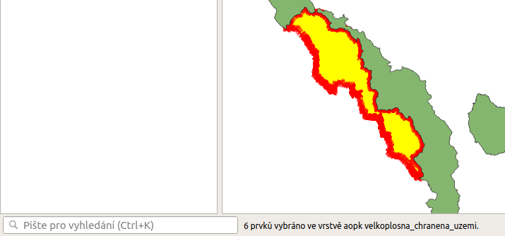
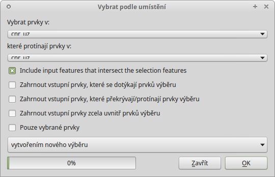

.. |mIconExpressionSelect| image:: ../images/icon/mIconExpressionSelect.png
    :width: 1.5em
.. |mActionCalculateField| image:: ../images/icon/mActionCalculateField.png
   :width: 1.5em
.. |select_location| image:: ../images/icon/select_location.png
   :width: 1.5em
.. |random_selection| image:: ../images/icon/random_selection.png
   :width: 1.5em 
.. |sub_selection| image:: ../images/icon/random_selection.png
   :width: 1.5em 
.. |selectstring| image:: ../images/icon/selectstring.png
   :width: 1.5em
.. |checkbox| image:: ../images/icon/checkbox.png
   :width: 1.5em  

Atributové a prostorové dotazování
==================================

.. _atrdotaz:

Atributové dotazování
---------------------

Atributové dotazování slouží k vytvoření výběru prvků z vektorové vrstvy 
dle námi zadaných kritérií. 
Funkce, která toto umožňuje je |mIconExpressionSelect| :sup:`Vybrat prvky pomocí 
vzorce` a můžeme jí spustit buď z nástrojového panelu, nebo z atributové tabulky 
dané vrstvy. Dialogové okno vypadá obdobně jako okno kalkulátoru polí 
|mActionCalculateField| a zadávání výrazu zde funguje na stejném principu. 
Tedy v levé části okna (:item:`Výraz`) je prostor pro zadání požadovaného výrazu 
a pravá část okna (:item:`Funkce`) slouží k rychlému přidání funkcí nebo 
parametrů do výrazu.

    Okno atributového dotazování.

Po zadání našeho výrazu potvrdíme tlačítkem |mIconExpressionSelect|
:item:`Vybrat`, čímž se nám vytvoří požadovaný výběr. Z nabídky vedle tlačítka 
můžeme vybrat další možnosti práce s výběrem pomocí atributového dotazu.

    
    Další možnosti práce s výběrem pomocí atributového dotazu.

.. tip:: V levé části stavového řádku vidíme aktuální počet vybraných 
    prvků (viz :num:`expstatus`).
    
Uvedeme si jednoduchý příklad atributového dotazu. Z vrstvy *Velkoplošných 
zvláště chráněných území*, potřebujeme vybrat národní parky a jejich ochranná 
pásma. Podmínkou samozřejmě je, že musíme mít takovou informaci o prvcích v 
atributové tabulce.

    
    Informace o prvcích v atributové tabulce.
    
Formulace našeho dotazu by v mluveném slově vypadala přibližně takto: "Vyber 
takové prvky, které mají buď atribut :option:`KAT` s hodnotou :option:`NP` nebo 
atribut :option:`KAT` s hodnotou :option:`OP`". Výraz, který potřebujeme vepsat 
do dialogového okna:
    
.. code-block:: sql

    "KAT" = 'OP' or "KAT" = 'NP' 
    

   
   Výsledek atributového dotazu ("KAT" = 'OP' or "KAT" = 'NP') ve vrstvě 
   Velkoplošných zvláště chráněných území .
    
.. _expstatus:
    

   
   Výpis počtu vybraných prvků (v levé části stavového řádku).
   
    
Prostorové dotazování
---------------------

Prostorové dotazování slouží k vytvoření výběru prvků na základě prostorového 
vztahu dvou vektorových vrstev. Funkce, která toto umožňuje je 
|select_location| :sup:`Vybrat podle umístění...` a najdeme ji v menu 
:menuselection:`Vektor --> Výzkumné nástroje --> Vybrat podle umístění...`

   
   Okno :guilabel:`Vybrat podle umístění`.

- :guilabel:`Vybrat vrstvy v` |selectstring| - vybereme vrstvu, ve které chceme 
  tvořit výběr 
- :guilabel:`které protínají prvky v` |selectstring| - vybereme vrstvu, podle 
  které se prvky budou vybírat
- |checkbox| :guilabel:`Include input features that intersect the selection 
  features` - vybere prvky, které se jakkoliv protínají
- |checkbox| :guilabel:`Zahrnout vstupní prvky, které se dotýkají prvků 
  výběru` - vybere prvky se společnou hranicí nebo lomovým bodem
- |checkbox| :guilabel:`Zahrnout vstupní prvky, které překrývají/protínají prvky 
  výběru` - vybere pouze prvky, které se protínají jen z části
- |checkbox| :guilabel:`Zahrnout vstupní prvky zcela uvnitř prvků 
  výběru` - vybere pouze prvky, které se protínají celou rozlohou (např. celý 
  polygon uvnitř polygonu)
- |checkbox| :guilabel:`Pouze vybrané prvky` - nový výběr se bude vytvářet nad 
  aktuálním výběrem
- možnosti výběru |selectstring| 
        
    - :guilabel:`vytvořením nového výběru` - zruší stávající výběr a vytvoří 
      zcela nový
    - :guilabel:`přidáním do aktuálního výběru` - k aktuálnímu výběru přidá 
      nadefinovaný výběr
    - :guilabel:`odstraněním z aktuálního výběru` - z aktuálního výběru odebere 
      prvky, které nadefinujeme
      
Příklad prostorového dotazu (:num:`sellocpriklad`) - zajímá nás, která
maloplošná chráněná území leží celou rozlohou ve velkoplošném chráněném
území. Prostorový dotaz bude vypadat takto: vyber prvky z vrstvy
:map:`maloplosna_uzemi`, které jsou prvky zcela uvnitř prvků ve vrstvě
:map:`velkoplosna_uzemi`.

.. _sellocpriklad:
 
.. figure:: images/select_by_location_priklad.png
    
   Výběr maloplošných chráněných území, které leží uvnitř velkoplošných 
   chráněných územích.

.. noteadvanced:: Pomocí funkcí 
   |random_selection| :sup:`Náhodný výběr...`/|sub_selection| :sup:`Náhodný 
   výběr v podmonožinách...` můžeme tvořit náhodné výběry z prvků. Tyto 
   funkce najdeme v hlavním menu :menuselection:`Vektor --> Výzkumné nástroje`.
