.. |selectstring| image:: ../images/icon/selectstring.png
   :width: 2.5em
.. |checkbox| image:: ../images/icon/checkbox.png
   :width: 1.5em
.. |checkbox_unchecked| image:: ../images/icon/checkbox_unchecked.png
   :width: 1.5em
.. |mActionAddOgrLayer| image:: ../images/icon/mActionAddOgrLayer.png
   :width: 1.5em
.. |mActionAllEdits| image:: ../images/icon/mActionAllEdits.png
   :width: 1.5em
.. |mActionDeleteAttribute| image:: ../images/icon/mActionDeleteAttribute.png
   :width: 1.5em
.. |mActionNewAttribute| image:: ../images/icon/mActionNewAttribute.png
   :width: 1.5em
.. |mActionCalculateField| image:: ../images/icon/mActionCalculateField.png
   :width: 1.5em
.. |mActionReshape| image:: ../images/icon/mActionReshape.png
   :width: 1.5em
.. |mActionMergeFeatures| image:: ../images/icon/mActionMergeFeatures.png
   :width: 1.5em
.. |checkbox| image:: ../images/icon/checkbox.png
   :width: 1.5em
.. |mActionSplitFeatures| image:: ../images/icon/mActionSplitFeatures.png
   :width: 1.5em
.. |mActionNodeTool| image:: ../images/icon/mActionNodeTool.png
   :width: 1.5em
.. |mActionMoveFeature| image:: ../images/icon/mActionMoveFeature.png
   :width: 1.5em
.. |mActionCapturePolygon| image:: ../images/icon/mActionCapturePolygon.png
   :width: 1.5em
.. |mActionCapturePoint| image:: ../images/icon/mActionCapturePoint.png
   :width: 1.5em
.. |selectnumber| image:: ../images/icon/selectnumber.png
   :width: 2.5em
.. |mActionCaptureLine| image:: ../images/icon/mActionCaptureLine.png
   :width: 1.5em
.. |mActionToggleEditing| image:: ../images/icon/mActionToggleEditing.png
   :width: 1.5em
.. |mActionSaveAllEdits| image:: ../images/icon/mActionSaveAllEdits.png
   :width: 1.5em
.. |splitter| image:: ../images/icon/digitizing_tools/splitter.png
   :width: 1.5em
.. |plugin| image:: ../images/icon/plugin.png
   :width: 1.5em

Tvorba nových vrstev a jejich editace
=====================================

Vytvoření Shapefile vrstvy
--------------------------
Novou vrstvu lze vytovřit pomocí tlačítka |mActionAddOgrLayer| :sup:`Nová
Shapefile vrstva`, nebo v hlavním menu :menuselection:`Vrstva --> Vytvořit
vrstvu --> Nová Shapefile vrstva`.

.. figure:: images/new_layer.png
    :scale: 75%

    Nová vektorová vrstva

Při vytváření zvolíme typ vrstvy (bod, linie nebo polygon), souřadnicový
systém vrstvy a pokud je třeba přidáme nové atributy.

Vytváření nového atributu

- :item:`Název` - název atributu (max. 10 znaků)
- :item:`Typ` |selectstring|

    - :option:`Text` (String) - formát buňek je text, nelze použít pro
      výpočty (max. 255 znaků)
    - :option:`Celé číslo` (Intiger) - formát buňek je celé číslo,
      tedy bez desetinných míst (max. 10 znaků)
    - :option:`Desetinné číslo` (Real) - formát buňek je desetinné
      číslo (max. 10 znaků)
    - :option:`Datum` (Date) - formát buňek je datum (max. 20 znaků)

- :item:`Šířka` - počet znaků
- :item:`Přesnost` - počet desetinných míst
- pro přidání atributu vrstvy je nutné kliknout na tlačítko
  |mActionNewAttribute| :item:`Přidat do seznamu atributů`

Ve spodní části okna máme seznam atributů, které máme ve vrstvě
připravené. Atributy lze odstranit označením a kliknutím na tlačítko
|mActionDeleteAttribute| :item:`Odstranit atribut`. Automaticky je zde
přidaný atribut "id", pokud ho nechceme, lze jej také vymazat.

Pokud máme připraveno, potvrdíme tlačítkem :item:`OK`, v okně zvolíme
název vrstvy a adresář, ve kterém se vrstva vytvoří a potvrdíme
tlačítkem :item:`Uložit`. Vytvořená vrstva se automaticky nahraje
do projektu.

Editace vrstvy
--------------

Editaci vrstvy spustíme pomocí tlačítka |mActionToggleEditing|
:sup:`Přepnout editaci` nebo v hlavním menu :menuselection:`Vrstva -->
Přepnout editaci`. Spuštěním režimu editace se aktivují editační funkce
v panelu a bude nám umožněno vytvářet nové prvky a jejich atributy,
nebo editovat stávající. Vrstva, která je momentálně v režimu editace
je v seznamu vrstev znázorěna s editační ikonkou |mActionToggleEditing|.

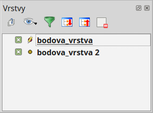

    Znázornění režimu editace vrstvy v seznamu vrstev

Režim editace ukončíme opět pomocí tlačítka |mActionToggleEditing|
:sup:`Přepnout editaci`. Provedené změny je vhodné průběžně ukládat
pomocí ikony |mActionSaveAllEdits| :sup:`Uložit změny vrstvy`. Pokud při
editaci zapomeneme uložit změny, QGIS se nás  při ukončení editace
zeptá, zda chceme provedené změny uložit či nikoliv.

.. tip:: |mActionAllEdits| :sup:`Aktuální změny` - hromadné ovládání
   změn a zapínání/vypínaní editací ve vrstvách

Základní editace geometrie
^^^^^^^^^^^^^^^^^^^^^^^^^^

- |mActionCapturePoint|, |mActionCaptureLine|, |mActionCapturePolygon|
:sup:`přidat prvek` - kliknutím vytvoříme prvek (bod), nebo lomové
body prvku (linie, polygon). V druhém případě ukončíme tvorbu prvku
kliknutím pravým tlačítkem a přidáme případné atributy. Při
přidávání lomových bodů je možné se vrátit o krok zpět pomocí
klávesy :kbd:`Backspace` nebo :kbd:`Del`.

.. figure:: images/edit_polygon.png

    Vytváření nového prvku ve vrstvě polygonů. Pokud by v tomto momentě
    byla tvorba prvku pravým kliknutím ukončena, polygon by měl tři uzly
    (tvar trojúhelníku)

- |mActionMoveFeature| :sup:`Přesunout prvek/prvky` - tažením přesuneme
  jeden prvek, nebo více prvků ve výběru

.. figure:: images/edit_polygon_move.png

    Přesun prvku tažením

- |remove| :sup:`Vymazat vybrané` - smaže vybrané prvky

- |mActionNodeTool| :sup:`Nástroj uzlú` - pomocí nástroje uzlů lze
  jednotlivé lomové body: přidávat dvojklikem, přesouvat tažením,
  mazat označením levým klikem a stisknutí klávesy :kbd:`Backspace`
  nebo :kbd:`Del`

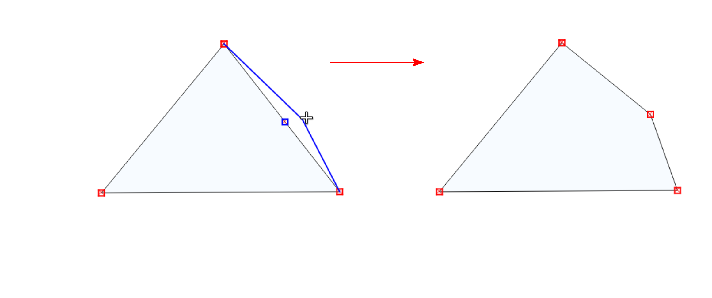

    Přidání a přesunutí lomového bodu (uzlu, vertexu)

- |mActionSplitFeatures| :sup:`Rozdělit objekt` - naklikáme "řez" přes
  místa, které chceme rozdělit a pro ukončení klikneme pravým tlačítkem,
  prvek se nám v místech průsečíků rozdělí

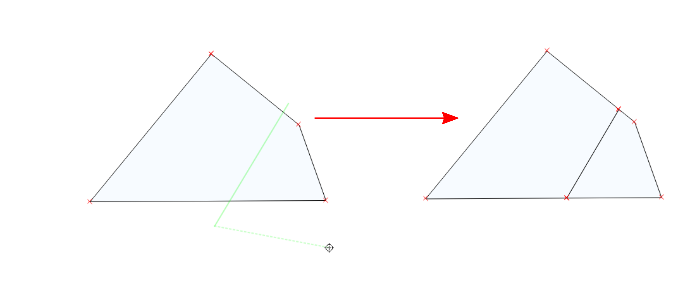

    Rozdělení polygonu na dva

- |mActionMergeFeatures| :sup:`Sloučit vybrané prvky` - nejdříve pomocí
  výběru označíme navazující objekty, které chceme spojit. Při sloučení
  vyskočí okno, ve kterém je možné zadat atributy "nového" - sloučeného
  prvku. Vychozí hodnota atributů je :option:`NULL` tedy žádná hodnota.

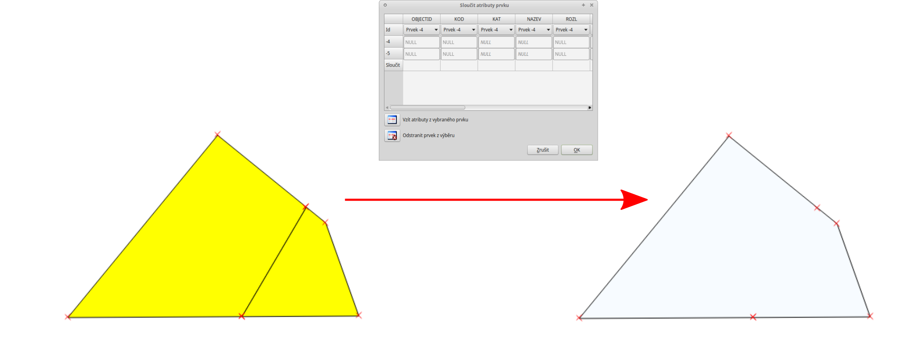

    Sloučení sousedních polygonů

- |mActionReshape| :sup:`Změnit tvar prvků` - obdobně jako při rozdělení
  nebo tvorbě nového prvku, lze naklikáním nového tvaru změnit tvar
  stávajícího prvku. Pro změnu tvaru musí být při naklikávání "řezu"
  vždy minimálně dva průsečíky. V případě změny tvaru polygonu bude
  část s menší plochou vymazána (:num:`#resh1`).

.. _resh1:

.. figure:: images/edit_polygon_resh.png

    Změna tvaru polygonu - zmenšení

.. figure:: images/edit_polygon_resh2.png

    Změna tvaru polygonu - zvětšení

.. figure:: images/edit_line_resh.png

    Změna tvaru linie

Přichytávání (snapping)
.......................

Pro topologicky čistou editaci můžeme pomocí funkce
:menuselection:`Nastavení --> Možnosti přichytávání` nastavit
přichytávání kurzoru s určitou citlivostí k uzlům či segmentům
konkrétních vrstev. Pro aktivaci je nunté vybrat parametr :item:`Přichytit
k`. Přichycení kurzoru se zobrazí výrazně růžovým křížkem
(viz. :num:`#snapvert` a :num:`snapsegm`).

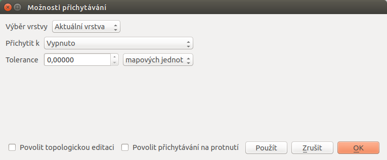

    Základní okono možnosti přichytávání

- :item:`Režim přichytávání...` |selectstring|

    - :option:`Aktuální vrstva` - přichytávání pouze v rámcí editované
      vrstvy, ostatní vrstvy ignoruje
    - :option:`Všechny vrstvy` - přichytávání ke všem vektorovým
      vrstvám projektu
    - :option:`Pokročílé` - samostatné nastavení pro jednotlivé vrstvy

- :item:`Přichytit k` |selectstring|

    - :option:`Vypnuto` - přichytávání je neaktivní!
    - :option:`K lomovému bodu` - pouze k lomovým bodům
      (uzelům/vertexům)(:num:`#snapvert`)
    - :option:`K segmentu` - pouze k segmentům
      (hranám/liniím)(:num:`#snapsegm`)
    - :option:`K lomovému bodu a segmentu` - k obojímu

- :item:`Tolerance` |selectnumber| - vzdálenost, od které se kurzor bude
  k lomovému bodu nebo segmentu přichytávat, hodnotu lze zadat v mapových
  jednotkách (vzdálenost na mapě) nebo pixelech (vzdálenost na monitoru)

- :item:`Povolit topologickou editaci` |checkbox| - při aktivaci lze
  pomocí |mActionNodeTool| :sup:`Nástroj uzlú` posouvat společný lomový
  bod přichycení obou prvků najednou. Pokud není aktivní, lomový bod
  lze oddělit

- :item:`povolit přichytávání na prolnutí` |checkbox| - při aktivaci se
  bude kurzor přichytávat i na případné místo "překřížení" segmentů
  (linií)

.. tip:: Nastavení přichytávání lze měnit i v momentě kdy vytváříme
   prvek a potřebujeme změnit parametry jen pro přidání konkrétního uzlu
   (např. :num:`#snapvert` a :num:`snapsegm`).

.. _snapvert:

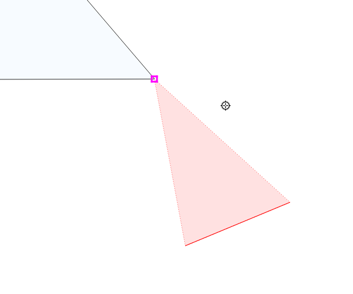

    Přichycení kurzoru pouze k lomovému bodu

.. _snapsegm:

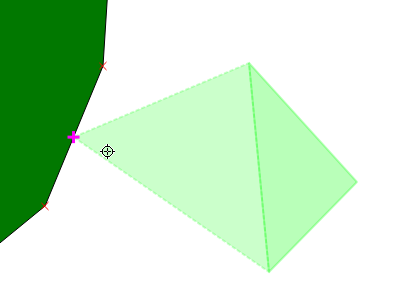

    Přichycení kurzoru k segmentu

Pokročílý režim přichytávání (:item:`Režim přichytávání...`
|selectstring| - :option:`Pokročílé`)
,,,,,,,,,,,,,,,,,,,,,,,,,,,,,,,,,,,,,,,,,,,,,,,,,,,,,,,,,,,,,,,,,,,,,,,,,,,,,,,,,,,,,,,,,,,,,,,,,,,

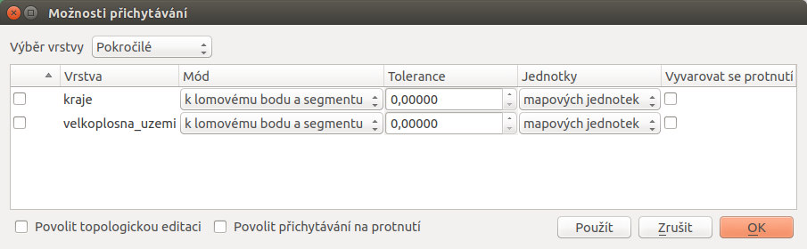

    Okno nastavení pokročílého režimu přichytávání

V pokročilém režimu, lze jednotlivé parametry nastavit pro každou vrstvu
zvlášť, navíc je zde u polygonových vrstev funkce |checkbox| `Avoid
intersection`, která zabraňuje polygonům jejich překryv, jednoduše
řečeno - nový polygon můžeme zakreslit s přesahem do sousedícího
polygonu, tento přesah bude potom automaticky vymazán. Takto snadno
docílíme čistě navazujících polygonů.

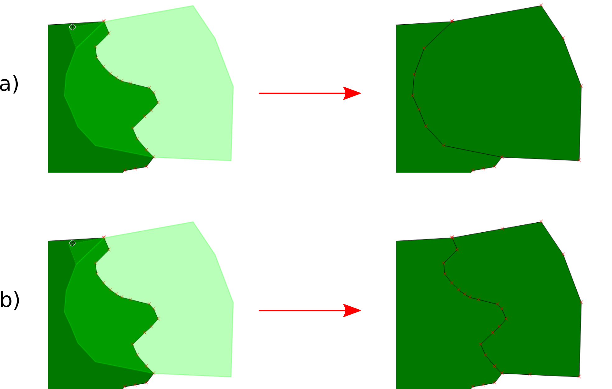

    Příklad použití :option:`Avoid intersection`. a) bez :option:`Avoid
    intersection` - polygon se vytvoří tak jak jsme ho zakreslili a
    překrývá předchozí polygon. Při odstranění nového polygonu bychom
    viděli opět hranici polygonu jako v prvním kroku. b) :option:`Avoid
    intersection` - poygon se vytvoří bez překryvu, hranice na sebe
    čistě navazuje

.. noteadvanced:: Funkce rozdělení polygonu pomocí linie - |splitter|
   :sup:`split by lines` ze zásuvného modulu |plugin| :guilabel:`Digitizing
   tools`. Touto funkcí můžeme nahradit :option:`Avoid intersection` - u linií
   není možná. Nechtěnou část polygonu potom ručně odstraníme. Takto
   můžeme vytvořit topologicky čistou hranici polygon-linie. Také lze takto
   "vklínit" liniový prvek (cestu, vodní tok, transekt) do polygonu, který
   tímto rozdělíme na více částí

    - nejprve je třeba výběrem označit jak polygon který chceme rozdělit,
      tak linii, která bude polygon rozdělovat
    - spustíme funkci -> v nabídce |selectstring| vybereme liniovou vrstvu
      (ve které je vybraný prvek, který bude polygon rozdělovat)

Editace atributové tabulky
^^^^^^^^^^^^^^^^^^^^^^^^^^

Pokud máme aktivní editaci (|mActionToggleEditing| :sup:`Přepnout editaci`),
můžeme editovat nejen geometrii, ale i atributovou tabulku vrstvy. V okně
atributové tabulky lze editaci ukládat |mActionSaveAllEdits| :sup:`Uložit
změny vrstvy` i mazat vybrané prvky |remove| :sup:`Vymazat vybrané`

    - kliknutím do libovolného pole můžeme vepisovat a upravovat hodnoty
      tabulky
    - |mActionNewAttribute| :sup:`Nový sloupec` - přidá nový atribut
      do tabulky
    - |mActionDeleteAttribute| :sup:`Smazat sloupec` - vyvolá nabídku,
      ze které vybereme sloupce k vymazání
    - |mActionCalculateField| :sup:`Otevřít kalkulátor polí`

Kalkulátor polí
---------------
Pomocí funkce |mActionCalculateField| :sup:`Otevřít kalkulátor polí`
můžeme zadáním výrazu provádět výpočty na základě existujících
hodnot v atributové tabulce, nebo funkcí (např. výpočet rozlohy
polygonu). Výsledek výrazu můžeme nechat zapsat do nového sloupce,
do virtuálního sloupce, nebo lze aktualizovat již existující sloupec.

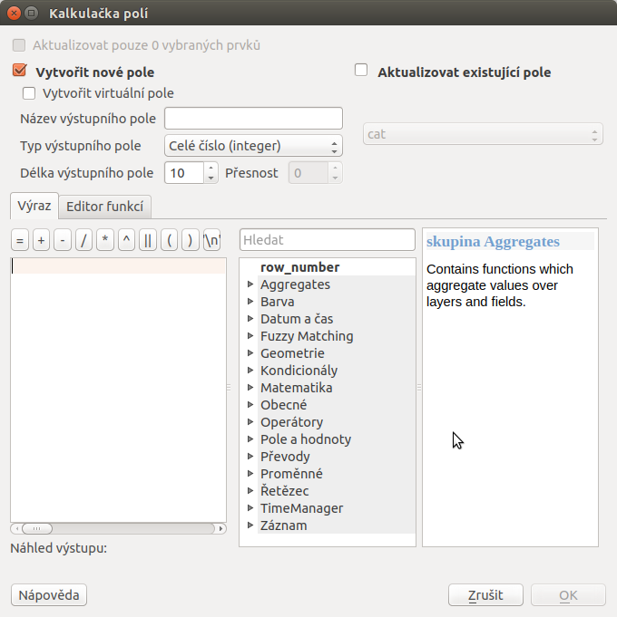

    Okno kalkulačky polí

Nejdříve je nutné nastavit zda chceme výsledek zapsat do nového pole,
virtuálního pole, nebo pouze aktualizovat existující pole.

- :item:`Vytvořit nové pole` |checkbox| - vytvoří nové pole, zde je
třeba definovat parametry nového atributu

    - :item:`Vytvořit virtuální pole` |checkbox| - vytvoří virtuální
      pole, které se při každé změně automaticky aktualizuje. Nevýhodou
      může být, že se pole neukládá do zdrojových dat, ale pouze do
      souboru projektu

- :item:`Aktualizovat existující pole` |checkbox| - přepíše hodnoty ve
  vybraném poli

    - |selectstring| - vybereme z nabídky vrstvu, kterou cheme přepsat

Nyní můžeme přejít k zadání vlastního výrazu - záložka
:item:`Výraz`.

Levá část okna (:item:`Výraz`) je prostor zadání výrazu, v horní
části máme několik tlačítek s vybranými operátory a ve spodní
části potom náhled výstupu.

.. figure:: images/field_calc_exp.png
    :scale: 80%

    okno pro zápis výrazu

Pravá část okna (:item:`Funkce`) slouží k rychlému zadání funkcí
nebo parametrů do výrazu, v pravé části se k vybrané funkci/parametru
zobrazuje nápověda. Požadované položky lze vyhledat pomocí filtru nebo
prohledáním příslušných kategorií. Přídání funkce nebo hodnoty
pole pomocí okna funkcí se provádí dvojklikem na položku

.. figure:: images/field_calc_fun.png

    Prohledávání funkcí v kategoriích

Při zadávání parametru pole nebo hodnoty pole (:option:`Pole a hodnoty`)
je možné nechat si zobrazit všechny hodnoty (tlačítko: :item:`všechny
jedinečné hodnoty`) nebo prvních 10 hodnot (tlačítko: :item:`10 vzorků`)
atributu.

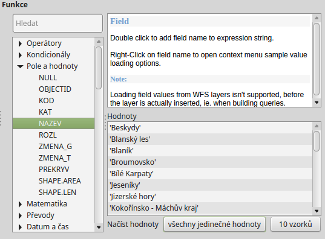

    Zobrazení všech hodnot konkrétního atributu pomocí tlačítka
    :item:`všechny jedinečné hodnoty`

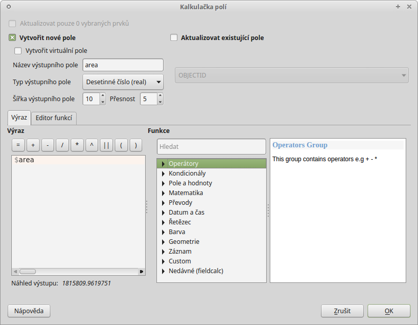

    Příklad jednoduchého výpočtu plochy polygonů vypsáním výrazu
    "$area"

.. noteadvanced:: druhá záložka - :item:`Editor funkcí` umožňuje
   definovat vlastní funkce pomocí jazyka Python

