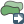
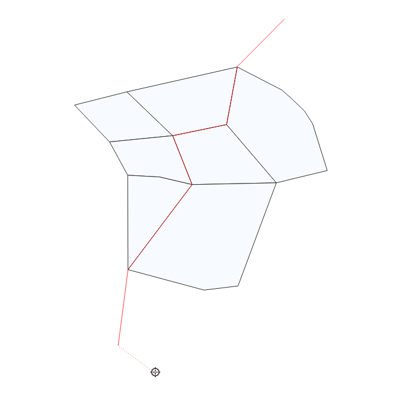

.. |selectstring| image:: ../images/icon/selectstring.png
   :width: 2.5em
.. |checkbox| image:: ../images/icon/checkbox.png
   :width: 1.5em
.. |checkbox_unchecked| image:: ../images/icon/checkbox_unchecked.png
   :width: 1.5em
.. |mActionAddOgrLayer| image:: ../images/icon/mActionAddOgrLayer.png
   :width: 1.5em
.. |mActionAllEdits| image:: ../images/icon/mActionAllEdits.png
   :width: 1.5em
.. |mActionDeleteAttribute| image:: ../images/icon/mActionDeleteAttribute.png
   :width: 1.5em
.. |mActionNewAttribute| image:: ../images/icon/mActionNewAttribute.png
   :width: 1.5em
.. |mActionCalculateField| image:: ../images/icon/mActionCalculateField.png
   :width: 1.5em
.. |mActionReshape| image:: ../images/icon/mActionReshape.png
   :width: 1.5em
.. |mActionMergeFeatures| image:: ../images/icon/mActionMergeFeatures.png
   :width: 1.5em
.. |checkbox| image:: ../images/icon/checkbox.png
   :width: 1.5em
.. |mActionSplitFeatures| image:: ../images/icon/mActionSplitFeatures.png
   :width: 1.5em
.. |mActionNodeTool| image:: ../images/icon/mActionNodeTool.png
   :width: 1.5em
.. |mActionMoveFeature| image:: ../images/icon/mActionMoveFeature.png
   :width: 1.5em
.. |mActionCapturePolygon| image:: ../images/icon/mActionCapturePolygon.png
   :width: 1.5em
.. |mActionCapturePoint| image:: ../images/icon/mActionCapturePoint.png
   :width: 1.5em
.. |selectnumber| image:: ../images/icon/selectnumber.png
   :width: 2.5em
.. |mActionCaptureLine| image:: ../images/icon/mActionCaptureLine.png
   :width: 1.5em
.. |mActionToggleEditing| image:: ../images/icon/mActionToggleEditing.png
   :width: 1.5em
.. |mActionSaveAllEdits| image:: ../images/icon/mActionSaveAllEdits.png
   :width: 1.5em
.. |splitter| image:: ../images/icon/digitizing_tools/splitter.png
   :width: 1.5em
.. |plugin| image:: ../images/icon/plugin.png
   :width: 1.5em
.. |remove| image:: ../images/icon/remove.png
   :width: 1.5em
.. |mIconExpression| image:: ../images/icon/mIconExpression.png
   :width: 1.5em

.. |mActionNewVectorLayer| image:: ../images/icon/mActionNewVectorLayer.png
   :width: 1.5em
.. |mIconSnapping| image:: ../images/icon/mIconSnapping.png
   :width: 1.5em

Tvorba nových vrstev a jejich editace
=====================================

Vytvoření Shapefile vrstvy
--------------------------

Novou vrstvu lze vytvořit pomocí tlačítka |mActionNewVectorLayer| :sup:`Nová
Shapefile vrstva` nebo v hlavním menu :menuselection:`Vrstva --> Vytvořit
vrstvu --> Nová Shapefile vrstva`.

.. figure:: images/new_layer.png
   :class: small
   :scale-latex: 40
   
   Nová vektorová vrstva.

V první řadě je nutné zadat cetu, kam se nová vrstva vytvoří. Dále při
vytváření zvolíme typ vrstvy (bod, linie nebo polygon), souřadnicový
systém vrstvy, a pokud je třeba, přidáme nové atributy. Také lze nastavit
vytvoření Z hodnot (nadmořské výšky) nebo M hodnot (další měřené hodnoty).

Vytváření nového atributu:

- :item:`Název` - název atributu (max. 10 znaků) - toto omezení
  vychází z formátu Esri Shapefile, který je zde použit
- :item:`Typ` |selectstring|

    - :option:`Textová data` (String) - formát buněk je text, nelze použít pro
      výpočty (max. 255 znaků)
    - :option:`Celé číslo` (Integer) - formát buněk je celé číslo,
      tedy bez desetinných míst (max. 10 znaků)
    - :option:`Desetinné číslo` (Real) - formát buněk je desetinné
      číslo (max. 10 znaků)
    - :option:`Datum` (Date) - formát buněk je datum (max. 20 znaků)

- :item:`Délka` - počet znaků
- :item:`Přesnost` - počet desetinných míst
- pro přidání atributu vrstvy je nutné kliknout na tlačítko
  |mActionNewAttribute| :item:`Add to Fields List`

Ve spodní části okna máme seznam atributů, které máme ve vrstvě
připravené. Atributy lze odstranit označením a kliknutím na tlačítko
|mActionDeleteAttribute| :item:`Remove Field`. Automaticky je zde
přidaný atribut "id", pokud ho nechceme, lze jej také vymazat.

Pokud máme vše nastaveno, potvrdíme tlačítkem :item:`OK` a nová vrstva se 
automaticky nahraje do projektu.

Editace vrstvy
--------------

Editaci vrstvy spustíme pomocí tlačítka |mActionToggleEditing|
:sup:`Přepnout editaci` nebo v hlavním menu :menuselection:`Vrstva -->
Přepnout editaci`. Spuštěním režimu editace se aktivují editační funkce
v panelu a bude nám umožněno vytvářet nové prvky a jejich atributy
nebo editovat stávající. Vrstva, která je momentálně v režimu editace,
je v seznamu vrstev znázorněna s editační ikonkou |mActionToggleEditing|.

.. figure:: images/edit_layers_icon.png
    :scale: 90%
    :scale-latex: 40
    
    Znázornění režimu editace vrstvy v seznamu vrstev.

Režim editace ukončíme opět pomocí tlačítka |mActionToggleEditing|
:sup:`Přepnout editaci`. Provedené změny je vhodné průběžně ukládat
pomocí ikony |mActionSaveAllEdits| :sup:`Uložit změny vrstvy`. Pokud při
editaci zapomeneme uložit změny, QGIS se nás  při ukončení editace
zeptá, zda chceme provedené změny uložit, či nikoliv.

.. tip:: |mActionAllEdits| :sup:`Aktuální změny` - hromadné ovládání
   změn a zapínání/vypínaní editací ve vrstvách.

Základní nástroje editace jsou dostupné ve výchozím nastavení 
mezi ostatními `Nástrojovými lištami`. Některké nástroje jsou ale 
dostupné v samostatné liště :item:`Pokročilá digitalizace`. 
Tu můžeme aktivovat v seznamu všech dostupních položek a to pomocí 
pravého kliku a následné `aktivace` vybrané položky.  

.. figure:: images/advanced_digitizing.png
    :scale: 90%
    :scale-latex: 40

Zapnutí panelu `Pokročilá digitalizace`.

Základní editace geometrie
^^^^^^^^^^^^^^^^^^^^^^^^^^

|mActionCapturePoint|, |mActionCaptureLine|, |mActionCapturePolygon|
:sup:`Přidat ... prvek` - kliknutím vytvoříme prvek (bod), nebo lomové
body prvku (linie, polygon). V druhém případě ukončíme tvorbu prvku
kliknutím pravým tlačítkem a přidáme případné atributy. Při
přidávání lomových bodů je možné se vrátit o krok zpět pomocí
klávesy :kbd:`Backspace` nebo :kbd:`Del`.

.. figure:: images/edit_polygon.png

    Vytváření nového prvku ve vrstvě polygonů. Pokud by v tomto momentě
    byla tvorba prvku pravým kliknutím ukončena, polygon by měl tři uzly
    (tvar trojúhelníku).

|mActionNodeTool| :sup:`Vertex tool` - pomocí nástroje uzlů lze
    - přidávat body kliknutím na křížek ve středu hrany a umístěním bodu 
    - přidávat body dvojklikem na hranu a umístěním bodu 
    - posunovat existující body kliknutím na bod a umístěním bodu 
    - mazat body označením bodu (nebo více bodů pomocí :kbd:`Shift`) a
      stisknutím klávesy :kbd:`Backspace` nebo :kbd:`Del`
    - posouvat celé hrany kliknutím na hranu a umístěním hrany

.. figure:: images/edit_polygon_node.png

    Přidání a přesunutí lomového bodu (uzlu, vertexu).

Nástroj uzlů lze použít ve dvou módech, buď pouze pro vrstvu kterou editujeme
, nebo pro všechny vrstvy které jsou v módu editace

|remove| :sup:`Vymazat vybrané` - smaže vybrané prvky

|mActionMoveFeature| :sup:`Přesunout prvek/prvky` - jednotlivé prvky přesuneme kliknutím na prvek, posunutím a opětovným klliknutím

.. figure:: images/edit_polygon_move.png

    Přesun prvku.

Další variantou funkce je |mActionMoveFeatureCopy|:sup:`Kopírovat a přesunout prvek/prvky`, kdy stejným principem prvky kopírujeme.
Pro přesun nebo kopírování více prvků můžeme pracovat s více prvky,
které máme ve výběru.

|mActionSplitFeatures| :sup:`Rozdělit objekt` - naklikáme "řez" přes
místa, které chceme rozdělit a pro ukončení klikneme pravým tlačítkem,
prvek se nám v místech průsečíků rozdělí

.. figure:: images/edit_polygon_split.png

    Rozdělení polygonu na dva.

|mActionMergeFeatures| :sup:`Sloučit vybrané prvky` - nejdříve pomocí
výběru označíme prvky, které chceme spojit. Při sloučení
vyskočí okno, ve kterém je možné zadat hodnoty atributů "nového" - sloučeného
prvku. Tyto hodnoty můžeme odvodit z konkrétního vstupního prvku, nebo je lze
vypočítat (např. suma, průměr). Výchozí hodnota atributů je :option:`NULL`,
tedy žádná hodnota.

.. figure:: images/edit_polygon_merge.png
   :class: middle
        
   Sloučení sousedních polygonů.

|mActionReshape| :sup:`Změnit tvar prvků` - obdobně jako při rozdělení
nebo tvorbě nového prvku lze naklikáním nového tvaru změnit tvar
stávajícího prvku. Pro změnu tvaru musí být při naklikávání "řezu"
vždy minimálně dva průsečíky. V případě změny tvaru polygonu bude
část s menší plochou vymazána (:numref:`resh1`).

.. _resh1:

.. figure:: images/edit_polygon_resh.png

    Změna tvaru polygonu - zmenšení.

.. figure:: images/edit_polygon_resh2.png

    Změna tvaru polygonu - zvětšení.

.. figure:: images/edit_line_resh.png

    Změna tvaru linie.

Přichytávání (snapping)
.......................

Pro topologicky čistou editaci můžeme pomocí lišty
:menuselection:`Přichytávání` nastavit
přichytávání kurzoru s určitou citlivostí k uzlům či segmentům
konkrétních vrstev. Přichitávání je nejdříve nutné aktivaovat kliknutím na
ikonu |mIconSnapping|:sup:`Enable Snapping`, nebo využít klávesovou zkratku
:kbd:`S`. Přichycení kurzoru se zobrazí výrazně růžovým čtverečkem v případě
lomového bodu (viz :numref:`snapvert`) nebo křížkem v případě segmentu
(:numref:`snapsegm`).

.. figure:: images/snapping.png

    Základní okno možnosti přichytávání.

.. _snapvert:

.. figure:: images/snapping_vertex.png

    Přichycení kurzoru pouze k lomovému bodu.

.. _snapsegm:

.. figure:: images/snapping_segment.png

    Přichycení kurzoru k segmentu.

- Nastavení |selectstring|:

    - :option:`All Layers` - přichytávání ke všem viditelným vektorovým
      vrstvám projektu
    - :option:`Active Layer` - přichytávání pouze v rámci editované
      vrstvy, ostatní vrstvy ignoruje
    - :option:`Pokročilé nastavení` - režim pokročilého nastavení, lze nastavit
      různé nastavení pro jednotlivé vrstvy a nabízí možnost `Vyvarovat 
      se protnutí`
    - :option:`Open snapping Options...` - otevře nastavení přichytávání v
      samostatném okně

- Přichytit k |selectstring|:

    - :option:`Lomový bod` - pouze k lomovým bodům
      (uzlům/vertexům, :numref:`snapvert`)
    - :option:`Vertex and Segment` - k obojímu
    - :option:`Segmentu` - pouze k segmentům
      (hranám/liniím, :numref:`snapsegm`)

- Tolerance |selectnumber| - vzdálenost, od které se kurzor bude
  k lomovému bodu nebo segmentu přichytávat, hodnotu lze zadat v mapových
  jednotkách (vzdálenost na mapě) nebo pixelech (vzdálenost na monitoru)

- `Zapnout topologickou editaci` - při aktivaci lze
  pomocí |mActionNodeTool| :sup:`Nástroj uzlú` posouvat společný lomový
  bod přichycení obou prvků najednou. Pokud není aktivní, lomový bod
  lze oddělit

- `Zapnout přichytávání na protnutí` - při aktivaci se
  bude kurzor přichytávat i na případné místo "překřížení" segmentů
  (linií)
  
- `Zapnout trasování` - trasování umožňuje vytvářet nové prvky tak aby na sebe
  přímo navazovaly (topologicky čistá data). Funguje na principu vyhledání
  nejkratší vzdálensoti na segmentech mezi zadanými body. Trasování může být
  problematické v případě, že máme vrstvu s více navazujícími polygony, kdy
  nejkratší vzdálenost nemusí vést po vnější hraně skupiny polygonů
  (:numref:`snapping_trace_poly`). To lze vyřešit přidáním více bodů při
  trasování, popř. u polygonů využitím funkce `Vyvarovat se protnutní`

.. figure:: images/snapping_trace_line.png 
   :class: middle 
   :scale-latex: 40 

   Trasovaní k linii při tvorbě polygonu.

.. _snapping_trace_poly:

   Trasovaní s nejkratší vzdáleností při tvorbě line.

.. tip:: Nastavení přichytávání lze měnit i v momentě, kdy vytváříme
   prvek a potřebujeme změnit parametry jen pro přidání konkrétního uzlu
   (např. :numref:`snapvert` a :numref:`snapsegm`).

Pokročílý režim přichytávání 
,,,,,,,,,,,,,,,,,,,,,,,,,,,,

.. figure:: images/snapping_adv.png
   :scale-latex: 60

   Režim pokročilého nastavení přichytávání.

V pokročilém režimu lze jednotlivé parametry nastavit pro každou vrstvu
zvlášť, navíc je zde u polygonových vrstev funkce |checkbox| `Vyvarovat 
se protnutí`, která zabraňuje polygonům jejich překryv, což lze mimo jiné
využít jako alternativu k funkci trasování. Nový polygon potom můžeme zakreslit
 s přesahem do sousedícího polygonu, tento přesah bude potom automaticky
 vymazán. Takto snadno docílíme čistě navazujících polygonů.

.. figure:: images/snapping_avoid.png

    Příklad použití :option:`Vyvarovat se protnutí`. 
    a) bez :option:`Vyvarovat se protnutí` - polygon se vytvoří tak, 
    jak jsme ho zakreslili, a
    překrývá předchozí polygon. Při odstranění nového polygonu bychom
    viděli opět hranici polygonu jako v prvním kroku. 
    b) :option:`Vyvarovat se protnutí` - polygon se vytvoří bez 
    překryvu, hranice na sebe čistě navazuje.

..       .. noteadvanced:: Funkce rozdělení polygonu pomocí linie - |splitter|
           :sup:`split by lines` ze zásuvného modulu |plugin| :guilabel:`Digitizing
           tools`. Touto funkcí můžeme nahradit :option:`Avoid intersection` - u linií
           není možná. Nechtěnou část polygonu potom ručně odstraníme. Takto
           můžeme vytvořit topologicky čistou hranici polygon-linie. Také lze takto
           "vklínit" liniový prvek (cestu, vodní tok, transekt) do polygonu, který
           tímto rozdělíme na více částí:

            - nejprve je třeba výběrem označit jak polygon, který chceme rozdělit,
              tak linii, která bude polygon rozdělovat
            - spustíme funkci ``->`` v nabídce |selectstring| vybereme liniovou vrstvu
              (ve které je vybraný prvek a který bude polygon rozdělovat)

Editace atributové tabulky
^^^^^^^^^^^^^^^^^^^^^^^^^^

Pokud máme aktivní editaci (|mActionToggleEditing| :sup:`Přepnout editaci`),
můžeme editovat nejen geometrii, ale i atributovou tabulku vrstvy. V okně
atributové tabulky lze editaci ukládat |mActionSaveAllEdits| :sup:`Uložit
změny vrstvy` i mazat vybrané prvky |remove| :sup:`Vymazat vybrané`:

    - kliknutím do libovolného pole můžeme vepisovat a upravovat hodnoty
      tabulky
    - |mActionNewAttribute| :sup:`Nové pole` - přidá nový atribut
      do tabulky
    - |mActionDeleteAttribute| :sup:`Smazat pole` - vyvolá nabídku,
      ze které vybereme sloupce k vymazání
    - |mActionCalculateField| :sup:`Otevřít kalkulátor polí` - pomocí 
      kalkulátoru polí lze vytvářet nebo aktualizovat sloupce (atributy) na 
      základě zadaného výrazu (vzorce)

Kalkulátor polí
---------------

Pomocí funkce |mActionCalculateField| :sup:`Otevřít kalkulátor polí`
můžeme zadáním výrazu provádět výpočty na základě existujících
hodnot v atributové tabulce nebo funkcí (např. výpočet rozlohy
polygonu). Výsledek výrazu můžeme nechat zapsat do nového sloupce,
do virtuálního sloupce, nebo lze aktualizovat již existující sloupec.

.. figure:: images/field_calc.png

    Okno kalkulačky polí.

Nejdříve je nutné nastavit, zda chceme výsledek zapsat do nového pole,
virtuálního pole, nebo pouze aktualizovat existující pole.

- :item:`Vytvořit nové pole` |checkbox| - vytvoří nové pole, zde je
  třeba definovat parametry nového atributu

- :item:`Vytvořit virtuální pole` |checkbox| - vytvoří virtuální
  pole, které se při každé změně automaticky aktualizuje. Nevýhodou
  může být, že se pole neukládá do zdrojových dat, ale pouze do
  souboru projektu

- :item:`Aktualizovat existující pole` |checkbox| - přepíše hodnoty ve
  vybraném poli

    - |selectstring| - vybereme z nabídky vrstvu, kterou cheme přepsat

Nyní můžeme přejít k zadání vlastního výrazu - záložka
:item:`Výraz`.

Levá část okna (:item:`Výraz`) je prostor zadání výrazu, v horní
části máme několik tlačítek s vybranými operátory a ve spodní
části potom náhled výstupu.

.. figure:: images/field_calc_exp.png
   :scale-latex: 25
    
   Okno pro zápis výrazu.

Pravá část okna (:item:`Funkce`) slouží k rychlému zadání funkcí
nebo parametrů do výrazu, v pravé části se k vybrané funkci/parametru
zobrazuje nápověda. Požadované položky lze vyhledat pomocí filtru nebo
prohledáním příslušných kategorií. Přidání funkce nebo hodnoty
pole pomocí okna funkcí se provádí dvojklikem na položku.

.. figure:: images/field_calc_fun.png
   :scale-latex: 40
                          
   Prohledávání funkcí v kategoriích.

Při zadávání parametru pole nebo hodnoty pole (:item:`Pole a hodnoty`)
je možné nechat si zobrazit všechny hodnoty (tlačítko: :item:`všechny
jedinečné hodnoty`) nebo prvních 10 hodnot (tlačítko: :item:`10 vzorků`)
atributu.

.. figure:: images/field_calc_fun_field.png
   :scale-latex: 45
		 
   Zobrazení všech hodnot konkrétního atributu pomocí tlačítka
   :item:`všechny jedinečné hodnoty`.

.. figure:: images/field_calc_area.png
   :scale-latex: 45
		 
   Příklad jednoduchého výpočtu plochy polygonů vypsáním výrazu
   "$area".

.. noteadvanced:: Druhá záložka - :item:`Editor funkcí` umožňuje
   definovat vlastní funkce pomocí jazyka Python

.. tip:: Editovat stávající atributy lze i přímo z atributové tabulky, a to 
    pomocí panelu (:numref:`editpanel`), který se aktivuje po přepnutí do
    režimu editace. Zde vybereme atribut, který chceme editovat, a zadáme
    požadovaný výraz (ručně nebo pomocí dialogu |mIconExpression|), potom
    potvrdíme aktualizaci buď pro všechny prvky, nebo jen pro prvky vybrané.

    .. _editpanel:
    
    .. figure:: images/field_edit_panel.png
       :class: middle
            
       Panel editace atributů v atributové tabulce.
