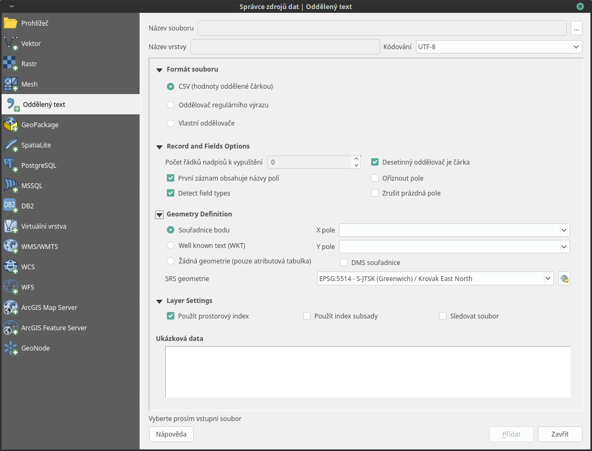
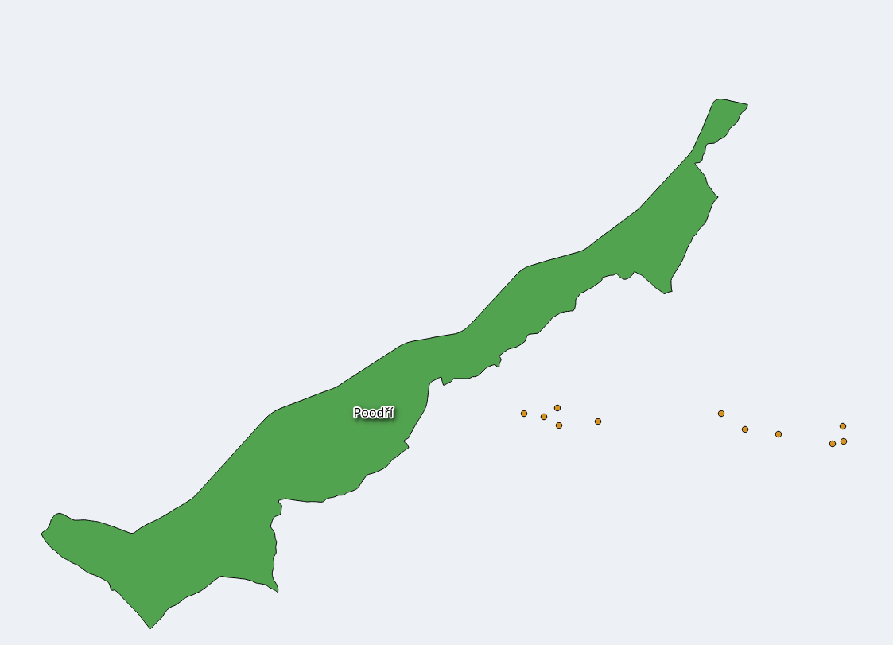
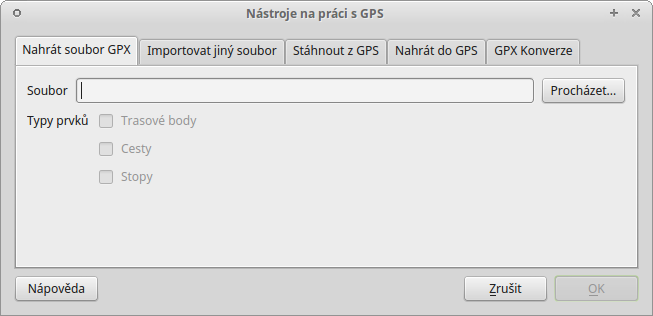

.. |selectstring| image:: ../images/icon/selectstring.png
   :width: 2.5em
.. |checkbox| image:: ../images/icon/checkbox.png
   :width: 1.5em
.. |radiobuttonon| image:: ../images/icon/radiobuttonon.png
   :width: 1.5em
.. |selectnumber| image:: ../images/icon/selectnumber.png
   :width: 2.5em
.. |mActionAddDelimitedTextLayer| image::
   ../images/icon/mActionAddDelimitedTextLayer.png
   :width: 1.5em
.. |mActionRefresh| image:: ../images/icon/mActionRefresh.png
   :width: 1.5em
.. |gps_importer| image:: ../images/icon/gps_importer.png
   :width: 1.5em
.. |create_gpx| image:: ../images/icon/create_gpx.png
   :width: 1.5em  
.. |import_gpx| image:: ../images/icon/import_gpx.png
   :width: 1.5em  
.. |inputtext| image:: ../images/icon/inputtext.png
   :width: 1.5em
.. |mActionAddOgrLayer| image:: ../images/icon/mActionAddOgrLayer.png
   :width: 1.5em

Import dat s oddělenými hodnotami a GPS dat
===========================================

Data s oddělenými hodnotami
---------------------------

Jestliže máme tabulková data obsahující geografické souřadnice,
můžeme tato data poměrně snadno naimportovat a vytvořit z nich
vektorovou vrstvu. Při importu pracujeme s daty s oddělenými hodnotami
(:wikipedia-en:`DSV <delimiter-separated values>`).

Tabulková data
^^^^^^^^^^^^^^

Data s oddělenými hodnotami jsou tabulková data uložená v textovém
souboru. V takovém souboru jsou sloupce odděleny specifickým
oddělovacím znakem a řádky koncem řádku. Pro oddělení hodnot
můžeme použít jakýkoliv znak, ale nejčastěji se setkáváme s hodnotami
oddělené čárkou (:wikipedia:`CSV`) nebo tabulátorem (:wikipedia-en:`TSV
<Tab-separated_values>`). Soubory tabulkových procesorů lze snadno exportovat
do textového souboru s oddělenými hodnotami, tyto soubory lze potom
prohlížet jak pomocí tabulkových procesorů, tak i textových editorů.

Existují dva způsoby, jak mohou být geodata v souboru s oddělenými
hodnotami uložena:

    - jako x,y souřadnice bodů v oddělených sloupcích (tzv. XY data)
    - jako well-known text (:wikipedia-en:`WKT <Well-known_text>`)

.. _xydata:

.. figure:: images/xydata.png
   :scale-latex: 45
              
   Příklad tabulky s vhodnými XY daty.

.. _xydatacsv:

.. figure:: images/xydata_csv.png
   :scale-latex: 45

   Tabulková data (:numref:`xydata`) převedená do formátu CSV.

.. note:: Na obrázku :numref:`xydatacsv` si můžeme všimnout zápisu
  desetinných čísel oddělenými čárkou v souboru s hodnotami oddělenými
  čárkou. V takovém případě musí být hodnota vymezená uvozovkami. Pokud
  by zde uvozovky nebyly, znamenala by čárka oddělení nového sloupce.

.. tip:: Pokud máme v tabulce souřadnice zapsané v takové formě,
   že je nedokážeme importovat, můžeme pro úpravu použít jednoduché funkce 
   tabulkového procesoru (LEFT, RIGHT, MID atd.)
   
Import dat
^^^^^^^^^^

Import se provadí pomocí funkce |mActionAddDelimitedTextLayer| :sup:`Přidat
vrstvu s odděleným textem`.

.. _delimited:

   
    Okno funkce |mActionAddDelimitedTextLayer| :sup:`Přidat vrstvu s
    odděleným textem`.

- :item:`Název souboru` - cesta a název souboru, můžeme vyhledat soubor
  pomocí tlačítka :item:`Procházet...`
- :item:`Název vrstvy` - název nově vzniklé vrstvy
- :item:`Formát souboru` |radiobuttonon| - vybereme typ oddělení hodnot
  v textovém souboru

    - |radiobuttonon| :sup:`CSV (hodnoty oddělené čárkou)` - standardní
      .csv soubor s hodnotami oddělenými čárkou
    - |radiobuttonon| :sup:`Oddělovač regulárního výrazu` - použití
      regulárního výrazu
    - |radiobuttonon| :sup:`Vlastní oddělovače` - výběr libovolného
      oddělovače

- :item:`Kódování` |selectstring| - vybereme kódování textu
- :item:`Možnosti záznamu a polí`

    - :item:`Počet řádků nadpisů k vypuštění` |selectnumber| - vynechá
      zadaný počet rádků na začátku
    - |checkbox| :item:`První záznam obsahuje názvy polí` - zaškrtneme,
      pokud máme v tabulce jako první řádek názvy sloupců
    - |checkbox| :option:`Detekovat typy polí` - detekuje datový typ sloupce
    - |checkbox| :option:`Desetinný oddělovač je čárka` - zaškrtneme,
      pokud v datech nemáme oddělena desetinná čísla tečkou, ale čárkou
      (např. :numref:`xydatacsv`)
    - |checkbox| :option:`Oříznout pole` - smaže přebytečné mezery v
      datech např. na konci nebo začátku záznamu
    - |checkbox| :option:`Zrušit prázdná pole` - odstraní prázdné sloupce

- :item:`Definice geometrie`

    - |radiobuttonon| :sup:`Souřadnice bodu` - body definovány souřadnicemi
      X a Y (XY Data)

        - :option:`X pole`, :option:`Y pole`  |selectstring| - výběr sloupců,
          ve kterých jsou zapsané souřadnice. :option:`Z pole`, :option:`M pole`
          vybíráme, pokud data obsahují hodnoty `Z` a `M`
        - |checkbox| :option:`DMS souřadnice` - zaškrtneme, pokud máme
          souřadnice ve tvaru DMS (degrees-minutes-seconds) - stupně,
          minuty, vteříny

    - |radiobuttonon| :sup:`Well known text (WKT)` - souřadnice uložené
      jako řetězec WKT (např. ``POINT(1.525622 51.20836)``)

        - :option:`Pole geometrie` |selectstring| - výběr sloupce, ve
          kterém jsou zapsané souřadnice
        - :option:`Geometrický typ` |selectstring| - typ geometrie

    - |radiobuttonon| :sup:`Žádna geometrie (pouze atributová tabulka)` -
      přidá pouze tabulku
      
    - |selectstring| :sup:`SRS geometrie` - souřadnicový systém, ve kterém
      jsou souřadnice uložené

- :item:`Nastavení vrstvy`

    - |checkbox| :option:`Použít prostorový index` - vytvoří prostorový
      index pro rychlejší práci s daty - vhodnější pro objemné soubory
    - |checkbox| :option:`Použít index subsady` - vytvoří index podmnožiny
      (filtrovaných) prvků
    - |checkbox| :option:`Sledovat soubor` - sledování změn souboru za
      běhu QGIS, při aktualizaci |mActionRefresh| se projeví změny souboru
      (např. přidání dalších dat do řádků) ve vrstvě

    - ve spodní části okna vidíme náhled vkládaných dat

Pokud chceme naimportovaná data uložit jako vrstvu, musíme 
exportovat (:guilabel:`Uložit jako...`).

    
    Výsledná vrstva bodů.

GPS data
--------

K práci s GPS daty QGIS používá plugin :guilabel:`GPS Nástroje`, který
by měl být v základní instalaci QGIS nainstalovaný a aktivní. V panelu
nástrojů se plugin zobrazí jako ikona |import_gpx| :sup:`GPS
nástroje`. Pro ukládání GPS dat je mnoho různých formátů. QGIS používá
standardní výměnný formát :wikipedia-en:`GPX <GPS_Exchange_Format>`
(GPS eXchange format).

.. _gps:

    Okno pluginu GPS Nástroje.

Získání .gpx souboru z GPS přístroje
^^^^^^^^^^^^^^^^^^^^^^^^^^^^^^^^^^^^
.. figure:: images/gpstools2.png
   :scale: 60 %
   :scale-latex: 45

   Získání GPX souboru z GPS přístroje pomocí pluginu GPS nástroje.

- pomocí pluginu |gps_importer| :sup:`GPS Nástroje` v záložce 
  :guilabel:`Stáhnout z GPS`
        
   - :guilabel:`GPS zařízení` |selectstring| - typ našeho GPS přístroje
   - :guilabel:`Port` |selectstring| - např. usb
   - :guilabel:`Typ prvku` |selectstring| - prvky, které chceme stáhnout z 
     GPS
   - :guilabel:`Název vrstvy` - jak se bude vrstva jmenovat
   - :guilabel:`Výstupní soubor` - zadáme cestu a název 
     souboru, a to buď ručně, nebo pomocí tlačítka :guilabel:`Uložit jako...`
        
- použitím externího software pro získání .gpx souboru
        
        - software od výrobce GPS
        - volně dostupný software 
..      - volně dostupný software `EasyGPS <http://www.easygps.com/>`_ 
    
Import .gpx souboru
^^^^^^^^^^^^^^^^^^^
- použitím pluginu |gps_importer| :sup:`GPS Nástroje` 

    - po otevření pluginu (:numref:`gps`) zadáme cestu a název souboru,
      a to buď ručně, nebo pomocí   tlačítka :guilabel:`Procházet`
    - potvrdíme tlačítkem :guilabel:`OK` a vybereme data, která chceme vložit
   
- stejně jako přidání vektorových dat |mActionAddOgrLayer| :sup:`přidání 
  vektorové vrstvy` nebo přetažením z prohlížeče souborů - v tomto případě 
  data nelze editovat!
      
Vytvoření .gpx souboru
^^^^^^^^^^^^^^^^^^^^^^
    
- pomocí tlačítka |create_gpx| :sup:`Vytvořit novou vrstvu GPX` (přidá 
  se do panelu na práci s vrstvami)
- export bodové nebo liniové vrstvy pomocí :guilabel:`Uložit jako...` s 
  výběrem formátu .gpx
