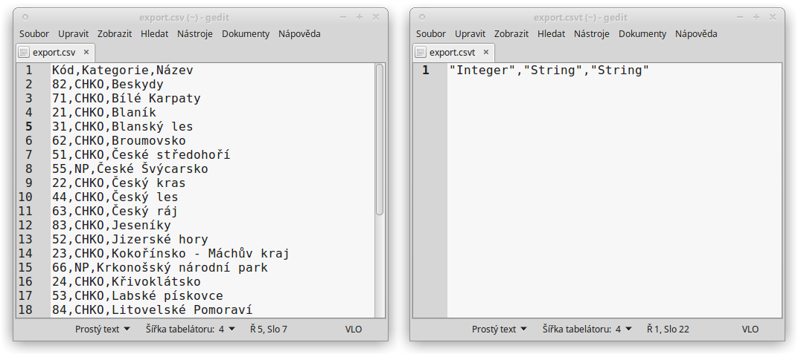
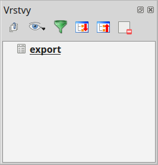
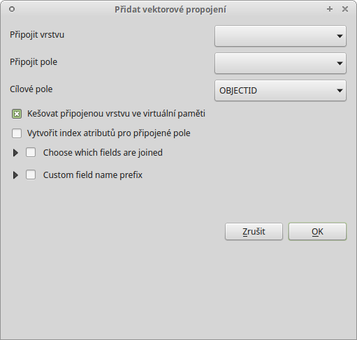

.. |selectstring| image:: ../images/icon/selectstring.png
   :width: 2.5em
.. |checkbox| image:: ../images/icon/checkbox.png
   :width: 1.5em
.. |radiobuttonon| image:: ../images/icon/radiobuttonon.png
   :width: 1.5em
.. |symbologyAdd| image:: ../images/icon/symbologyAdd.png
   :width: 1.5em
.. |symbologyRemove| image:: ../images/icon/symbologyRemove.png
   :width: 1.5em
.. |symbologyEdit| image:: ../images/icon/symbologyEdit.png
   :width: 1.5em
.. |join| image:: ../images/icon/join.png
   :width: 1.5em
.. |mActionAddDelimitedTextLayer| image::
   ../images/icon/mActionAddDelimitedTextLayer.png
   :width: 1.5em
.. |mActionAddOgrLayer| image:: ../images/icon/mActionAddOgrLayer.png
   :width: 1.5em

.. todo:: nachystat data, obrázek výsledku

Připojení tabulkových dat
=========================

V této kapitole si ukážeme funkci |join| :sup:`Připojení` resp. její
využití k připojení tabulkových dat k atributové tabulce vrstvy, kterou
máme v projektu. Funkce připojení umožňuje na základě shodných hodnot
jednoho atributu připojit atributovou tabulku k vektorové vrstvě. Takto k
sobě můžeme připojit atributové tabulky dvou vektorových vrstev. Díky
knihovně OGR však lze jako atributovou tabulku nahrát i tabulková data bez
geometrie (formáty \*.csv, \*.dbf, \*.ods, \*.xls aj.). To má využití
zejména pokud potřebujeme připojit získané tabulky s informacemi
o prvcích ve vektorové vrstvě nebo pokud potřebujeme připojit data
naměřená v terénu ke známým prvkům nebo např. naměřeným GPS bodům.

.. Pokud máme vektorovou vrstvu, můžeme k jejím prvkům připojit data z
   tabulek. Atributová tabulka vektorové vrstvy i připojovaná tabulka musí
   mít sloupec, ve kterém budou hodnoty, přes které se bude připojení
   vytvářet. Podle tohoto sloupce QGIS pozná, který řádek tabulky a prvek
   ve vrstvě patří k sobě.

.. .. tip:: Možné využití v praxi:

            - připojení získaných informací o prvcích ve vektorové
             vrstvě
            - připojení naměřených dat z terénu k prvkům ve vektorové
             vrstvě

Postup připojení
----------------

Nejprve je vhodné převést naši tabulku na data s oddělenými hodnotami,
např. formát :wikipedia:`CSV`, což provedeme přímo v tabulkovém
procesoru - při ukládání nebo exportu vybereme formát \*.csv

Existují dva hlavní způsoby jak nahrát tabulková data jako vrstvu do QGIS:

1. Stejně jako vektorovou vrstvu, přetažením z prohlížeče nebo pomocí
|mActionAddOgrLayer| :sup:`Přidat vektorovou vrstvu`

    \+ lze editovat přímo v QGIS

    \- interpretuje všechny atributy jako :option:`text`, lze ošetřit
     vytvořením doplňujícího textového souboru \*.csvt

        - \*.csvt soubor musí být v stejném adresáři a mít stejný název
          jako přidávaný \*.csv soubor. Dále musí obsahovat pouze jeden
          řádek, ve kterém jsou uvedeny typy atributů k odpovídajícím
          sloupcům \*.csv ("Integer","Real","String").

    Ukázka tabulkových dat ve formátu \*.csv (vlevo) a odpovídající
    soubor \*.csvt (vpravo)

2. Pomocí |mActionAddDelimitedTextLayer| :sup:`Přidat vrstvu s odděleným
textem`, kde bychom zvolili |radiobuttonon| :sup:`Žádna geometrie (pouze
atributová tabulka)`

    \- nelze editovat přímo v QGIS

    \+ rozpozná typ atributu (:option:`text`, :option: `Celé číslo` atd.)

    Zobrazení tabulkových dat v seznamu vrstev

Jakmile máme přidána tabulková data otevřeme vlastnosti vektorové
vrstvy, ke které chceme tabulku připojit a zvolíme záložku |join|
:sup:`Připojení` a přidáme nové připojení pomocí tlačítka
|symbologyAdd|. V dialogovém okně (:num:`join`) potom nastavíme parametry
připojení.

.. _join:

    Okno přidání připojení

|

- :item:`Připojit vrstvu` |selectstring| - vyberem vrstvu (.csv tabulku)
- :item:`Připojit pole` |selectstring| - vyberem atribut (týká se tabulky
  .csv), který chceme připojit
- :item:`Cílové pole` |selectstring| - vybereme souhlasný atribut,
  přes který se bude tabulka připojovat
- |checkbox| :item:`Kešovat připojenou vrstvu ve virtuální paměti` -
  pro rychlejší práci s daty
- |checkbox| :item:`Choose which fields are joined` - zaškrtneme pokud
  chceme připojit pouze některé atributy
- |checkbox| :item:`Custom field name prefix` - zde můžeme zvolit vlastní
  předponu názvů připojených atributů (jejich sloupců)

- po přidání se připojení objeví v seznamu, zavřeme vlastnsti a
 můžeme překontrolovat připojení zobrazením atributové tabulky vrstvy.

    - pomocí tlačítka |symbologyEdit| lze připojení editovat
    - pomocí tlačítka |symbologyRemove| lze připojení ručit

- s takto připojenou tabulkou můžeme dále pracovat stejně jako by byla
  přímo ve vektorové vrstvě (např.měnit symbol, provádět dotazování
  a analýzy)

.. note:: Při připojení se zdrojová data (vektorové vrstvy ani připojené
   tabulky) nemění. Data z tabulky jsou připojením pouze odkazována k
   odpovídajícím prvkům atributové tabulce vrstvy.

    - po odebrání tabulky ze seznamu vrstev, nebo přímo vymazání souboru
      .csv se připojení zruší
    - pro trvalé uložení připojených dat do vektorové vrstvy lze použít
      funkci exportu vrstvy (:item:`Uložit jako...`)
