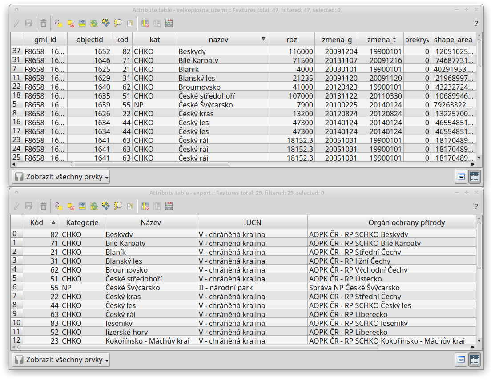
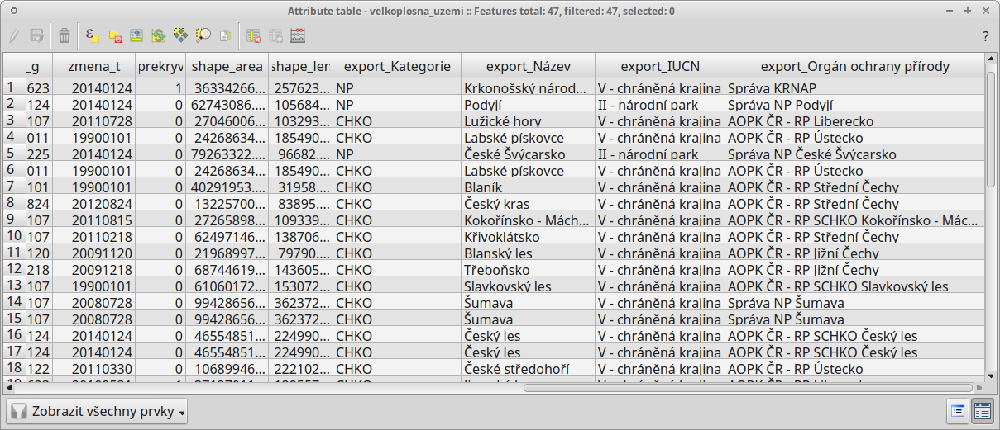

.. |selectstring| image:: ../images/icon/selectstring.png
   :width: 2.5em
.. |checkbox| image:: ../images/icon/checkbox.png
   :width: 1.5em
.. |radiobuttonon| image:: ../images/icon/radiobuttonon.png
   :width: 1.5em
.. |symbologyAdd| image:: ../images/icon/symbologyAdd.png
   :width: 1.5em
.. |symbologyRemove| image:: ../images/icon/symbologyRemove.png
   :width: 1.5em
.. |symbologyEdit| image:: ../images/icon/symbologyEdit.png
   :width: 1.5em
.. |join| image:: ../images/icon/join.png
   :width: 1.5em
.. |mActionAddDelimitedTextLayer| image::
   ../images/icon/mActionAddDelimitedTextLayer.png
   :width: 1.5em
.. |mActionAddOgrLayer| image:: ../images/icon/mActionAddOgrLayer.png
   :width: 1.5em

Připojení tabulkových dat
=========================

V této kapitole si ukážeme funkci |join| :sup:`Připojení` resp. její
využití k připojení tabulkových dat k atributové tabulce vrstvy, kterou
máme v projektu. Funkce připojení umožňuje na základě shodných hodnot
jednoho atributu připojit atributovou tabulku k vektorové vrstvě. Takto k
sobě můžeme připojit atributové tabulky dvou vektorových vrstev. Díky
knihovně GDAL však lze jako atributovou tabulku nahrát i tabulková data bez
geometrie (formáty \*.csv, \*.dbf, \*.ods, \*.xls aj.). To má využití
zejména pokud potřebujeme připojit získané tabulky s informacemi
o prvcích ve vektorové vrstvě nebo pokud potřebujeme připojit data
naměřená v terénu ke známým prvkům nebo např. naměřeným GPS bodům.

Postup si ukážeme na připojení tabulky získané z databáze chráněných území 
(http://drusop.nature.cz) k vektorové vrstvě velkoplošných zvláště chráněných území 
(AOPK). Připojením získáme informaci, pod jaké orgány ochrany přírody spadají 
jednotlivá území.

.. Pokud máme vektorovou vrstvu, můžeme k jejím prvkům připojit data z
   tabulek. Atributová tabulka vektorové vrstvy i připojovaná tabulka musí
   mít sloupec, ve kterém budou hodnoty, přes které se bude připojení
   vytvářet. Podle tohoto sloupce QGIS pozná, který řádek tabulky a prvek
   ve vrstvě patří k sobě.

.. .. tip:: Možné využití v praxi:

            - připojení získaných informací o prvcích ve vektorové
             vrstvě
            - připojení naměřených dat z terénu k prvkům ve vektorové
             vrstvě

Postup připojení
----------------

Nejprve je vhodné převést naši tabulku na data s oddělenými hodnotami,
např. formát :wikipedia:`CSV`, což provedeme přímo v tabulkovém
procesoru - při ukládání nebo exportu vybereme formát \*.csv.

Existují dva hlavní způsoby jak nahrát tabulková data jako vrstvu do QGIS:

1. Pomocí |mActionAddDelimitedTextLayer| :sup:`Přidat vrstvu s odděleným
textem` stejně jako při přidání XY dat, pouze zvolíme
|radiobuttonon| :sup:`Žádna geometrie (pouze atributová tabulka)`

    \- nelze editovat přímo v QGIS

    \+ rozpozná typ atributu (:option:`text`, :option:`Celé číslo` atd.)

2. Stejně jako vektorovou vrstvu, přetažením z prohlížeče nebo pomocí
|mActionAddOgrLayer| :sup:`Přidat vektorovou vrstvu`.

    \+ lze editovat přímo v QGIS

    \- interpretuje všechny atributy jako :option:`text`, lze ošetřit
    vytvořením doplňujícího textového souboru \*.csvt

        - \*.csvt soubor musí být umístěn ve stejném adresáři a mít stejný název
          jako přidávaný \*.csv soubor. Dále musí obsahovat pouze jeden
          řádek, ve kterém jsou uvedeny typy atributů k odpovídajícím
          sloupcům \*.csv ("Integer","Real","String").

.. figure:: images/join_csvt.png
   :scale-latex: 70

   Ukázka tabulkových dat ve formátu \*.csv (vlevo) a odpovídající
   soubor \*.csvt (vpravo)

.. figure:: images/join_layer.png
    :scale: 70%
    :scale-latex: 35
    
    Zobrazení tabulkových dat v seznamu vrstev.
    

   
   Atributové tabulky vektorové vrstvy (nahoře) a importované tabulky (dole). 
   V tomto případě budeme připojovat pomocí atributů "kod" a "Kód", které jsou 
   souhlasné.

Jakmile máme přidána tabulková data, otevřeme vlastnosti vektorové
vrstvy, ke které chceme tabulku připojit, zvolíme záložku |join|
:sup:`Připojení` a přidáme nové připojení pomocí tlačítka
|symbologyAdd|. V dialogovém okně (:numref:`join`) potom nastavíme parametry
připojení.

.. _join:

.. figure:: images/join.png
   :scale-latex: 40

   Okno přidání připojení.

Základní nastavení připojení
^^^^^^^^^^^^^^^^^^^^^^^^^^^^

- :item:`Připojit vrstvu` |selectstring| - vybereme vrstvu (.csv tabulku)
- :item:`Připojit pole` |selectstring| - vybereme atribut (týká se tabulky
  .csv),  přes který chceme data připojit
- :item:`Cílové pole` |selectstring| - vybereme souhlasný atribut (vektorové 
  vrstvy), ke kterému se bude tabulka připojovat

Další volitelné nastavení
^^^^^^^^^^^^^^^^^^^^^^^^^

- |checkbox| :item:`Kešovat připojenou vrstvu ve virtuální paměti` -
  pro rychlejší práci s daty
- |checkbox| :item:`Dynamický formulář` - automatické načtení, v případě změn
  hodnot v "Cílovém poli"
- |checkbox| :item:`Editable join layer` - umožňuje editovat atributy připojené
  vrstvy z atributové tabulky cílové vrstvy. Obě vrstvy musí být v režimu
  editace

    - |checkbox| :item:`Upsert on edit` - při vytvoření nového prvku v cílové
      vrstvě se automaticky vytvoří záznam v připojené vrstvě
    - |checkbox| :item:`Delete cascade` - při smazání prvku v cílové vrstvě se
      automaticky smaže záznam v připojené vrstvě

- |checkbox| :item:`Joined Fields` - lze zvolit konkrétní atributy pro
  připojení
- |checkbox| :item:`Custom Field Name Prefix` - zde můžeme zvolit vlastní
  předponu názvů připojených atributů (jejich sloupců)

Po přidání se připojení a jeho nastavení objeví v seznamu. Pomocí tlačítek lze
připojení editovat |symbologyEdit| nebo odstranit |symbologyRemove|.

.. _join:

.. figure:: images/join.png
   :scale-latex: 40

   Seznam připojení ve vlastnostech vrstvy.

Zobrazením  atributové tabulky vrstvy můžeme překontrolovat připojení.
Připojené atributy se zobrazí na konci tabulky.
  

        
   Výsledek spojení tabulek.
   
S takto připojenou tabulkou můžeme dále pracovat stejně, jako by byla
přímo ve vektorové vrstvě (např. měnit symbol, provádět dotazování a analýzy)

.. note:: Při připojení se zdrojová data (vektorové vrstvy ani připojené
   tabulky) nemění. Data z tabulky jsou připojením pouze odkazována k
   odpovídajícím prvkům atributové tabulce vrstvy.

    - po odebrání tabulky ze seznamu vrstev, nebo přímo vymazání souboru
      .csv se připojení zruší
    - pro trvalé uložení připojených dat do vektorové vrstvy lze použít
      funkci exportu vrstvy (:item:`Export -> Save Features As...`)
