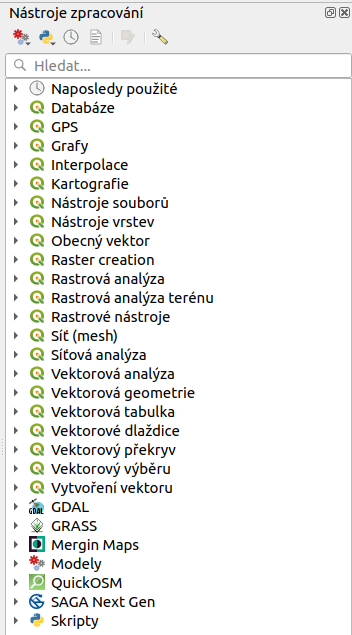

.. |checkbox| image:: ../images/icon/checkbox.png
   :width: 1.5em
.. |selectstring| image:: ../images/icon/selectstring.png
   :width: 1.5em
.. |img| image:: ../images/icon/img.png
   :width: 1.5em
.. |img| image:: ../images/icon/img.png
   :width: 1.5em
.. |img| image:: ../images/icon/img.png
   :width: 1.5em
      

.. todo:: vytvořit příklad bufferu a popsat postup, na tocích nebo MZCHU
         struktura jak v grass školení - Překrytí (union), Průnik (intersect), Spojení vektorových map (merge), vyloučení

Prostorové analýzy
==================

V prostředí QGIS máme k dispozici širokou škálu funkcí pro prostorové analýzy 
vektorových dat. Základní funkce nalezneme v hlavním menu 
:menuselection:`Vektor --> Nástroje geoprocessingu`. Další možností jak 
spouštět analýzy je pomocí okna :item:`Nástroje zpracování`, které sdružuje 
funkce z knihovny OGR/GDAL a dalších dostupných externích nástrojů jako jsou 
například GRASS, SAGA nebo R.

    
    Okno :item:`Nástroje zpracování` (Pokročilé zobrazení)

Obalová zóna (buffer)
---------------------

Jednou z nejzákladnějších prostorových analýz je obalová zóna. Obalové zńoy jsou
reprezentovány polygony s hranicí o dané vzdálenosti od prvků. U bodových 
prvků má obalová zóna tvar kruhu (nebo aproximace kruhu), u linií a polygonů se 
kružnice generují kolem uzlů. Cílem analýzy je tedy vytvořit novou polygonovou 
vrstvu obalových zónVytváření obalových zón nalezneme v menu 
:menuselection:`Vektor --> Nástroje geoprocessingu --> Obalové zóny...`

.. figure:: images/prost_buffer.png
    :scale: 90%
       
    Dialogové okno obalové zóny
    

- :item:`Vstupní vektorová vrsvta` |selectstring| - vstupní vrstva pro 
  vytvoření obalových zón
- |checkbox|:option:`Použít pouze vybrané prvky` - vytvoří obalovou zónu jen pro 
  prvky ve výběru
- :item:`Segmentů proaproximaci` |checkbox| - míra aproximace kruhu při tvorbě 
  obalové zóny (:num:`aprox`)
    
    - nízká hodnota (min. 5) - méně uzlů - rychlejší výpočty, ale méně přesné
    - vysoká hodnota (max. 99) - více uzlů - pomalejší výpočty, více odpovídá 
    kruhu 

- |checkbox|:option:`Vzdálenost obalové zóny`  - vzdálenost v metrech 
  (v závislosti nastavení QGIS a použitého SRS)
- |checkbox|:option:`Pole vzdálenosti obalové zóny` - aktivujeme pokud máme v 
  atributové tabulce sloupec, ve kterém máme definovanou vzdálenost. Vhodné 
  pokud potřebujeme pro různé prvky různě velké obalové zóny (např. kategorie 
  vodních toků, nebo komunikací)
- |checkbox|:option:`Rozpustit výsledky obalové zóny` - zaškrtneme, pokud 
  nechceme aby se nám výsledné obalové zóny překrývaly, výsledkem analýzy je 
  jeden prvek.
- :item:`Vstupní vektorová vrsvta` - zadáme cestu a název výstupního souboru
- |checkbox|:option:`Přidat výsledek do mapového okna` - výsledná vrstva se 
  nahraje do projektu

.. _aprox:

.. figure:: images/prost_buffer_seg.png
    
    Obalová zóny body s rozdílným počtem segmentů pro aproximaci 
    (vlevo 5, vpravo 50)

V následujícím příkladu jsme vytvořili obalovou zónu 10km kolem dálnic 
(s možností rozpuštění výsledků).

.. figure:: images/prost_buffer_dalnice.png
       
    Dialogové okno obalové zóny

Překryvné operace
-----------------

.. todo:: úvod překryvných operací, jedno okno, popsat, uvézt příklady
