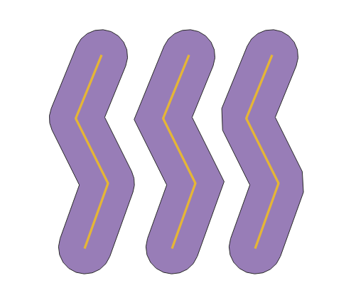

.. |checkbox| image:: ../images/icon/checkbox.png
   :width: 1.5em
.. |selectstring| image:: ../images/icon/selectstring.png
   :width: 1.5em

.. todo:: přidat u překryvných analýz obrázky prakticých příkladů 
   (i na bodech)

Prostorové analýzy
==================

V prostředí QGIS máme k dispozici širokou škálu funkcí pro prostorové analýzy 
vektorových dat. Základní funkce nalezneme v hlavním menu 
:menuselection:`Vektor --> Nástroje geoprocessingu`.

.. raw:: latex

   \newpage
   
.. noteadvanced:: Další možností jak 
    spouštět analýzy je pomocí okna :item:`Nástroje zpracování`, které sdružuje 
    funkce z knihovny GDAL a dalších dostupných externích nástrojů, jako jsou 
    například GRASS GIS, SAGA nebo R. Jednotlivé funkce lze rychle vyhledávat 
    pomocí filtru v horní části okna (nutno zadat anglický název funkce).

    .. figure:: images/geoprocess.png
       :class: small
       :scale-latex: 40
       
       Okno :item:`Nástroje zpracování` (Advanced interface - pokročilé 
       zobrazení).

.. _buffer:

Obalová zóna dle pevné vzdálenosti (buffer)
-------------------------------------------

Jednou z nejzákladnějších prostorových analýz je obalová zóna
(tzv. buffer). Obalové zóny jsou reprezentovány polygony s hranicí o
dané vzdálenosti od prvků. U bodových prvků má obalová zóna tvar kruhu
(nebo aproximace kruhu), u linií a polygonů se hranice obalové zóny
generuje vzdálenostmi od uzlů. Cílem analýzy je tedy vytvořit novou
polygonovou vrstvu obalových zón. Tuto funkci najdeme v menu
:menuselection:`Vektor --> Nástroje geoprocessingu --> Obalová
zóna dle pevné vzdálenosti`. Velikost bufferu lze nastavit i jako proměnlivou
hodnotu.

.. figure:: images/prost_buffer.png
   :class: medium
   :scale-latex: 40

   Dialogové okno obalové zóny.
    

- :item:`Vstupní vrsvta` |selectstring| - vstupní vrstva pro 
  vytvoření obalových zón
- :item:`Vzdálenost`  - vzdálenost obalové zóny v metrech 
  (v závislosti nastavení QGIS a použitého SRS)    
- :item:`Segmenty` - počet liniových segmentů při zaoblených částěch 
  obalové zóny (:numref:`aprox`)
    
    - nízká hodnota (min. 5) - méně uzlů - rychlejší výpočty, ale méně přesné
    - vysoká hodnota (max. 99) - více uzlů - pomalejší výpočty, zaoblené
      části více odpovídají kruhu 
      kruhu

.. _aprox:

.. figure:: images/prost_buffer_seg.png
   :scale-latex: 45

   Obalová zóna s rozdílným počtem segmentů pro aproximaci 
   (vlevo 5, vpravo 50).

- :item:`Styl zakončení` - styl zakončení obalové zóny na konci linií (`kulatý`, 
`plochý`, `čtverec`) :numref:`zakonceni`
- :item:`Připojit styl` - styl obalové zóny při rozích (`kulatý`, `kosý`,
  `zaoblený`) :numref:`spoj`
- :item:`Miter limit` - maximální vzdálenost od odsazené křivky při vytváření
  kosého spoje

.. _zakonceni:

.. figure:: images/prost_buffer_zak.png
   :scale-latex: 45

   Typy stylů zakončení (`kulatý` , `plochý`, `čtverec`).

.. _spoj:

   Typy stylů připojení (`kulatý`, `kosý`, `zaoblený`).

- |checkbox|:option:`Výsledek rozpuštění` - zaškrtneme, pokud 
  nechceme, aby se nám výsledné obalové zóny překrývaly, výsledkem analýzy je 
  jeden prvek
- :item:`Obalová zóna` - zadáme cestu a název výstupního souboru
- |checkbox|:option:`Otevřít výstupní soubor po doběhnutí algoritmu` 
  - výsledná vrstva se přidá do projektu

V následujícím příkladu jsme vytvořili obalovou zónu 10 km kolem dálnic 
(s možností rozpuštění výsledků).

.. figure:: images/prost_buffer_dalnice.png
   :scale-latex: 48
    
   Příklad obalové zóny 10 km okolo dálnic.

Překryvné analýzy
-----------------

Další skupinou prostorových analýz jsou tzv. překryvné analýzy. Principem je 
vytvořit novou vektorovou vrstvu na základě interakce prvků jedné nebo více 
vektorových vrstev. Pro dosažení správného výsledku je nutné, aby vrstvy byly 
ve shodném souřadnicovém systému. Překryvné operace opět nalezneme v menu 
:menuselection:`Vektor --> Nástroje geoprocessingu`.

.. figure:: images/prost_okno.png
   :class: medium
   :scale-latex: 30
    
   Okno funkce překryvné analýzy (Oříznout...).
    
- :item:`Vstupní vrsvta` |selectstring| - vstupní vrstva
- :item:`Oříznout vrsvtu` |selectstring| - druhá vrstva, která vstupuje do analýzy
- :item:`Oříznuto` - zadáme cestu a název výstupního souboru
- |checkbox|:option:`Otevřít výstupní soubor po doběhnutí algoritmu` - 
  výsledná vrstva se 
  nahraje do projektu

.. figure:: images/prost_puvod.png
   :class: middle
   :scale-latex: 45

   Původní vrstvy vstupující do ukázkových příkladů.

Ořezávač (`Clip`)
^^^^^^^^^^^^^^^^^
Vytvoří novou vrstvu, ve které je `Vstupní vektorová vrstva` ořezána 
vrstvou vybranou v nabídce `Oříznout vrstvu`. Prvky výstupní vrstvy 
nesou atributy pouze z vrstvy zadané jako `Vstupní vektorová vrstva`.

.. figure:: images/prost_orez.png
   :scale-latex: 35

   Výsledek funkce Ořezání... - čtverec jsme ořezali podle kruhu.

Průsečík (`Interesction`)
^^^^^^^^^^^^^^^^^^^^^^^^^

Vytvoří novou vrstvu s prvky pouze v místech překryvu vstupních vrstev. Každý 
prvek nese atributy obou vstupních vrstev. 

.. figure:: images/prost_prus.png 
   :scale-latex: 30

   Výsledek funkce Průsečík.

Sjednotit (`Union`)
^^^^^^^^^^^^^^^^^^^

Vytvoří novou vrstvu se všemi původními prvky, v místech překryvu vrstev jsou 
vytvořeny nové prvky.

.. figure:: images/prost_sjed.png
   :scale-latex: 35

   Výsledek funkce Sjednotit.
    
Symetrický rozdíl (`Symmetric difference`)
^^^^^^^^^^^^^^^^^^^^^^^^^^^^^^^^^^^^^^^^^^

Vytvoří novou vrstvu, kde v místech překryvu vrstev nejsou vytvořeny prvky. 
Prvky vznikají tedy pouze tam, kde se vstupní vrstvy nepřekrývají.

.. figure:: images/prost_sym.png
   :scale-latex: 35 

   Výsledek funkce Symetrický rozdíl.

.. _orez:

Rozdíl (`Difference`)
^^^^^^^^^^^^^^^^^^^^^

Vytvoří novou vrstvu, která je rozdílem vstupních vrstev. Ve `Vstupní 
vektorové vrstvě` se odstraní plochy, které se překrývají s vrstvou v 
nabídce `Rozdíl ve vrstvě`.

.. figure:: images/prost_rozd.png
   :scale-latex: 35
    
   Výsledek funkce Rozdíl - vrstva čtverce s rozdílem ve vrstvě kruhu.

Rozpustit (`Dissolve`)
^^^^^^^^^^^^^^^^^^^^^^

Vytvoří novou vrstvu, ve které jsou definované prvky jedné vrstvy sloučeny do 
jednoho. Pokud chceme aplikovat pro všechny prvky, 
zvolíme |checkbox|:option:`Dissolve all (do not use fields)`. Pokud chceme
metodu aplikovat podle atributů, tak v nabídce :item:`Unique ID fields` 
můžeme vybrat atributy, pro které chceme rozpuštění aplikovat. 

.. raw:: latex

   \newpage
	 
.. figure:: images/prost_rozp_okno.png
   :class: medium
   :scale-latex: 25
    
   Okno funkce Rozpustit.
    
.. figure:: images/prost_rozp.png
   :scale-latex: 32
 
   Výsledek funkce Rozpustit (vstupní vrstva: výsledek Sjednocení).
    
V následujícím příkladu provedeme sjednocení vrstvy velkoplošných chráněných 
území a obalové zóny dálnic (10 km).
   
.. figure:: images/prost_sjed_priklad.png
   :scale-latex: 55
 
   Sjednocení vrstvy velkoplošných chráněných území a obalové zóny dálnic 
   (10 km).

Díky tomu, že vytvořená vrstva sjednocení nese atributy obou vstupních vrstev 
(obalová zóna nesla pouze atribut "typ" s hodnotou "dalnice"), můžeme zjistit 
různé informace. Například odfiltrováním 10. prvku, tedy prvku, který 
představuje obalovou zónu nezasahující do žádného velkoplošného chráněného 
území, můžeme snadno vypočítat poměr chráněného území, do kterého zasahuje 
obalová zóna 10 km od dálnic.

 .. note:: Pokud máme vybrané nějaké prvky, je automaticky aktivováno.
