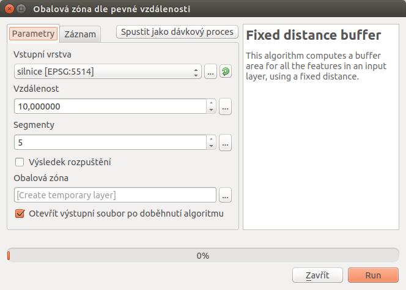
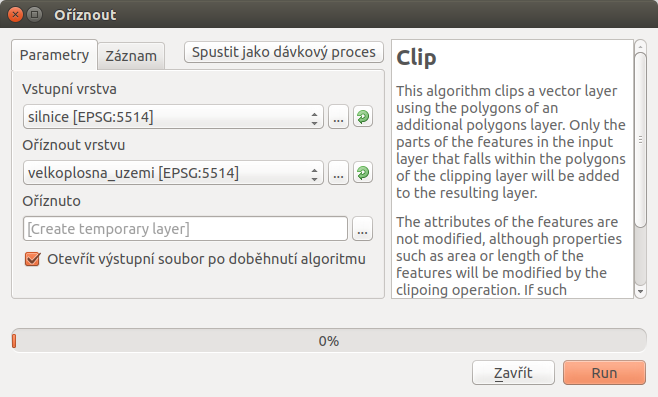
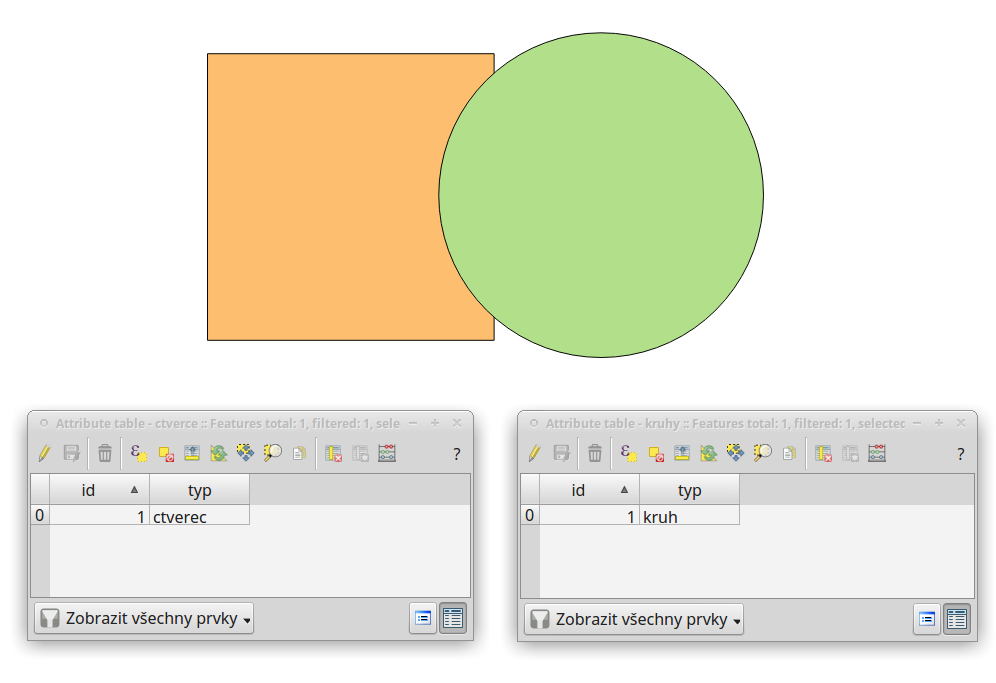
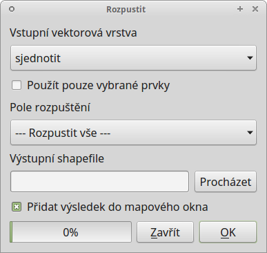
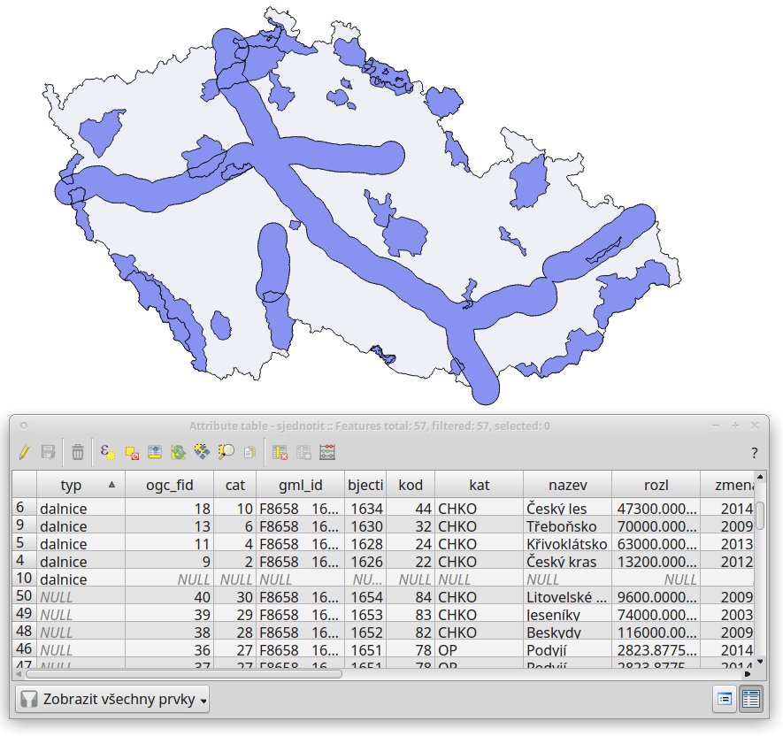

.. |checkbox| image:: ../images/icon/checkbox.png
   :width: 1.5em
.. |selectstring| image:: ../images/icon/selectstring.png
   :width: 1.5em

.. todo:: přidat u překryvných analýz obrázky prakticých příkladů 
   (i na bodech)

Prostorové analýzy
==================

V prostředí QGIS máme k dispozici širokou škálu funkcí pro prostorové analýzy 
vektorových dat. Základní funkce nalezneme v hlavním menu 
:menuselection:`Vektor --> Nástroje geoprocessingu`.

.. noteadvanced:: Další možností jak 
    spouštět analýzy je pomocí okna :item:`Nástroje zpracování`, které sdružuje 
    funkce z knihovny GDAL a dalších dostupných externích nástrojů jako jsou 
    například GRASS GIS, SAGA nebo R. Jednotlivé funkce lze rychle vyhledávat 
    pomocí filtru v horní části okna (nutno zadat anglický název funkce).

    .. figure:: images/geoprocess.png
       :class: small
                        
       Okno :item:`Nástroje zpracování` (Adnvanced interface - pokročilé 
       zobrazení).

Obalová zóna (buffer)
---------------------

Jednou z nejzákladnějších prostorových analýz je obalová zóna
(tzv. buffer). Obalové zóny jsou reprezentovány polygony s hranicí o
dané vzdálenosti od prvků. U bodových prvků má obalová zóna tvar kruhu
(nebo aproximace kruhu), u linií a polygonů se hranice obalové zóny
generuje vzdálenostmi od uzlů. Cílem analýzy je tedy vytvořit novou
polygonovou vrstvu obalových zón. Tuto funkci najdeme v menu
:menuselection:`Vektor --> Nástroje geoprocessingu --> Obalové
zóny...`

        
   Dialogové okno obalové zóny.
    

- :item:`Vstupní vektorová vrsvta` |selectstring| - vstupní vrstva pro 
  vytvoření obalových zón
- |checkbox|:option:`Použít pouze vybrané prvky` - vytvoří obalovou zónu jen pro 
  prvky ve výběru
  
  .. note:: Pokud máme vybrané nějaké prvky, je automaticky aktivováno.
  
- :item:`Segmentů pro aproximaci` |checkbox| - míra aproximace kruhu při tvorbě 
  obalové zóny (:num:`aprox`)
    
    - nízká hodnota (min. 5) - méně uzlů - rychlejší výpočty, ale méně přesné
    - vysoká hodnota (max. 99) - více uzlů - pomalejší výpočty, více odpovídá 
      kruhu 

.. _aprox:

.. figure:: images/prost_buffer_seg.png
    
    Obalová zóny s rozdílným počtem segmentů pro aproximaci 
    (vlevo 5, vpravo 50).

- |checkbox|:option:`Vzdálenost obalové zóny`  - vzdálenost v metrech 
  (v závislosti nastavení QGIS a použitého SRS)
- |checkbox|:option:`Pole vzdálenosti obalové zóny` - aktivujeme pokud máme v 
  atributové tabulce sloupec, ve kterém máme definovanou vzdálenost. Vhodné 
  pokud potřebujeme pro různé prvky různě velké obalové zóny (např. kategorie 
  vodních toků, nebo komunikací)
- |checkbox|:option:`Rozpustit výsledky obalové zóny` - zaškrtneme, pokud 
  nechceme, aby se nám výsledné obalové zóny překrývaly, výsledkem analýzy je 
  jeden prvek
- :item:`Vstupní shapefile` - zadáme cestu a název výstupního souboru
- |checkbox|:option:`Přidat výsledek do mapového okna` - výsledná vrstva se 
  nahraje do projektu

V následujícím příkladu jsme vytvořili obalovou zónu 10 km kolem dálnic 
(s možností rozpuštění výsledků).

.. figure:: images/prost_buffer_dalnice.png
       
    Příklad obalové zóny 10 km okolo dálnic.

Překryvné analýzy
-----------------

Další skupinou prostorových analýz jsou tzv. překryvné analýzy. Princepem je 
vytvořit novou vektorovou vrstvu na základě interakce prvků jedné nebo více 
vektorových vrstvev. Pro dosažení správného výsledku je nutné, aby vrstvy byly 
ve shodném souřadnicovém systému. Překryvné operace opět nalezneme v menu 
:menuselection:`Vektor --> Nástroje geoprocessingu`.

    
   Okno funkce překryvné analýzy (Oříznout...).
    
- :item:`Vstupní vektorová vrsvta` |selectstring| - vstupní vrstva
- |checkbox|:option:`Použít pouze vybrané prvky` - akce se provede jen pro 
  prvky ve výběru
- :item:`...` |selectstring| - druhá vrstva, která vstupuje do analýzy
- :item:`Vstupní shapefile` - zadáme cestu a název výstupního souboru
- |checkbox|:option:`Přidat výsledek do mapového okna` - výsledná vrstva se 
  nahraje do projektu

                    
   Původní vrstvy vstupující do ukázkových příkladů.

Průsečík
^^^^^^^^

Vytvoří novou vrstvu s prvky pouze v místech překryvu vstupních vrstev. Každý 
prvek nese atributy obou vstupních vrstev. 

.. figure:: images/prost_prus.png 
    
    Výsledek funkce Průsečík.

Sjednotit
^^^^^^^^^
Vytvoří novou vrstvu se všemi původnímy prvky, v místech překryvu vrstev jsou 
vytvořeny nové prvky.

.. figure:: images/prost_sjed.png
    
    Výsledek funkce Sjednotit.
    
Symetrický rozdíl
^^^^^^^^^^^^^^^^^
Vytvoří novou vrstvu, kde v místech překryvu vrstev nejsou vytvořeny prvky. 
Prvky vznikají tedy pouze tam, kde se vstupní vrstvy nepřekrývají.

.. figure:: images/prost_sym.png
    
    Výsledek funkce Symetrický rozdíl.

.. _orez:

Ořezávač
^^^^^^^^
Vytvoří novou vrstvu, ve které je `Vstupní vektorová vrstva` ořezána 
vrstvou vybranou v nabídce `Oříznout vrstvu`. Prvky výstupní vrstvy 
nesou atributy pouze z vrstvy zadané jako `Vstupní vektorová vrstva`.

.. figure:: images/prost_orez.png
    
    Výsledek funkce Ořezání... - čtverec jsme ořezali podle kruhu.

Rozdíl
^^^^^^
Vytvoří novou vrstvu, která je rozdílem vstupních vrstev. Ve `Vstupní 
vektorové vrstvě` se odstraní plochy, které se překrývají s vrstvou v 
nabídce `Rozdíl ve vrstvě`.

.. figure:: images/prost_rozd.png
    
    Výsledek funkce Rozdíl - vrstva čtverce s rozdílem ve vrstvě kruhu.

Rozpustit
^^^^^^^^^

Vytvoří novou vrstvu, ve které jsou definované prvky jedné vrstvy sloučeny do 
jednoho. V nabídce :item:`Pole rozpuštění` můžeme vybrat atribut pro který 
chceme rozpuštění aplikovat. Pokud chceme aplikovat pro všechny prvky, 
zvolíme :item:`--- Rozpustit vše ---`.

    
   Okno funkce Rozpustit.
    
.. figure:: images/prost_rozp.png
    
    Výsledek funkce Rozpustit (vstupní vrstva: výsledek Sjednocení).
    
V následujícím příkladu provedeme sjednocení vrstvy velkoplošných chráněných 
území a obalové zóny dálnic (10 km).
   

    
    Sjednocení vrstvy velkoplošných chráněných území a obalové zóny dálnic 
    (10 km).
    
Díky tomu, že vytvořená vrstva sjednocení nese atributy obou vstupních vrstev 
(obalová zóna nesla pouze atribut "typ" s hodnotou "dalnice"), můžeme zjistit 
různé informace. Například odfiltrováním 10tého prvku, tedy prvku, který 
představuje obalovou zónu nezasahující do žádného velkoplošného chráněného 
území, můžeme snadno vypočítat poměr chráněného území, do kterého zasahuje 
obalová zóna 10 km od dálnic.
