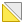
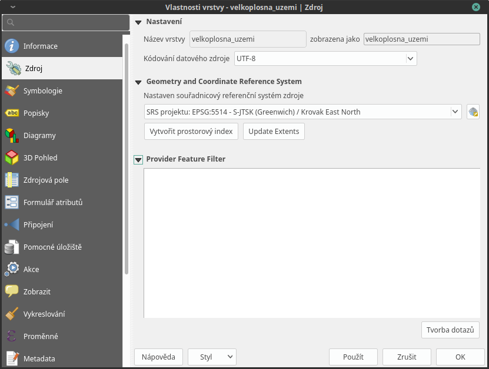
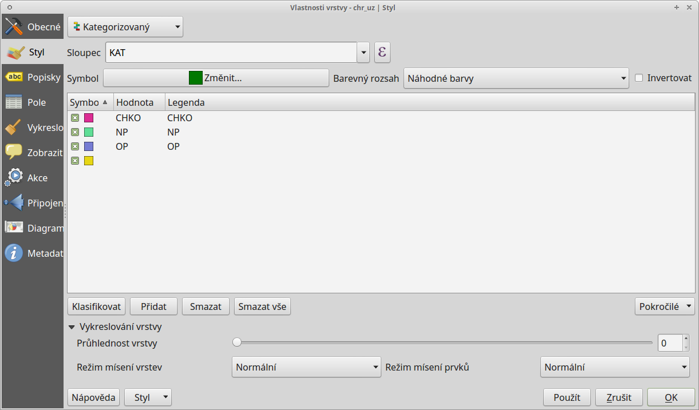
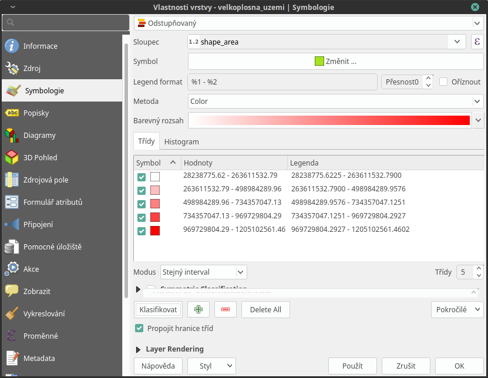
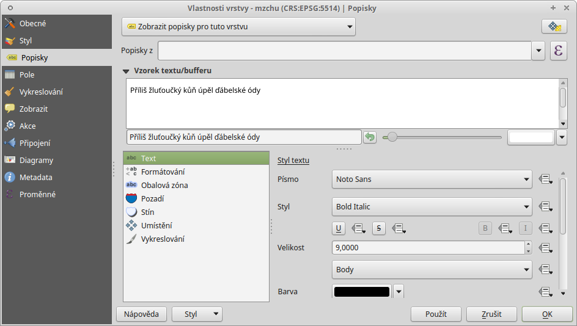
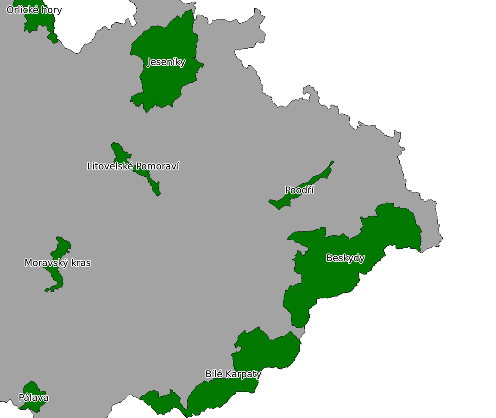
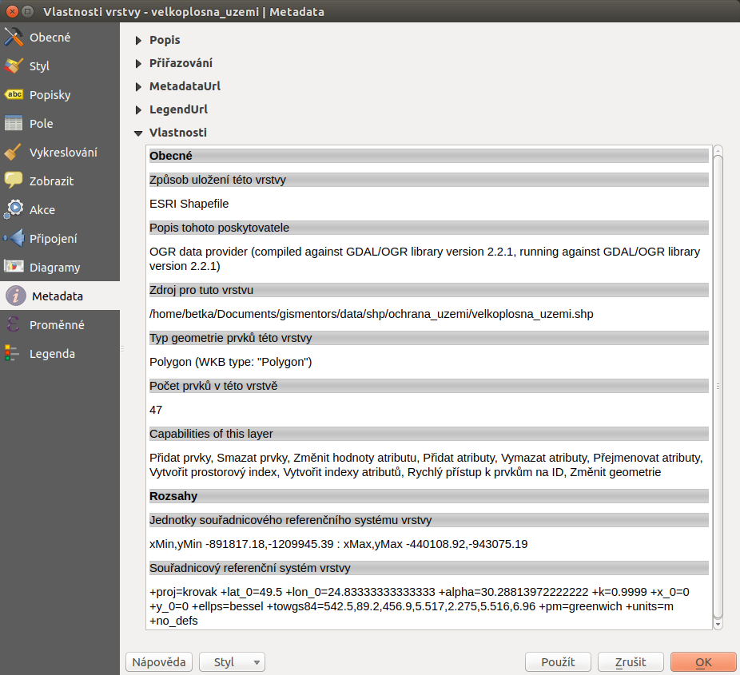
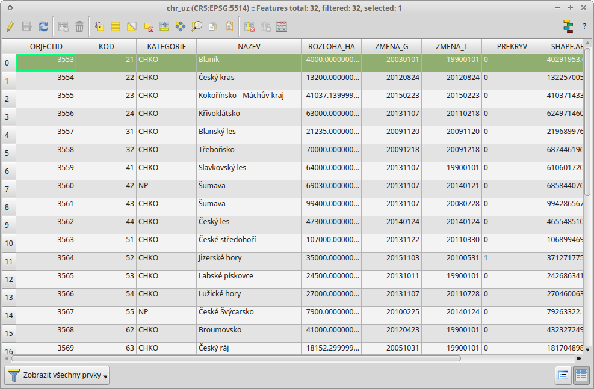

.. |symbology image:: ../images/icon/symbology.png
   :width: 2em
.. |selectstring| image:: ../images/icon/selectstring.png
   :width: 2.5em
.. |symbologyAdd| image:: ../images/icon/symbologyAdd.png
   :width: 1.5em
.. |symbologyRemove| image:: ../images/icon/symbologyRemove.png
   :width: 1.5em
.. |mActionOpenTable| image:: ../images/icon/mActionOpenTable.png
   :width: 1.5em

.. |mActionSelectedToTop| image:: ../images/icon/mActionSelectedToTop.png
   :width: 1.5em
.. |symbologyUp| image:: ../images/icon/symbologyUp.png
   :width: 1.5em
.. |symbologyDown| image:: ../images/icon/symbologyDown.png
   :width: 1.5em
.. |locked| image:: ../images/icon/locked.png
   :width: 1.5em

.. |mIconExpression| image:: ../images/icon/mIconExpression.png
   :width: 1.5em

Vlastnosti vrstvy
=================

Vlastnosti
----------

Vlastnosti vyvoláme dvojklikem na vrstvu nebo pravým tlačítkem myši
kontextové menu a zvolíme :item:`Vlastnosti`.

Obecné
^^^^^^

V první záložce nalezneme základní informace o nahrané vrstvě jako
název vrstvy, zdroj, kódování znaků, souřadnicový systém (SRS) a
další.

    Vlastnosti vektorové vrstvy.

.. _styl-vrstvy:

Styl (symbologie)
^^^^^^^^^^^^^^^^^

Pomocí rolovací nabídky |selectstring| vybereme typ symbologie:

- :guilabel:`jednoduchý symbol` - zde máme na výběr z uložených
  symbolů. V levém sloupci máme zobrazený typ symbolu a jeho jednotlivé
  části. Při kliknutí na konkrétní složku symbolu můžeme měnit
  její vlastnosti (Barvy, Typ výplně, Šířka ohraničení atd.).

.. figure:: images/symbol_simple.png

    Jednoduchá symbologie. V levé části vlastnosti označené
    složky symbolu.

.. tip:: Pomocí tlačítek můžeme další složky symbolu přidávat 
         |symbologyAdd|, odebírat |symbologyRemove|, zamykat |locked| nebo 
         měnit jejich pořadí |symbologyUp|, |symbologyDown|. Tímto způsobem 
         si můžeme vytvořit vlastní symbologii.

- :guilabel:`kategorizovaný` - vhodný pro katogoriální proměnné

    - :guilabel:`sloupec` - pro výběr atributu
    - :guilabel:`barevný rozsah` - výběr barev
    - pro vytvoření kategorii kliknout na :guilabel:`klasifikovat`

    Kategorizovaná symbologie.

- :guilabel:`odstupňovaný` - vhodný pro spojité proměnné

    - nastavení obdobné jako u možnosti :guilabel:`kategorizovaný`
    - možnost režimu intervalů a počet tříd

    Odstupňovaná symbologie.

Popisky
^^^^^^^

Kromě rozlišení prvků pomocí symbologie, lze také přidat k jednotlivým
prvkům popisek na základě jednoho z atributů.

    Vlastnosti popisků vrstvy.

Na této záložce je nejdříve nutné zaškrtnout políčko :item:`Vytvořit
popisky vrstvy z` a poté pomocí rolovací nabídky vybrat zdrojový atribut
popisku. Tím se nám otevřou možnosti stylizace popisků, kde můžeme
nastavit formát textu, obalovou zónu kolem textu, pozadí, stínování,
možnosti umístění a vykreslování.

    Příklad popisků s použitím obalové zóny textu.

.. noteadvanced:: Jako zdroj popisků lze použít i vzorec a to buď
    přímým vepsáním do nabídky, nebo vytvořením vzorce pomocí kalkulátoru 
    |mIconExpression|.

Metadata
^^^^^^^^
V záložce :item:`Metadata` je možné získat základní metadata vektorové vrstvy.

   Příklad výpisu metadat vrstvy ve formátu ESRI shapefile.

.. figure:: images/postgis_metadata.png
   :scale-latex: 80

   Příklad výpisu metadat vrstvy ve formátu PostGIS.

Atributová tabulka
------------------

Atributovou tabulku otevřeme pomocí ikony |mActionOpenTable| :sup:`Otevřít
atributovou tabulku` nebo pravým kliknutím vyvoláme kontextové menu
a zvolíme :item:`Otevřít atributovou tabulku`. Tabulka slouží
k prohlížení a editaci atributové složky dat. Kliknutím na číslo
řádku můžeme označit jednotlivé prvky do výběru. V názvu okna je
vypsaný název vrstvy, celkový počet prvků (`Features total`), počet
odfiltrovaných prvků (`filtered`) a počet prvků ve výběru (`selected`).

    Atributová tabulka vrstvy.

.. tip:: Pomocí tlačítka |mActionSelectedToTop| :sup:`Přesunout výběr 
   nahoru` lze zobrazit vybrané prvky na prvním místě tabulky, což nám 
   vybraná data zpřehlední.

   Pomocí tlačítka |mActionInvertSelection| :sup:`Invertovat výběr`, 
   můžeme invertovat výběr. Zruší se aktuální výběr a 
   vytvoří se výběr prvků, které ve výběru nebyly.

   Pomocí nabídky |mActionFilter| v levém dolním rohu lze zvolit filtr 
   zobrazených prvků. Ve výchozím nastavení filtr zobrazuje všechny 
   prvky ve vrstvě, tedy hodnota: |mActionFilter| :item:`Zobrazit všechny 
   prvky`

