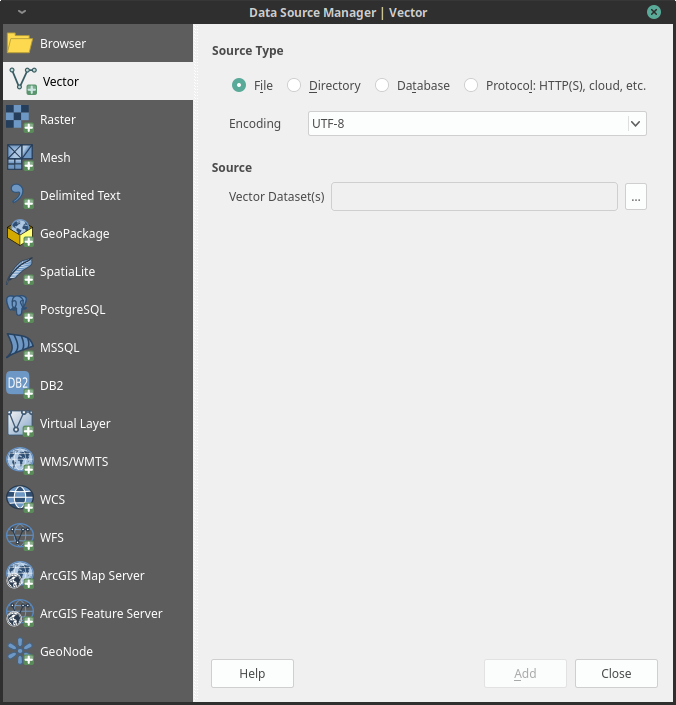
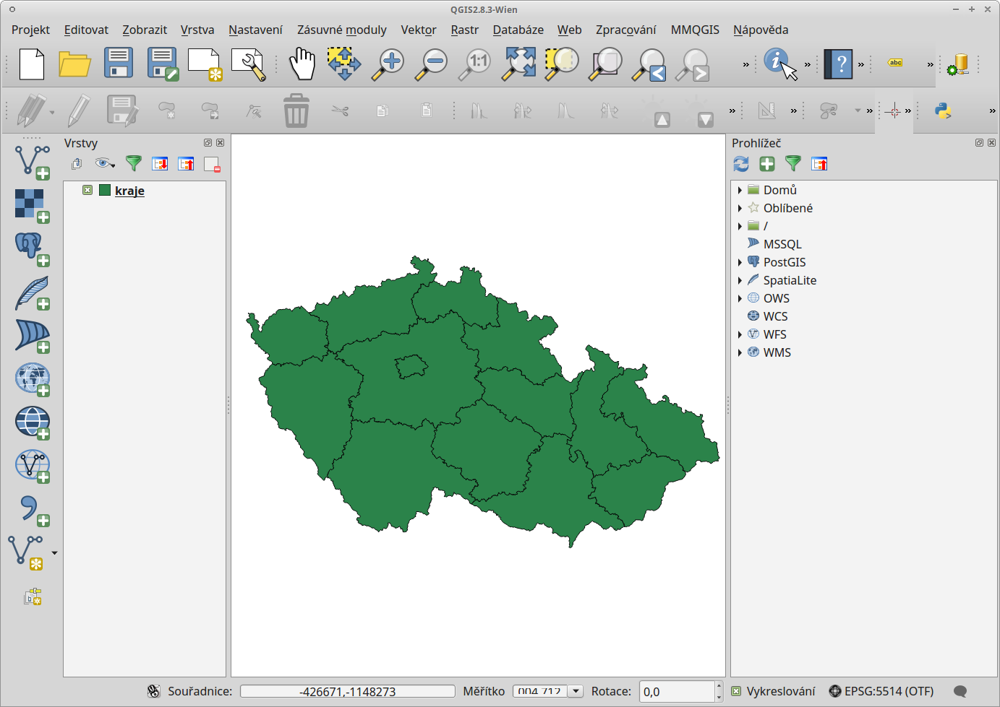
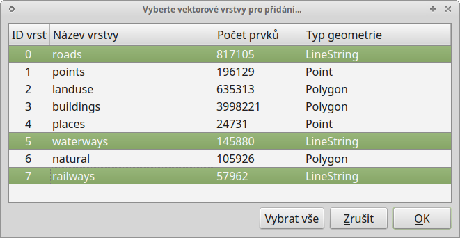
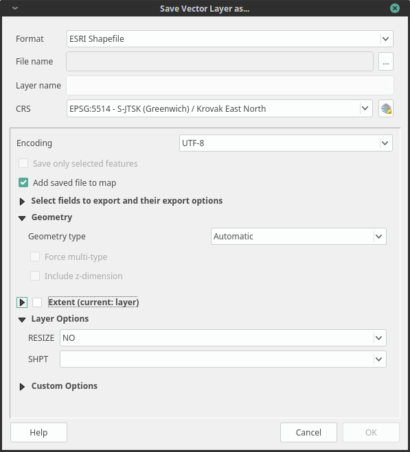

.. |checkbox| image:: ../images/icon/checkbox.png
   :width: 1.5em
.. |mActionAddOgrLayer| image:: ../images/icon/mActionAddOgrLayer.png
   :width: 1.5em
.. |mActionSelectRectangle| image:: ../images/icon/mActionSelectRectangle.png
   :width: 1.5em
.. |mIconExpressionSelect| image:: ../images/icon/mIconExpressionSelect.png
   :width: 1.5em
.. |ogr| image:: ../images/icon/ogr.png
   :width: 1.5em

Přidání a export dat 
====================

V této kapitole je popsán postup přídání a exportu vektorových dat. Obecný 
princip přidávání a exportu dat v QGIS najdeme v kapitole :ref:`importexport`. 
Pro čtení a zápis vektorových formátů používá QGIS knihovnu OGR. V režimu čtení 
lze vektorová data také načíst přímo z archivu zip a gzip.

Přidávání vektorových dat dat
-----------------------------

Nabídka pro načtení vektorové vrstvy se aktivuje v záložce
:menuselection:`Vrstva --> Přidat vrstvu --> Přidat vektorovou vrstvu`, 
ikonou |mActionAddOgrLayer| :sup:`přidání vektorové vrstvy` nebo pomocí
klávesové zkratky :kbd:`Ctrl+Shift+V`

   Dialogové okno přidání vektorové vrstvy

Nejčastější volbou vkládání dat je soubor nebo adresář. Vložení
jedné vrstvy je možné označením :item:`Typ zdroe` - |checkbox|
:option:`soubor`. Kliknutím na tlačítko :item:`procházet` se otevře
navigační okno s možností vybrat vektorová data. Po potvrzení se
označená vrstva načte do mapového pole. 

	    
   Nahrání vektorové vrstvy do QGIS

Volba adresář umožňuje označit
složku, ve které se nachází vektorová data. Potvrzením tlačítkem
:item:`otevřít` QGIS připraví všechna dostupná data uložená ve
složce k načtení. Objeví se potvrzující okno se všemi dostupnými
vrstvami. Vrstvy lze buď označit všechny nebo podrženímklávesy
:kbd:`Ctrl` vybrat jen požadované vrstvy (:num:`vecfolder`). Další
možností je přidat data pomocí vestavěného datového katalogu
(prohlížeče souborů) viz. :ref:`vectorimport`.

.. _vecfolder:

	    
   Výběr jednotlivých vrstev při přidávání vektorových vrstev ze složky
   
Export vektorových dat
----------------------
Pravým kliknutím na vrstvu vyvoláme kontextové menu, vybereme možnost :guilabel:`Uložit jako...` a zadáme parametry exportu. Můžeme zde zvolit výstupní formát (např. *.kml, *.shp, *.gpx), souřadnicový systém vrstvy a další volitelné parametry.

    Okno exportu vektorové vrstvy
	    
        
.. tip:: pokud potřebujeme exportovat pouze část vrstvy nebo konkrétní zájmové prvky, musíme tyto chtěné prvky nejprve označit výběrem (např. |mActionSelectRectangle| :sup:`Vybrat prvky oblastí nebo jednoklikem` nebo |mIconExpressionSelect| :sup:`Vabrat prvky pomocí vzorce`), potom se nám v okně exportu aktivuje možnost |checkbox| :sup:`Uložit pouze vybrané prvky`.

.. tip:: Pro uložení pouze atributové tabulky vrstvy lze zvolit výstupní formát *.csv 
