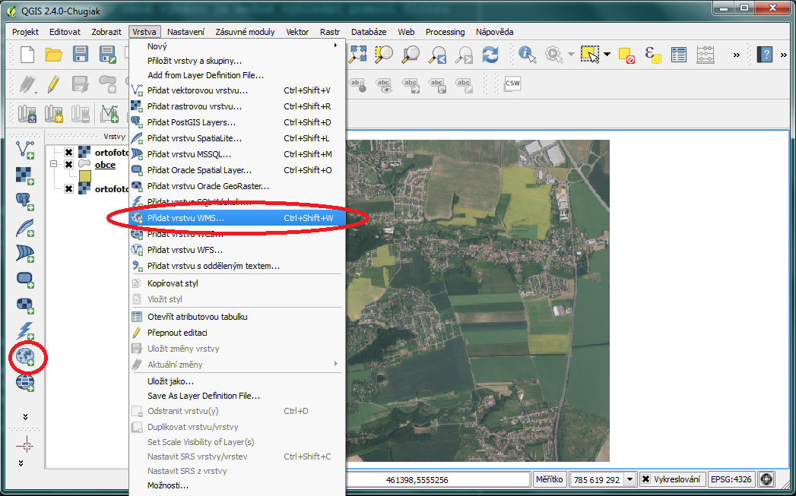

Rastrová síťová data
====================

Existuje více variant síťových rastrových služeb. Nejrozšířenější
službou
je WMS.
Rychlejší, ale méně používanou alternativou k WMS je WMTS, kde \"T\"
v názvu
znamená \"Tile\", tedy dlaždice. WMTS přistupuje k již předgenerovaným
dlaždicím,
tudíž tolik nezatěžuje server a data se ke klientovi dostanou rychleji.
Rastrová data je možné ukládat a následně je zobrazovat přímo v
databázích.
QGIS poskytuje možnosti jak pracovat s daty z databází PostGIS nebo Oracle.

WMS/WMTS
^^^^^^^^

Bezesporu nejpoužívanější webovou službou je WMS (Web Map
Service). Služba WMS
se postupem času vyvíjela a dnes můžeme narazit na různé verze
1.0.0, 1.1.1 nebo 1.3.0. . QGIS podporuje všechny werze WMS, a tak lze bez
obav přistupovat k jakékoliv publikované službě.
V QGISu je správa WMS a WMTS vrstev umístěna do stejného okna. Do
správce se
vstupuje buď ikonkou vlevo, nebo v záložce :menuselection:`Vrstva -->
Přidat vrstvu --> Přidat vrstvu WMS`[obr 8].

   Obr 8

Pokud nejsou ve správci vložené žádné připojení, dá se tak udělat
přes
tlačítko přidat [obr 9].

.. figure:: images/qgis_ogc_addwms_manager.png

   Obr 9

Přidání a editace připojení služby WMS nebo WMTS probíhá ve formuláři
[obr 10].
Pokud není služba zaheslovaná a nebo není potřeba klást na službu
speciální
požadavky (ve většině případů), pro úspěšné vložení stačí
zadat název služby,
jak jej chceme pro vlastní potřebu, a připojovací URL.

.. figure:: images/qgis_ogc_addwms_add_edit.png

   Obr 10

Pokud je nastaveno připojení ke službě správně, vyberáním požadované
služby z
menu a potvrzením tlačítkem :item:`Připojit` proběhne komunikace se
serverem.

Pokud bylo v předchozím formuláři [obr 10] zadáno spojení k WMS serveru,
po úspěšném navázání spojení se serverem se zobrazí v závislosti
na dostupných
vrstvách a nastavení serveru nabídka bodobná [obr 11]. Nabídka pouze
rozšířila
stávající zobrazení okna. V závislosti na dostupných vrstvách serveru se
zobrazí strom, ze kterého je možné vybírat vrstvy pro následné
přidání do mapy.
Tak jako tomu bylo u lokálních vektorových a rastrových dat, je možné
použít
klávesu :kbd:`CTRL` k označení více vrstev. Přidání vrstvy může
proběhnout jak na
nejnižší úrovni stromu, kde se zpravidla jedná o licenční logo služby,
tak je
možné označit nejsyšší úroveň, čímž budou přidány všechny
dostupné vrstvy.
Pokud server umožňuje poskytování dat ve více formátech, volba
formátu se
prování ve spodní části okna. Na obrázku 10 je v levé spodní části
vypsáno
\"WGS 84\" a na stejné úrovni se nachází tlačítko :item:`změnit`. Již
bylo zmíněno,
že služby WMS lze konzumovat ve více formátech (PNG,JPEG,GIF...),
taktéž lze
specifikovat souřadnicový systém, v jakém bude služba vyžadována. Změna
souřadnicového systému se provádí pod vyvoláním nabídky tlačítkem
:item:`změnit`.
Okno pro změnu projekce je shodné s oknem definování projekce vkládaných
lokálních rastrových a vektorových dat [obr 7]. QGIS v okně zobrazí poze
podporované souřadnicové systémy ze strany serveru. Po nastavení všech
parametrů služby a výběru vrstev proběhne přidání vrstvy do mapového
pole
tlačítkem přidat. Pokud bylo vybráno více vrstev, jeví se v layer
manageru
jako jedna.

.. figure:: images/qgis_ogc_addwms_choose.png

   Obr 11

Jak bylo zmíňeno, správa WMS a WMTS probíhá ve stejném okně. V
předchozím
kroku bylo ukázáno jak vkládat WMS služby. Pro připojení WMTS služby je
potřeba v nabídce přidání nového spojení zadat URL na platný WMTS
server.
Po vybrání služby a připojení přes tlačítko :item:`připojit`
proběhne komunikace s
WMTS serverem. Po navázání spojení se ve správci vrstev aktivuje záložka
:item:`sady dlaždic` [obr 12]. Tabulka zobrazuje dostupné vrstvy ze serveru.
V jednotlivých sloupcích je možné číst informace oo názvu vrstvy,
poskytovaném
formátu i projekci. V tabulce není možné vybrat více vrstev najednou,
stačí
vybrat jednu vrstvu a potvrdit ok.

.. figure:: images/qgis_ogc_addwmts_choose.png

   Obr 12

Vkládání síťových dat pomocí panele prohlížeče
^^^^^^^^^^^^^^^^^^^^^^^^^^^^^^^^^^^^^^^^^^^^^^
Obdobně jako u lokálních dat lze dvojitým kliknutím nebo přetažením
z datového katalogu (prohlížeče) přidat do projektu také síťové
služby. Pomocí datového katalogu můžeme pomocí kontextového menu
také editovat stávající připojení nebo vytvářet nová [obr 17].

.. figure:: images/qgis_ogc_addwms_browser.png

    Obr 17

