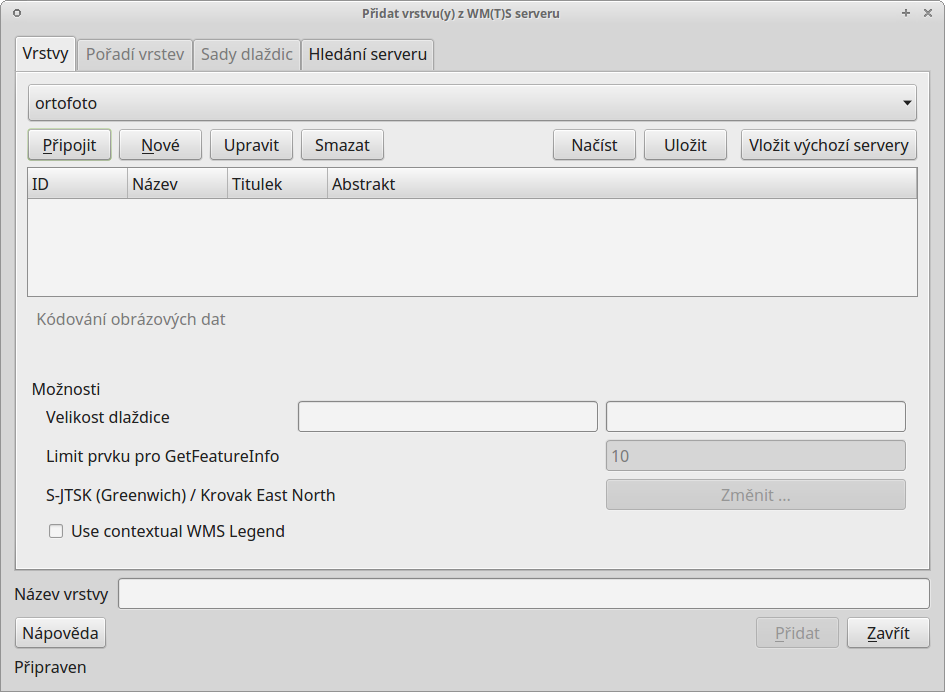
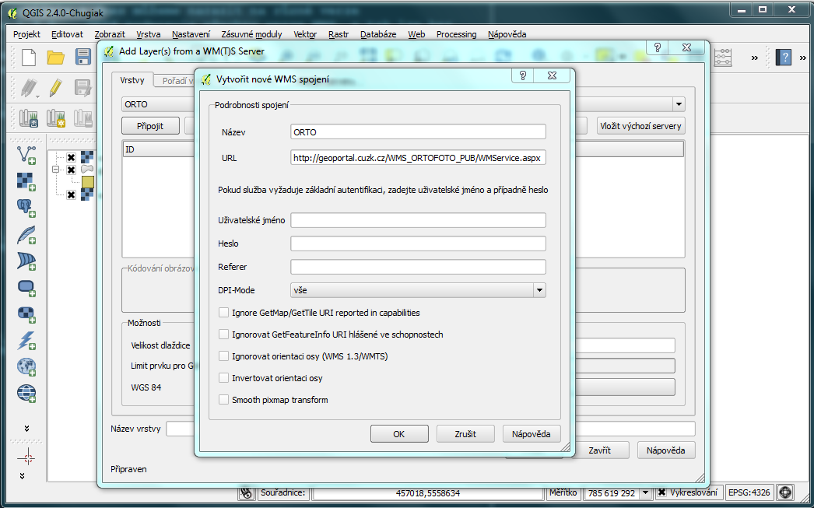
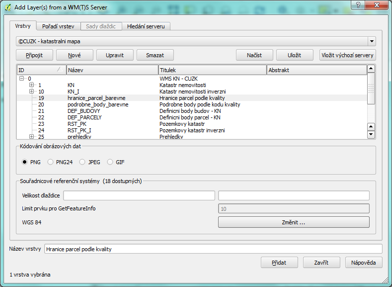
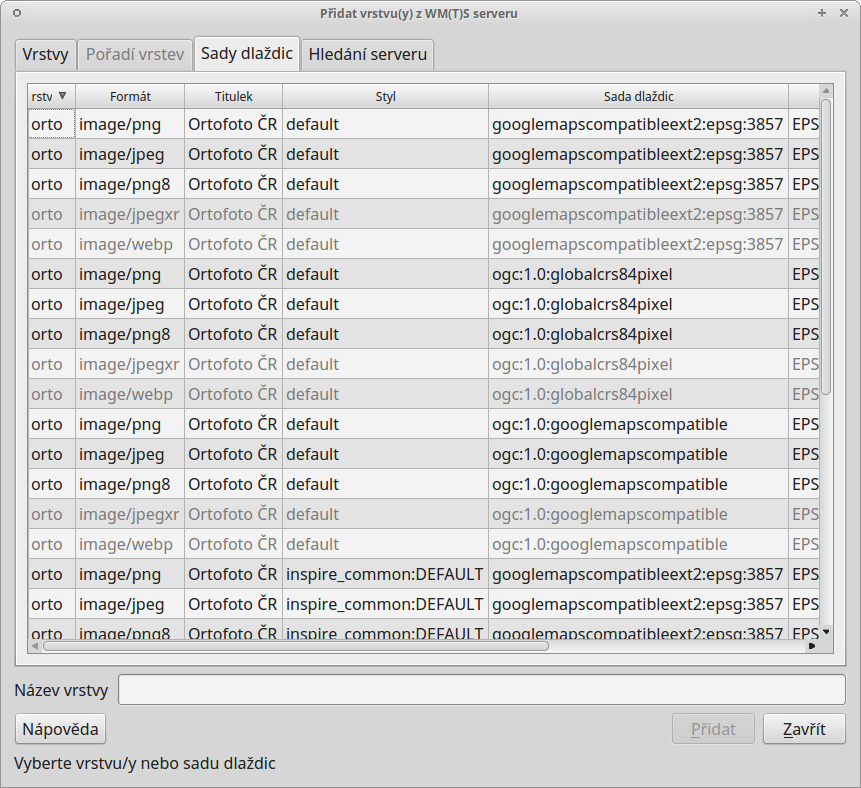
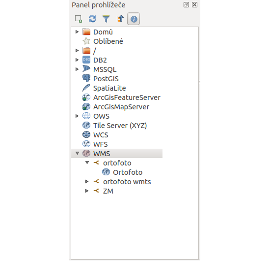

.. |mActionAddWmsLayer| image:: ../images/icon/mActionAddWmsLayer.png
   :width: 1.5em
.. |mIconWms| image:: ../images/icon/mIconWms.png
   :width: 1.5em
.. |mIconConnect| image:: ../images/icon/mIconConnect.png
   :width: 1.5em
   
   
Webové služby poskytující rastrová data
=======================================

Existuje více variant. Nejrozšířenější službou je WMS. Rychlejší, ale
méně používanou alternativou k WMS je WMTS, kde \"T\" v názvu znamená
\"Tile\", tedy dlaždice. WMTS přistupuje k již předgenerovaným
dlaždicím, tudíž tolik nezatěžuje server a data se ke klientovi
dostanou rychleji. Rastrová data je možné ukládat a následně je
zobrazovat přímo v databázích. QGIS poskytuje možnosti jak pracovat s
daty v databázích PostGIS nebo Oracle.

Připojení WMS služby
--------------------

Bezesporu nejpoužívanější webovou službou je WMS (Web Map Service). Služba WMS 
se postupem času vyvíjela a dnes můžeme narazit na různé 
verze 1.0.0, 1.1.1 nebo 1.3.0. QGIS podporuje všechny verze WMS, a tak lze bez
obav přistupovat k jakékoliv publikované službě. V QGISu je správa WMS a WMTS 
vrstev umístěna do stejného okna. 

Správce WMS a WMTS spustíme v záložce :menuselection:`Vrstva --> Přidat vrstvu 
--> Přidat vrstvu WMS`, ikonou |mActionAddWmsLayer| 
:sup:`Přidat vrstvu WMS/WMTS` nebo pomocí klávesové zkratky :kbd:`Ctrl+Shift+W`.

.. raw:: latex

   \newpage

   Okno správce WM(T)S služeb.
   
Pokud nejsou ve správci vložené žádné připojení, dá se tak udělat přes tlačítko 
:item:`Nové`.

Přidání a editace připojení služby WMS nebo WMTS probíhá ve formuláři
(:num:`wmsedit`). Pro úspěšné vložení (pokud není služba zaheslovaná a
nebo není potřeba klást na službu speciální požadavky) stačí zadat
název služby, připojovací URL a potvrdíme tlačítkem :item:`Ok`.

.. _wmsedit:

   
   Okno přidání/editace WMS vrstvy.

Pokud je nastaveno připojení ke službě správně, vybráním požadované služby z 
menu a potvrzením tlačítkem :item:`Připojit` proběhne komunikace se serverem. 
Po úspěšném navázání spojení, v závislosti na nastavení serveru, se zobrazí 
nabídka dostupných vrstev.

.. _wmsedit2:

   Nabídka dostupných vrstev a možnosti jejich nahrání.

Tak jako tomu bylo u lokálních vektorových a rastrových dat, k
označení více vrstev je možné použít klávesu :kbd:`CTRL`. Přidání
vrstvy může proběhnout jak na nejnižší úrovni stromu, kde se zpravidla
jedná o licenční logo služby, tak je možné označit nejvyšší úroveň,
čímž budou přidány všechny dostupné vrstvy. Některé servery mohou
poskytovat data ve více formátech a souřadnicových systémech. Výběr
formátu kódování obrazových dat můžeme specifikovat pod seznamem
dostupných vrstev. V levé spodní části okna máme vypsaný použitý
souřadnicový systém, na stejné úrovni se nachází tlačítko
:item:`Změnit ...`.  Okno pro změnu souřadnicového systému (SRS) je
shodné s oknem definování SRS vkládaných lokálních rastrových a
vektorových dat. QGIS v okně zobrazí pouze podporované souřadnicové
systémy ze strany serveru. Po nastavení všech parametrů služby a
výběru vrstev proběhne přidání vrstvy do mapového pole tlačítkem
:item:`Přidat`. Pokud bylo vybráno více vrstev, jeví se v seznamu
vrstev jako jedna.

Připojení WMTS služby
---------------------

Jak bylo zmíněno, správa WMS a WMTS probíhá ve stejném dialogovém
okně. V předchozím kroku bylo ukázáno jak vkládat WMS služby. Pro
připojení WMTS služby je potřeba v nabídce přidání nového spojení
zadat URL na platný WMTS server.  Po vybrání služby a připojení přes
tlačítko :item:`Připojit` proběhne komunikace s WMTS serverem. Po
navázání spojení se ve správci vrstev aktivuje záložka :item:`Sady
dlaždic` (:num:`wmts`). Tabulka zobrazuje dostupné vrstvy ze
serveru. V jednotlivých sloupcích je možné číst informace o názvu
vrstvy, poskytovaném formátu i souřadnicovém systému. V tabulce není
možné vybrat více vrstev najednou, stačí vybrat jednu vrstvu a
potvrdit tlačítkem :item:`Ok`.

.. _wmts:

   Záložka :item:`Sady dlaždic` při připojení na WMTS server.
   

.. warning:: V současných verzích QGIS musíme při zadání URL WMTS serveru 
    přesně specifikovat, že se jedná o WMTS. Za URL tedy přidáme:

    .. code-block:: none
    
       ?SERVICE=WMTS&REQUEST=GetCapabilities
       

Práce s WMS/WMTS službami v okně prohlížeče
^^^^^^^^^^^^^^^^^^^^^^^^^^^^^^^^^^^^^^^^^^^

Procházet, editovat a přidávat WMS/WMTS připojení lze také v panelu
prohlížeče (:num:`wmsbrowser`). Vyvoláním kontextového menu pravým
kliknutím na položku můžeme provádět vybrané akce.

- |mIconWms| WMS - vytvoření připojení
- |mIconConnect| konkrétní připojení - editace, odstranění
- |mIconWms| konkrétní vrstva - přidání do projektu, vlastnosti

Přidat požadovanou vrstvu do projektu jde obdobně jako u lokálních dat, 
dvojitým kliknutím nebo přetažením z datového katalogu (prohlížeče).

.. _wmsbrowser:

   
   Práce s WMS/WMTS službami v okně prohlížeče.
