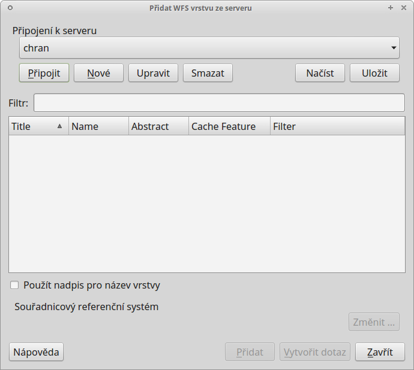
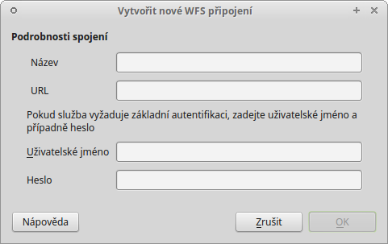
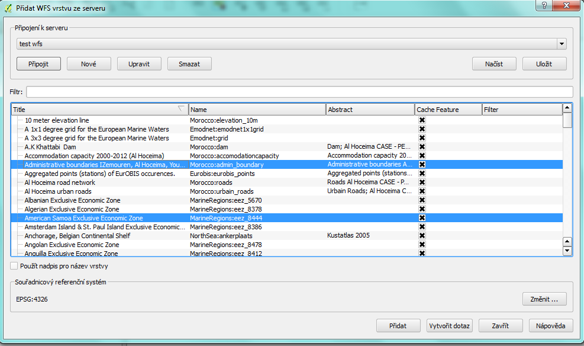
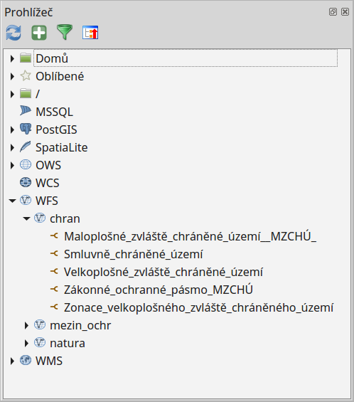

.. |mActionAddWfsLayer| image:: ../images/icon/mActionAddWfsLayer.png
   :width: 1.5em
.. |mIconWfs| image:: ../images/icon/mIconWfs.png
   :width: 1.5em
.. |mIconConnect| image:: ../images/icon/mIconConnect.png
   :width: 1.5em

Webové služby poskytující vektorová data
========================================

Připojení WFS služby
--------------------
Správce WFS spustíme v záložce :menuselection:`Vrstva --> Přidat vrstvu 
--> Přidat vrstvu WFS` nebo pomocí ikony |mActionAddWfsLayer| 
:sup:`Přidání vrstvu WFS`

   Okno správce WFS služeb

Okno správce umožňuje přidání, odebrání služby nebo k nahrání vrstev do projektu. Formulář přidání nové služby se aktivuje tlačítkem :item:`Nové`. Ve
formuláři (:num:`wfsform`) stačí v případě nezaheslované služby vyplnit pouze 
URL a pojmenování služby. V případě zaheslované služby jsou vyžadovány 
přihlašovací údaje.

.. _wfsform:

   Formulář přidání WFS služby

Po potvrzení a připojení ke službě ze správce tlačítkem
:item:`Připojit` se zobrazí seznam vrstvev poskytované WFS serverem (:num:`wfslayers`). 

.. _wfslayers:

   Seznam dostupných vrstev na připojeném WFS serveru
   
Výběr více vrstev pro přidání lze opět uskutečnit pomocí klávesy :kbd:`CTRL`, 
vrstvy se v takovém případě nahrají do seznamu vrstev samostatně 
(jako při přidávání lokálních dat). Tak jako v případě WMS lze změnit 
souřadnicový systém sloužící ke stahování dat. Změna se provádí pod tlačítkem
:item:`Změnit ...` ve spodní pravé části okna. Potvrzením :item:`Ok` proběhne přidání vrstev do mapy.

Vkládání síťových dat pomocí panele prohlížeče
^^^^^^^^^^^^^^^^^^^^^^^^^^^^^^^^^^^^^^^^^^^^^^
Procházet, editovat a přidávat WFS připojení lze také pomocí panele 
prohlížeče (:num:`wfsbrowser`). Vyvoláním kontextového menu pravým kliknutím na položku můžeme provádět vybrané akce.

- |mIconWfs| WFS - vytvoření připojení
- |mIconWfs| konkrétní připojení - editace, odstranění
- |mIconConnect| konkrétní vrstva - přidání do projektu, vlastnosti

Přidat požadovanou vrstvu do projektu jde obdobně jako u lokálních dat, 
dvojitým kliknutím nebo přetažením z datového katalogu (prohlížeče).

.. _wfsbrowser:

 
   Práce s WFS službami v okně prohlížeče
